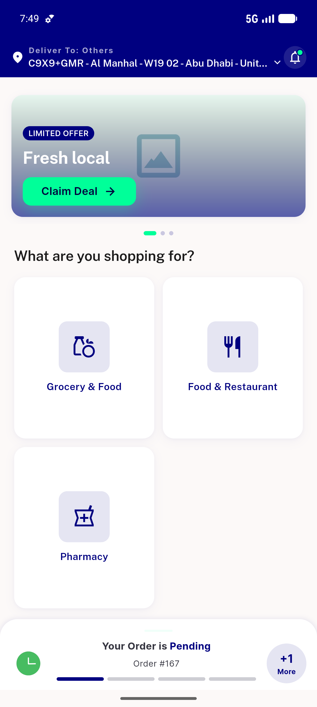

# QA Evidence — NEARS-731

**PASS — NEARS-731 chat null-unwrap: pre-fix crash reproduced + post-fix green; null-body route latent (no live UI/deep-link path)**

**1 screenshot(s).** Click any thumbnail for full resolution.

<table>
<tr>
<td align="center" width="33%"> live app home healthy</td>
</tr>
</table>

### Other artifacts
- [`live-nullbody-route-attempt.log`](live-nullbody-route-attempt.log)
- [`postfix-tests-pass.log`](postfix-tests-pass.log)
- [`prefix-crash-reproduction.log`](prefix-crash-reproduction.log)

---
*From `nears/docs/qa-evidence/NEARS-731/` · public-repo scrub policy (no live secrets; verified clean).*
