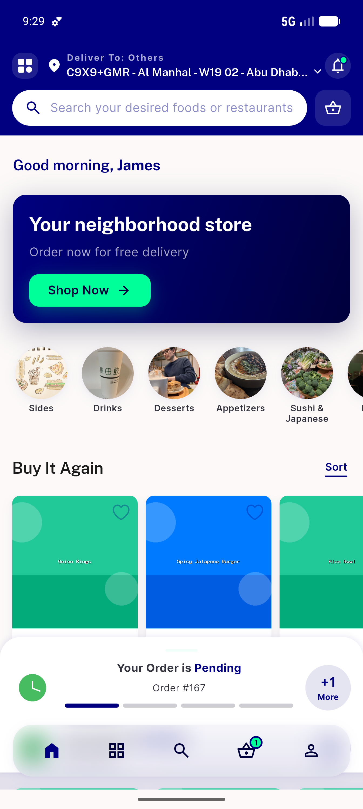
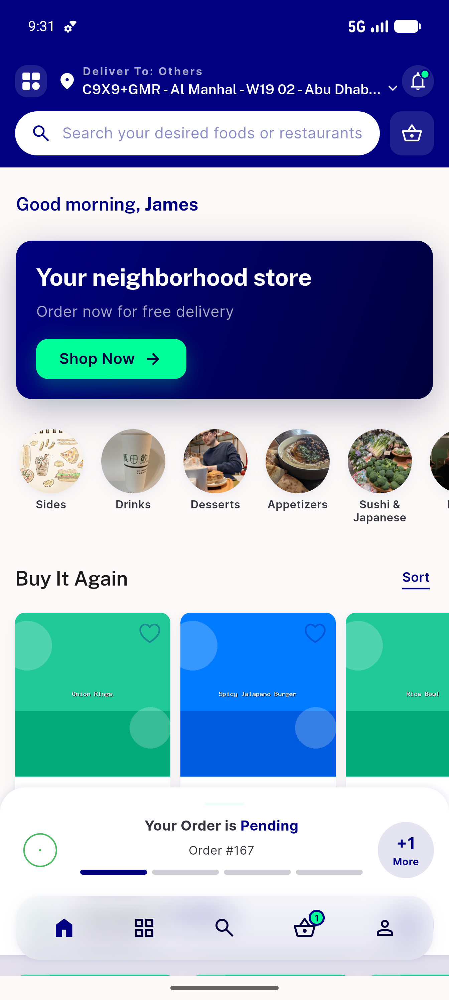

# QA Evidence — NEARS-732

**PASS — null selected_modules_for_interest no longer crashes single-sector/switchModule; home loads (2 shots)**

**2 screenshot(s).** Click any thumbnail for full resolution.

<table>
<tr>
<td align="center" width="33%"> ac1 food home loaded null interest</td>
<td align="center" width="33%"> ac2 module switch home loads</td>
</tr>
</table>

---
*From `nears/docs/qa-evidence/NEARS-732/` · public-repo scrub policy (no live secrets; verified clean).*
