# QA Evidence — NEARS-734

**PASS — CustomImage decode-cap: large covers + all image surfaces crisp, no blur; layout/intrinsic screens unchanged; 174 tests green**

**13 screenshot(s).** Click any thumbnail for full resolution.

<table>
<tr>
<td align="center" width="33%"><a href="00-home-initial.png">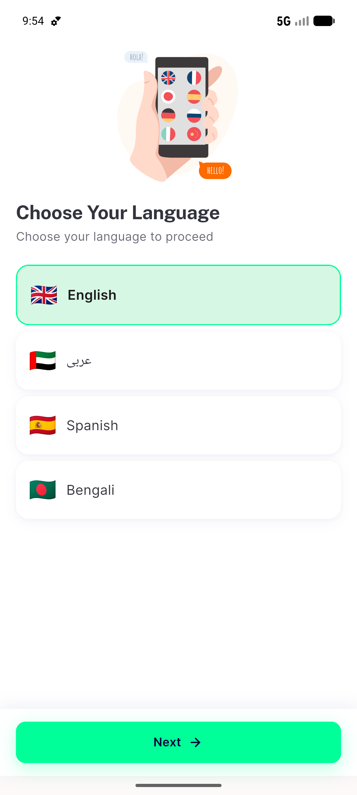</a> home initial</td>
<td align="center" width="33%"><a href="01-home-rails.png">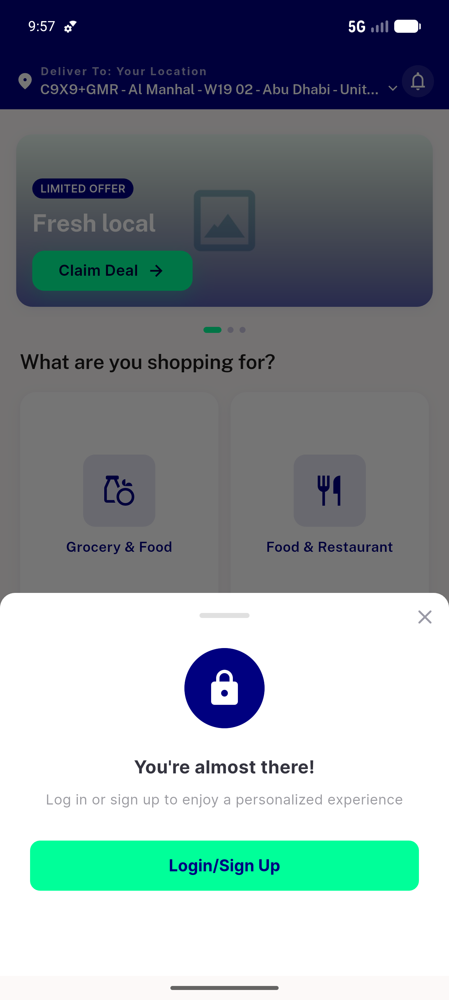</a> home rails</td>
<td align="center" width="33%"><a href="02-signin-intrinsic.png">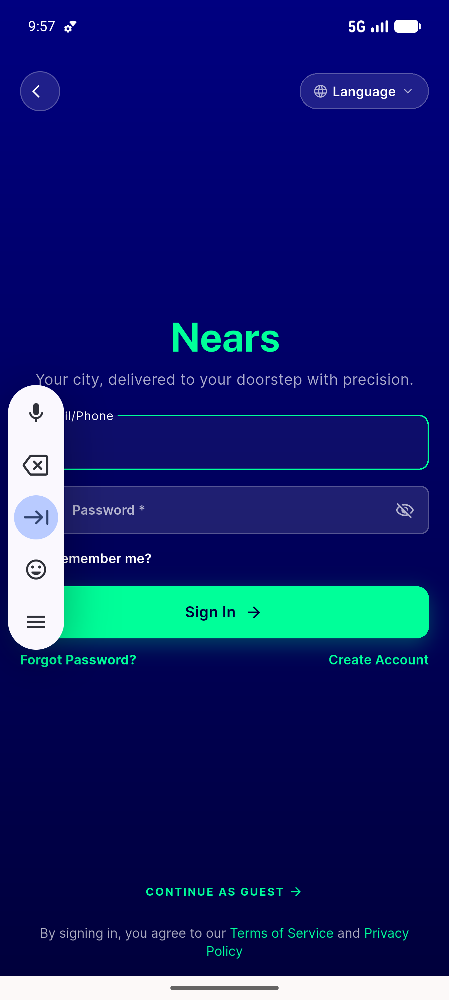</a> signin intrinsic</td>
</tr>
<tr>
<td align="center" width="33%"><a href="03-signup-intrinsic.png">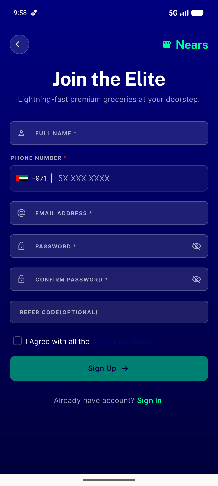</a> signup intrinsic</td>
<td align="center" width="33%"><a href="04-forgotpw-intrinsic.png">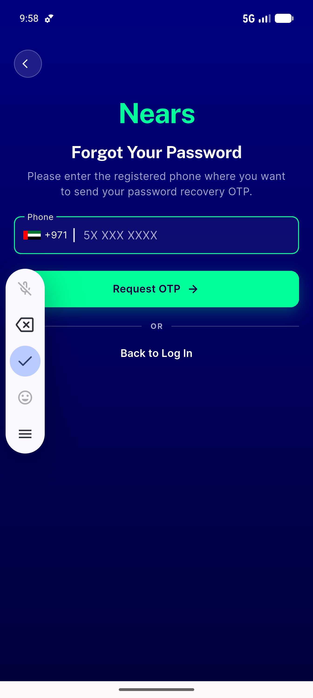</a> forgotpw intrinsic</td>
<td align="center" width="33%"><a href="05-home-recommended-rail.png">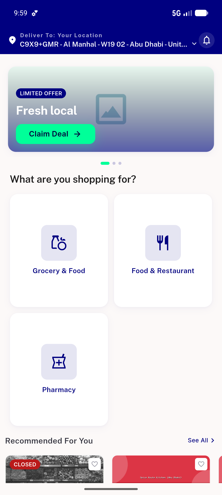</a> home recommended rail</td>
</tr>
<tr>
<td align="center" width="33%"><a href="06-recommended-stores-list.png">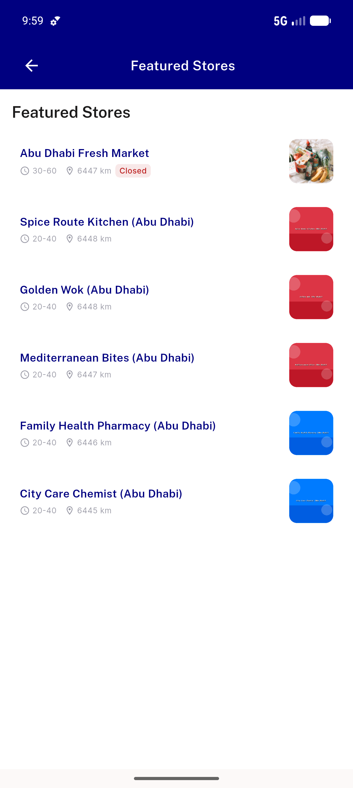</a> recommended stores list</td>
<td align="center" width="33%"><a href="07-store-large-cover.png">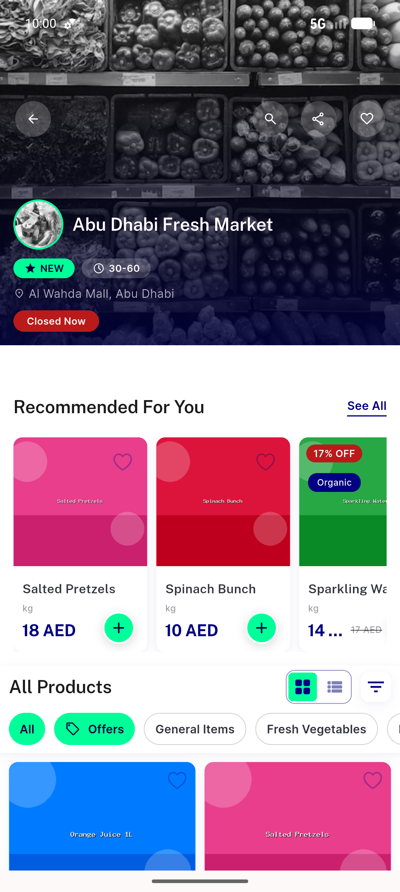</a> store large cover</td>
<td align="center" width="33%"><a href="08-store-items-scrolled.png">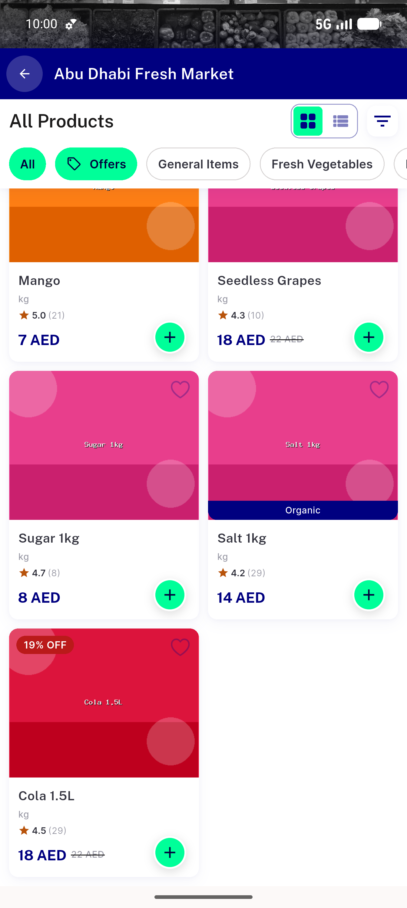</a> store items scrolled</td>
</tr>
<tr>
<td align="center" width="33%"> search results</td>
<td align="center" width="33%"><a href="10-search-water-results.png">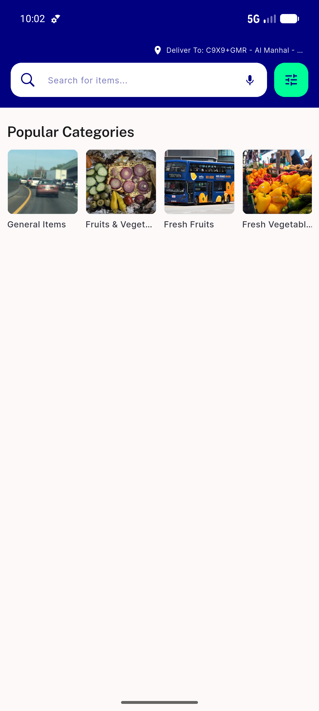</a> search water results</td>
<td align="center" width="33%"><a href="11-category-items.png">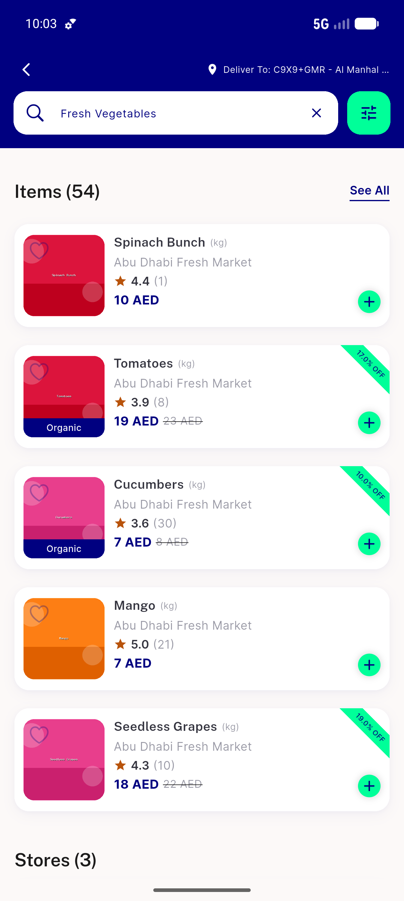</a> category items</td>
</tr>
<tr>
<td align="center" width="33%"><a href="12-rtl-arabic-home.png">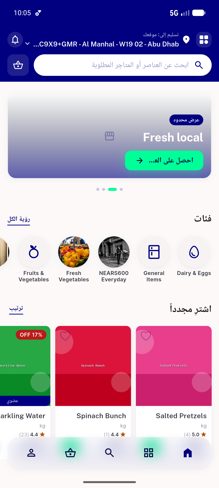</a> rtl arabic home</td>
</tr>
</table>

### Other artifacts
- [`bug-store-back-doublepop.log`](bug-store-back-doublepop.log)

---
*From `nears/docs/qa-evidence/NEARS-734/` · public-repo scrub policy (no live secrets; verified clean).*
