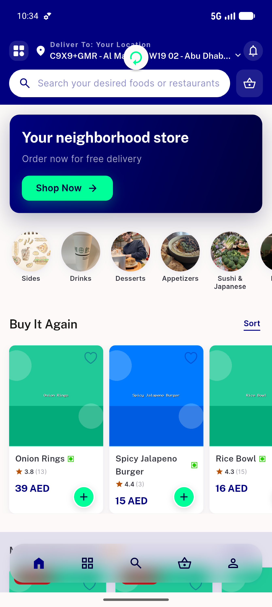
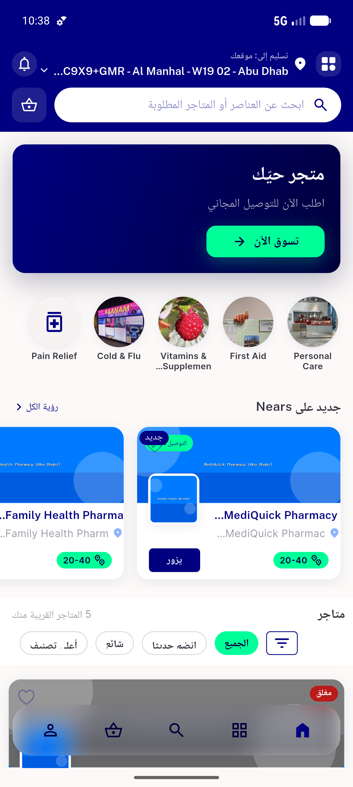

# QA Evidence — NEARS-737

**PASS — CircleListView controller-lifecycle fix: clean logs across refresh/nav/RTL, 2 lifecycle tests green, carousel data un-seeded (fallback)**

**2 screenshot(s).** Click any thumbnail for full resolution.

<table>
<tr>
<td align="center" width="33%"> ac1 food module home render</td>
<td align="center" width="33%"> ac6 pharmacy home arabic rtl</td>
</tr>
</table>

---
*From `nears/docs/qa-evidence/NEARS-737/` · public-repo scrub policy (no live secrets; verified clean).*
