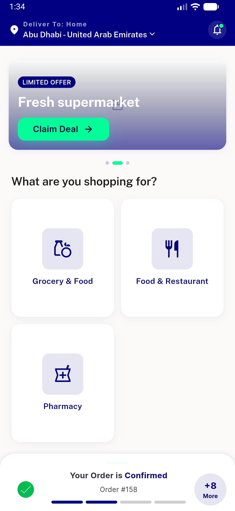
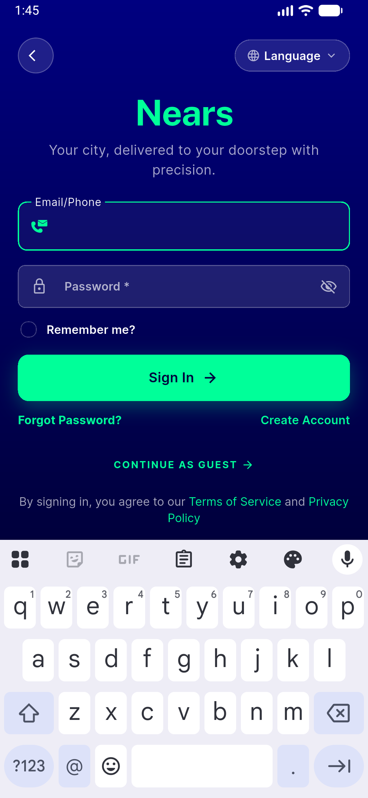
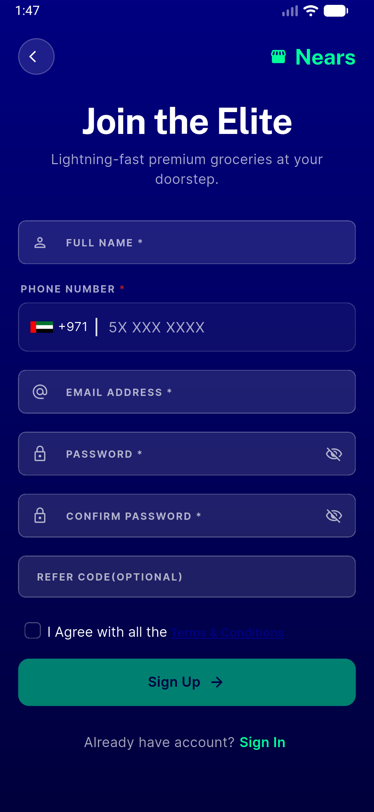
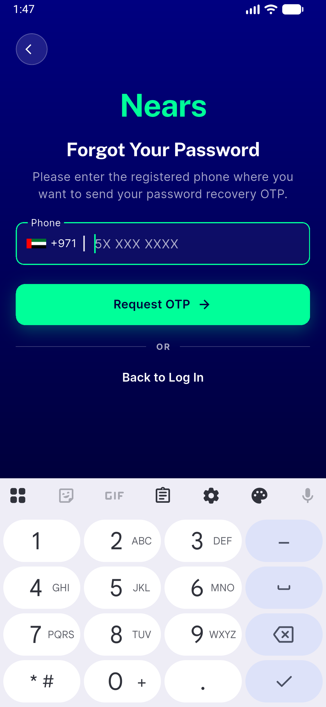
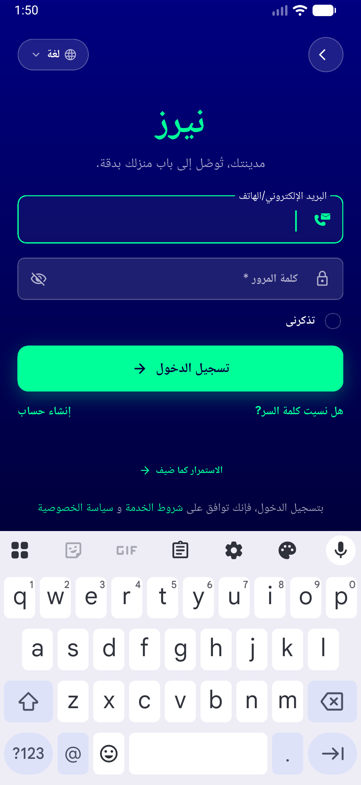
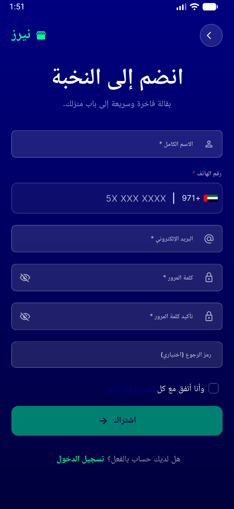

# QA Evidence — NEARS-741

**PASS — a11y names live-verified (back+password EN/AR), no visual/RTL regression, 7/7 tests**

**6 screenshot(s).** Click any thumbnail for full resolution.

<table>
<tr>
<td align="center" width="33%"> home ltr</td>
<td align="center" width="33%"> signin ltr</td>
<td align="center" width="33%"> signup ltr</td>
</tr>
<tr>
<td align="center" width="33%"> forgetpass ltr</td>
<td align="center" width="33%"> signin rtl ar</td>
<td align="center" width="33%"> signup rtl ar</td>
</tr>
</table>

---
*From `nears/docs/qa-evidence/NEARS-741/` · public-repo scrub policy (no live secrets; verified clean).*
