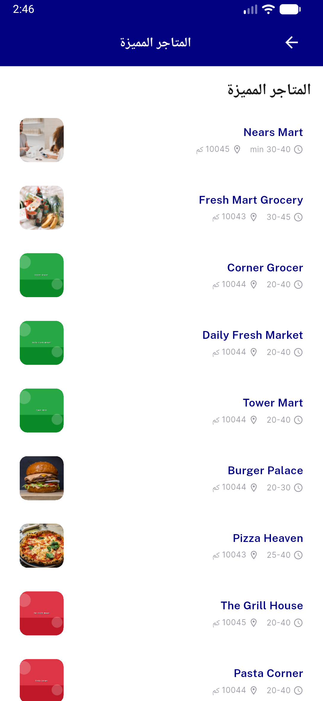
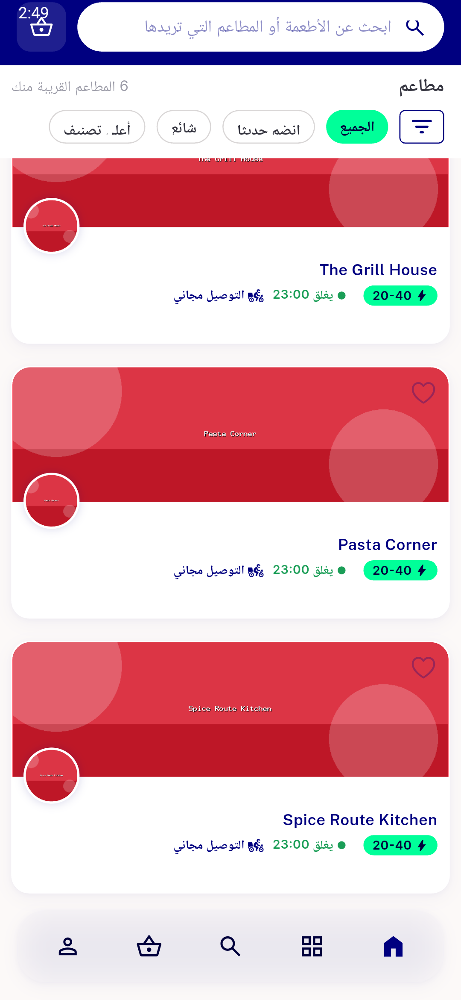
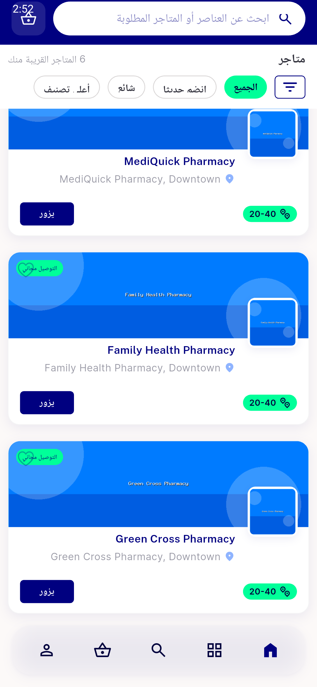
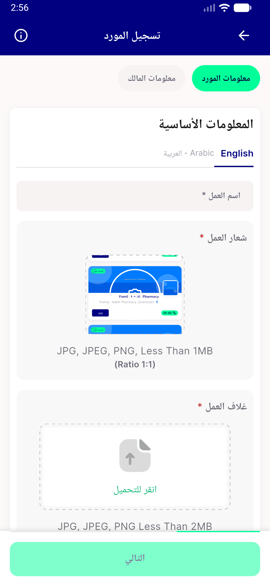
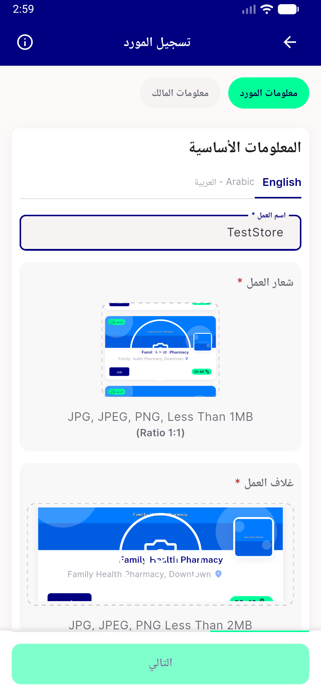
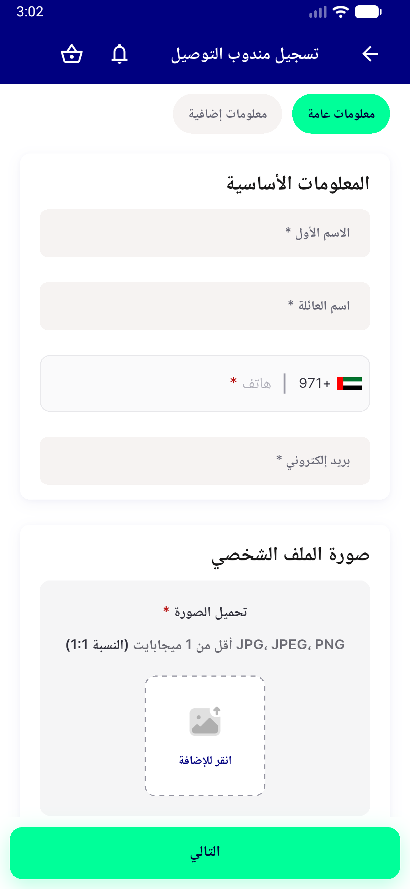
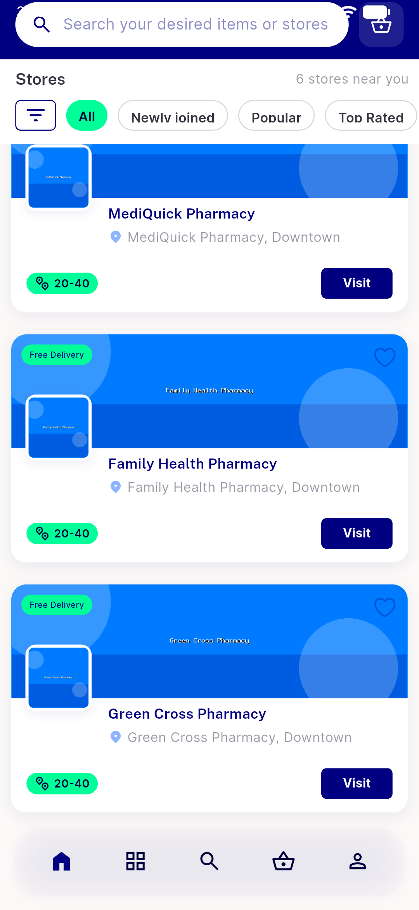
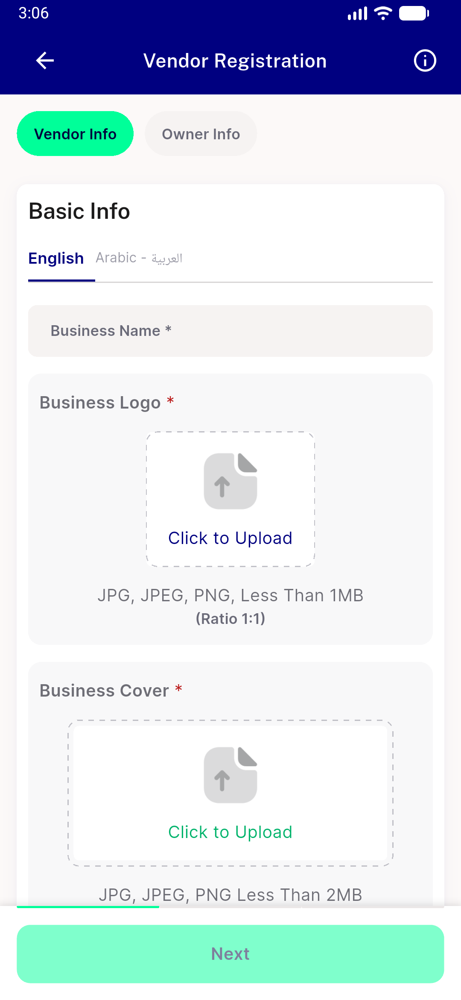
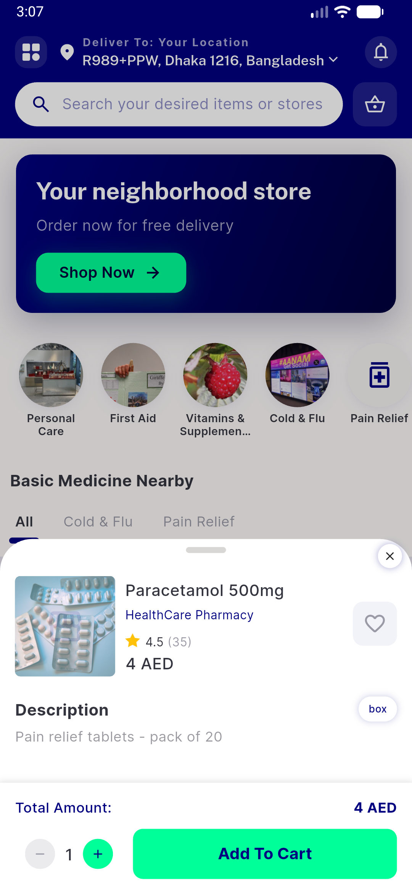
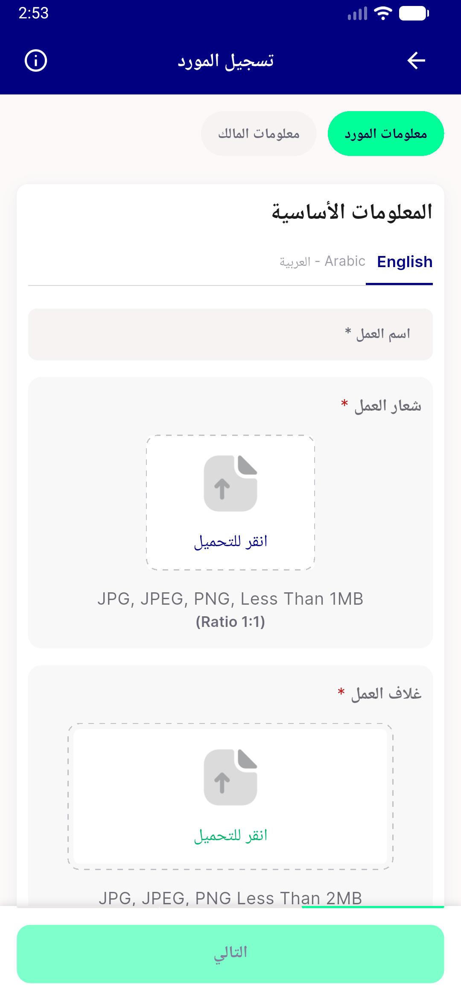

# QA Evidence — NEARS-743

**PASS — RTL directional-geometry fix: store-card logo mirrors RIGHT (no overlap), registration tab bars anchor RIGHT, LTR byte-identical (emulator-5560)**

**17 screenshot(s).** Click any thumbnail for full resolution.

<table>
<tr>
<td align="center" width="33%"> home ar</td>
<td align="center" width="33%"> home scrolled ar</td>
<td align="center" width="33%"> featured stores ar</td>
</tr>
<tr>
<td align="center" width="33%"> food scroll ar</td>
<td align="center" width="33%"> food newon ar</td>
<td align="center" width="33%"> pharmacy stores ar</td>
</tr>
<tr>
<td align="center" width="33%"> store reg step1 ar</td>
<td align="center" width="33%"> store reg logo preview ar</td>
<td align="center" width="33%"> store reg owner ar</td>
</tr>
<tr>
<td align="center" width="33%"> dm reg tabbar ar</td>
<td align="center" width="33%"> pharmacy stores en ltr</td>
<td align="center" width="33%"> store reg en ltr</td>
</tr>
<tr>
<td align="center" width="33%"> item bottomsheet en ltr</td>
<td align="center" width="33%"> AC1 storecard rtl logo right nooverlap</td>
<td align="center" width="33%"> AC2 dm reg tabbar rtl right</td>
</tr>
<tr>
<td align="center" width="33%"> AC2 store reg tabbars rtl right</td>
<td align="center" width="33%"> AC3 storecard ltr logo left nooverlap</td>
</tr>
</table>

### Other artifacts
- [`progress.md`](progress.md)

---
*From `nears/docs/qa-evidence/NEARS-743/` · public-repo scrub policy (no live secrets; verified clean).*
