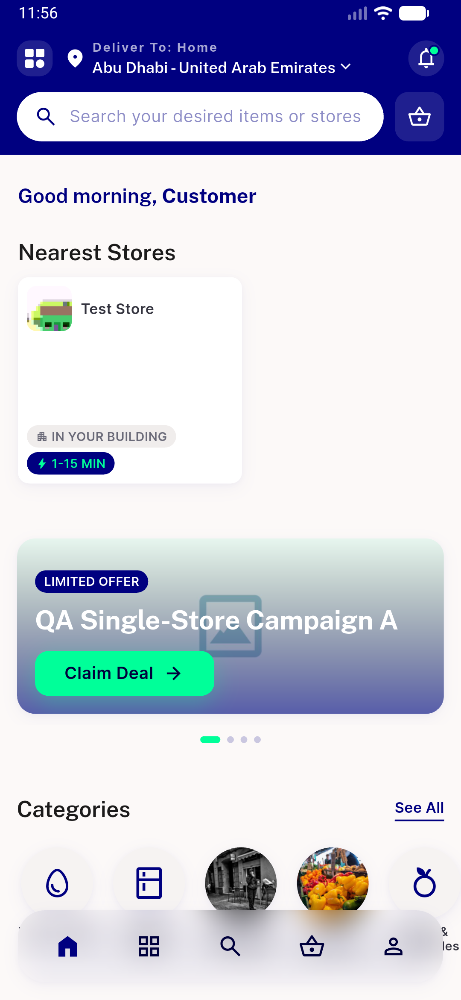

# QA Evidence — NEARS-746

**PASS — NEARS-746 tower analytics PII removal: view_tower_feed & select_tower_store carry zone_id (int) not tower_name, verified live on emulator-5560**

**1 screenshot(s).** Click any thumbnail for full resolution.

<table>
<tr>
<td align="center" width="33%"> ac1 tower feed nearest stores rail</td>
</tr>
</table>

### Other artifacts
- [`ac1-ac2-analytics-mirror.log`](ac1-ac2-analytics-mirror.log)

---
*From `nears/docs/qa-evidence/NEARS-746/` · public-repo scrub policy (no live secrets; verified clean).*
