# QA Evidence — NEARS-75

**13 screenshot(s).** Click any thumbnail for full resolution.

<table>
<tr>
<td align="center" width="33%"><a href="00-after-login.png">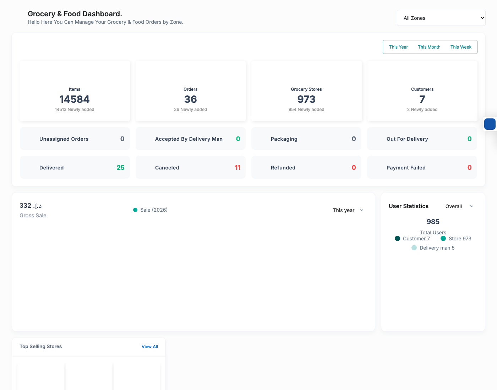</a> after login</td>
<td align="center" width="33%"><a href="ar-notification.png">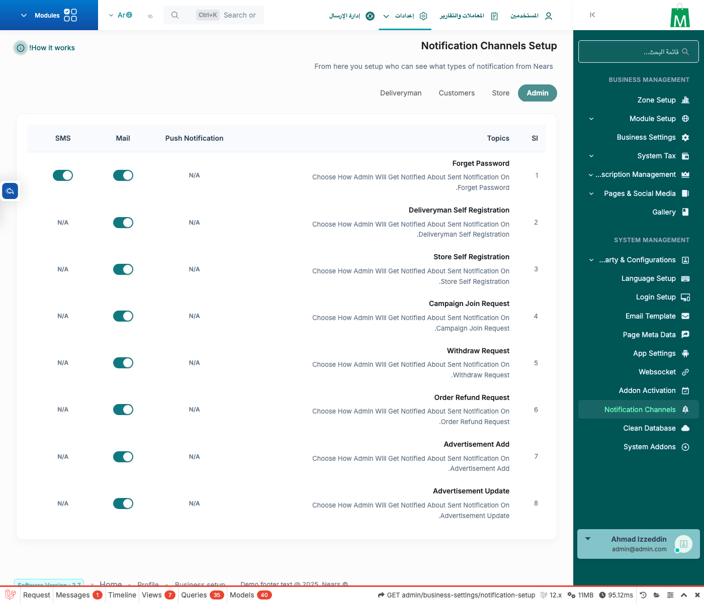</a> ar notification</td>
<td align="center" width="33%"><a href="ar-payment.png">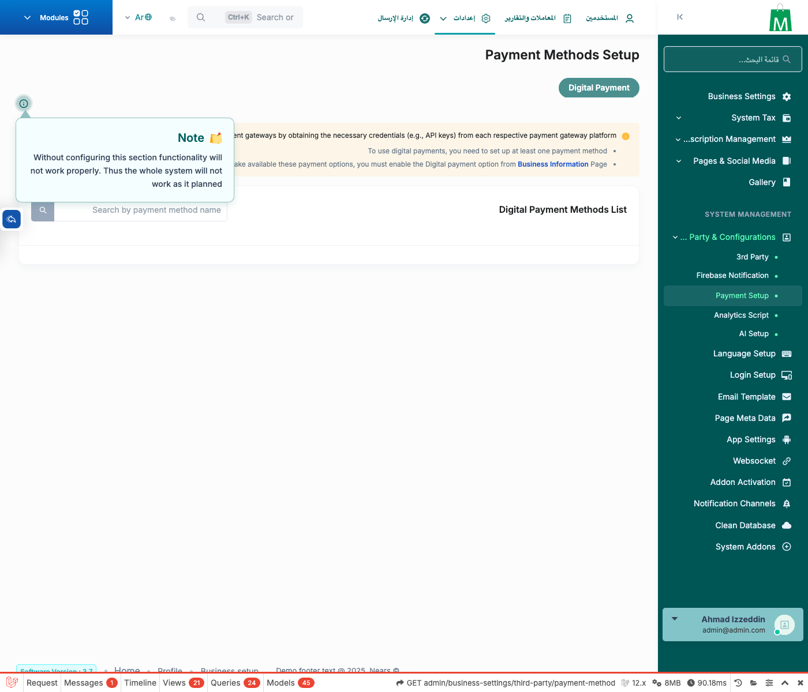</a> ar payment</td>
</tr>
<tr>
<td align="center" width="33%"><a href="ar-subscription.png">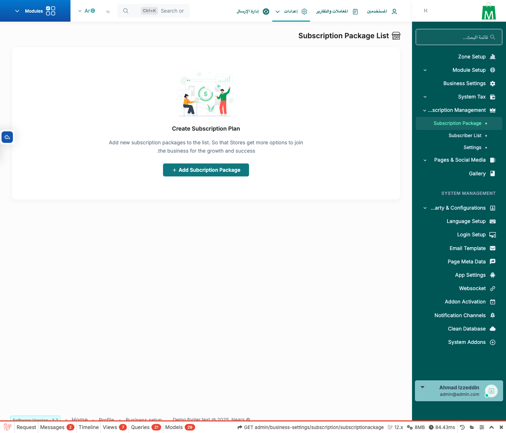</a> ar subscription</td>
<td align="center" width="33%"><a href="error-404.png">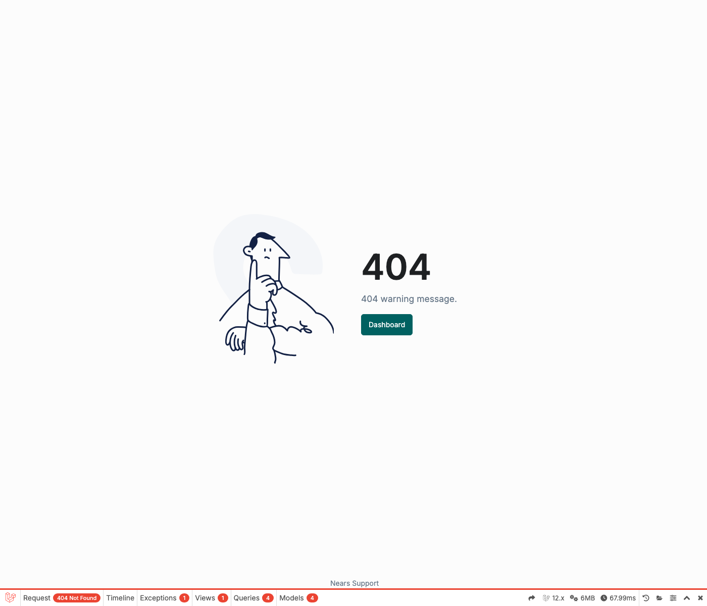</a> error 404</td>
<td align="center" width="33%"><a href="landing-download-dm.png">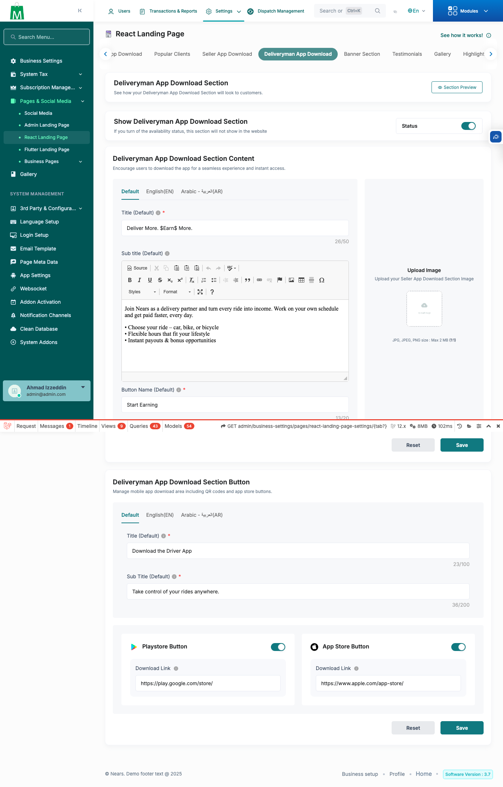</a> landing download dm</td>
</tr>
<tr>
<td align="center" width="33%"><a href="landing-download-seller.png">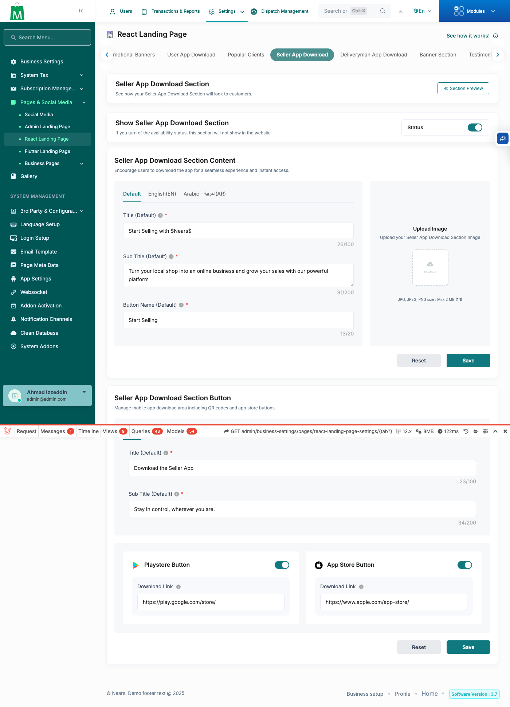</a> landing download seller</td>
<td align="center" width="33%"><a href="landing-download-user.png">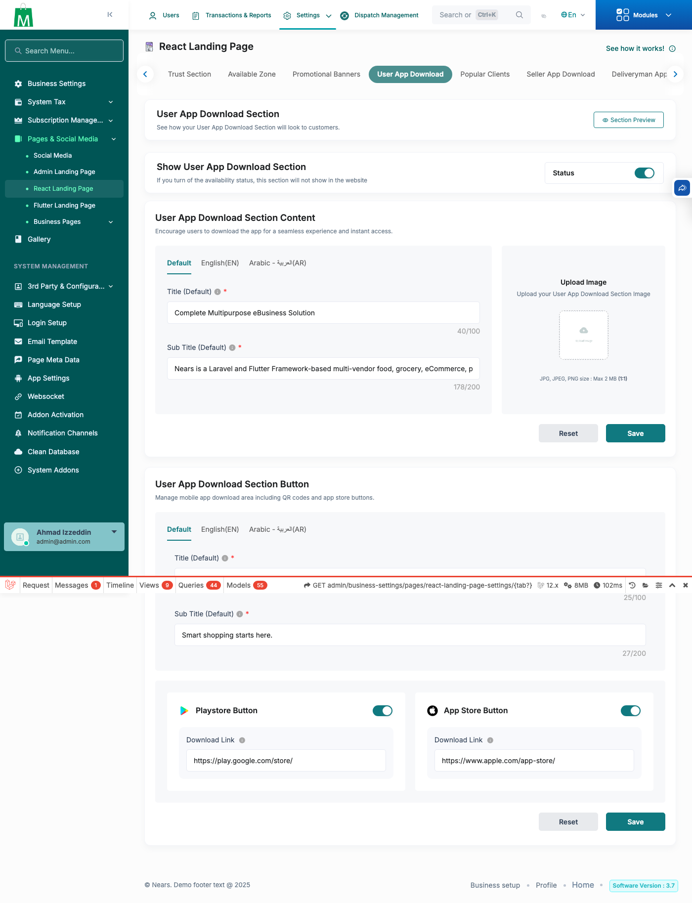</a> landing download user</td>
<td align="center" width="33%"><a href="landing-faq.png">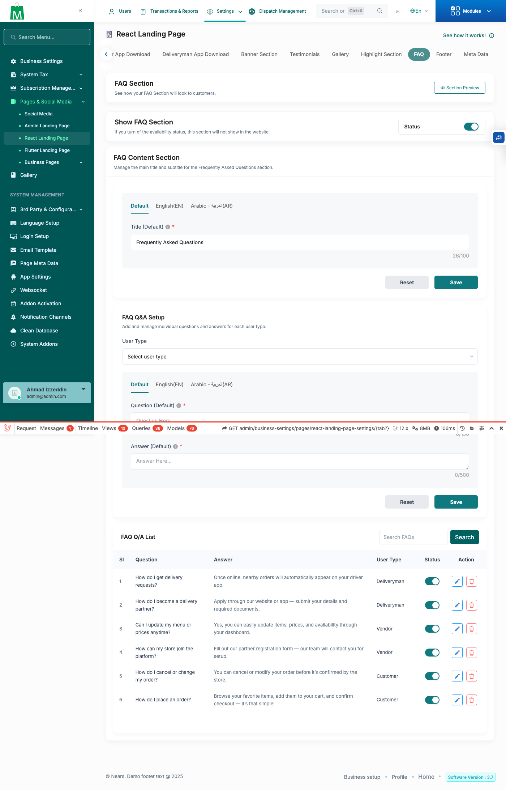</a> landing faq</td>
</tr>
<tr>
<td align="center" width="33%"><a href="landing-gallery.png">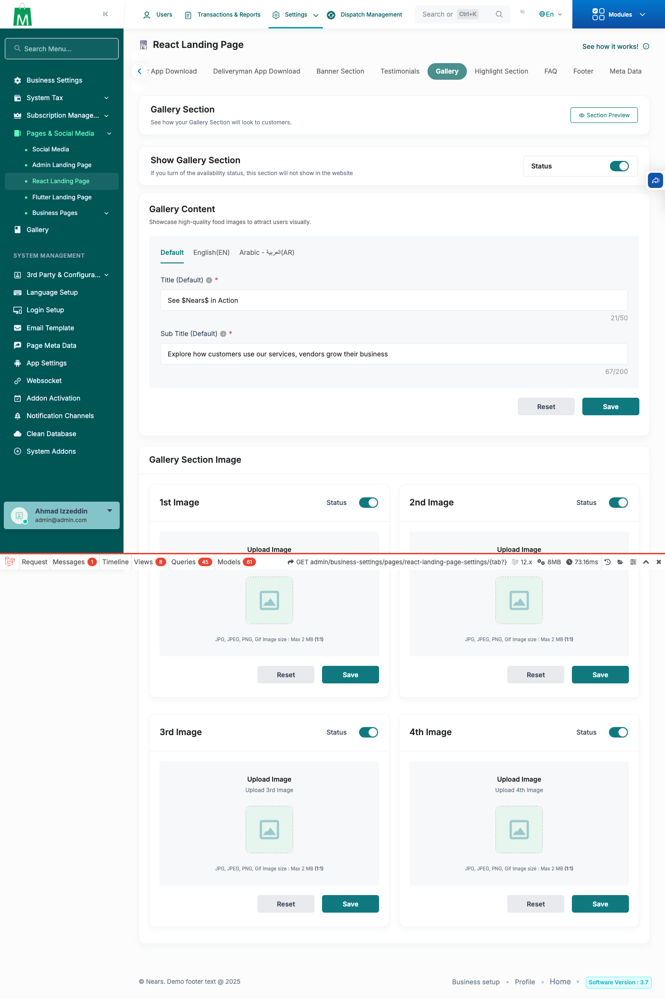</a> landing gallery</td>
<td align="center" width="33%"><a href="notification-setup.png">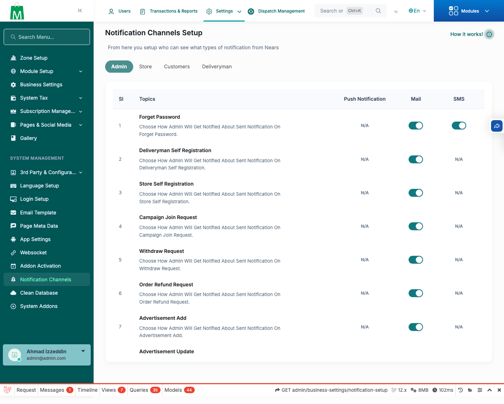</a> notification setup</td>
<td align="center" width="33%"><a href="payment-method.png">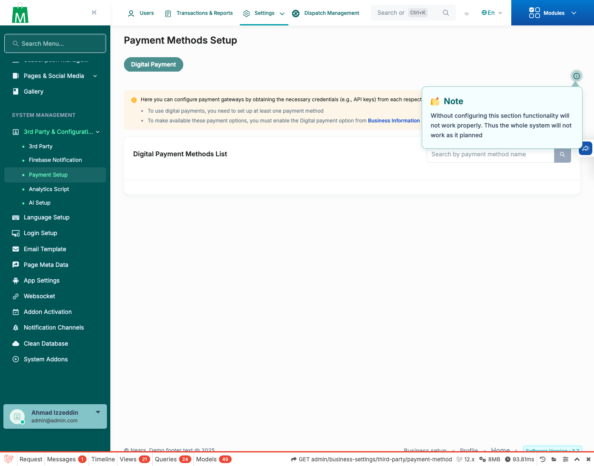</a> payment method</td>
</tr>
<tr>
<td align="center" width="33%"><a href="subscription-index.png">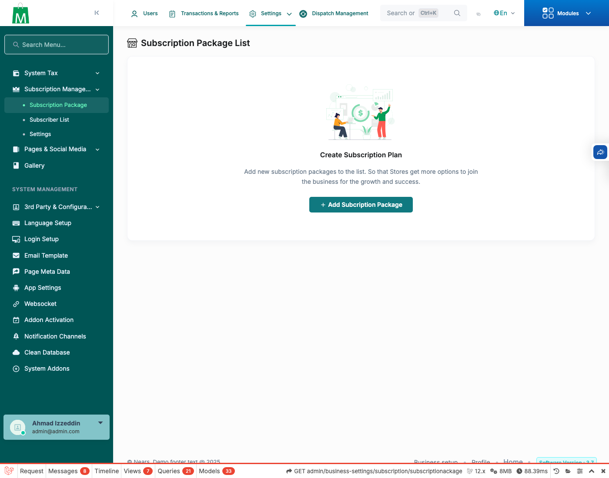</a> subscription index</td>
</tr>
</table>

### Other artifacts
- [`AC1-drivemond-translate-resolution.txt`](AC1-drivemond-translate-resolution.txt)

---
*From `nears/docs/qa-evidence/NEARS-75/` · public-repo scrub policy (no live secrets; verified clean).*
