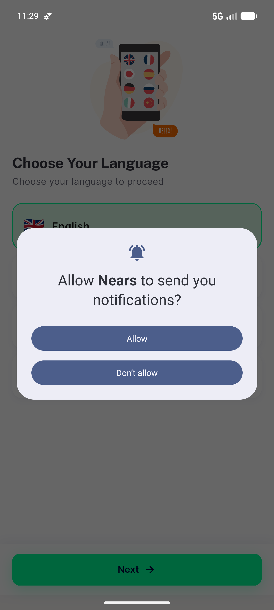
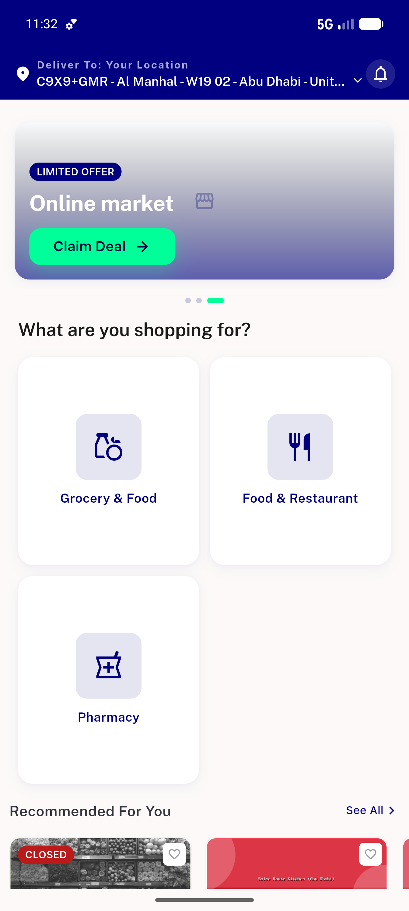
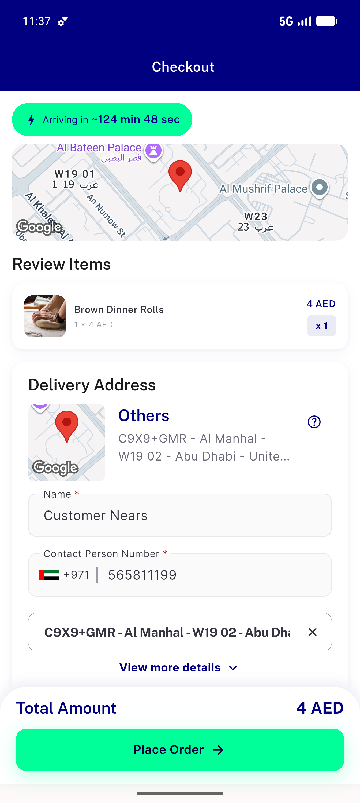
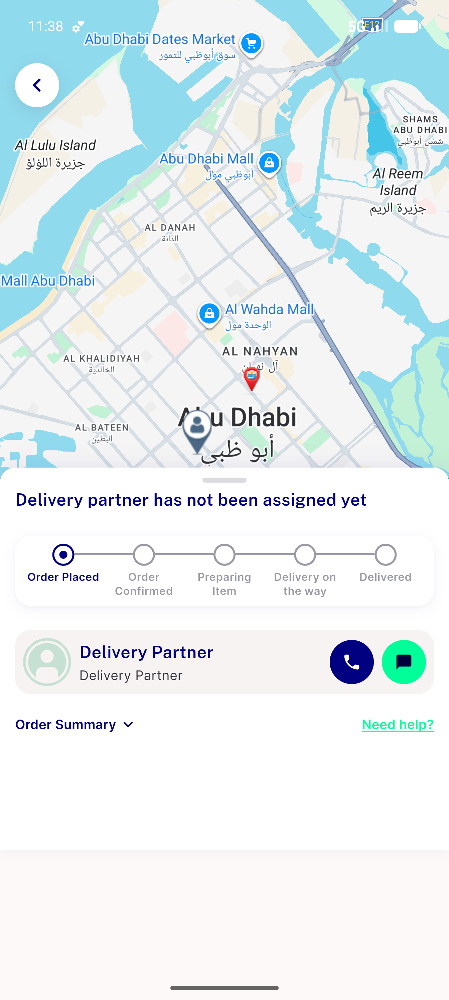
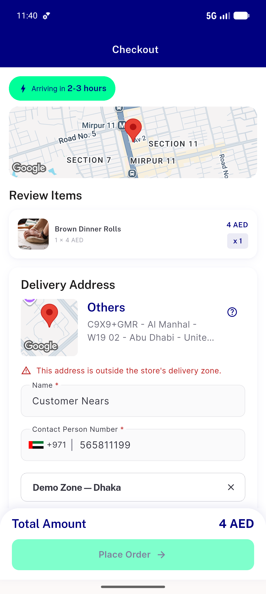
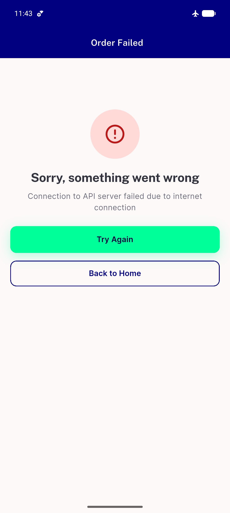
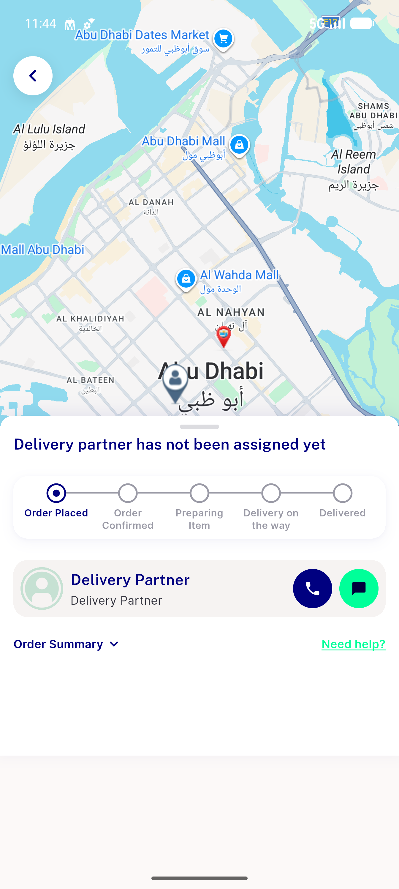

# QA Evidence — NEARS-752

**PASS - checkout zone transport-failure fix: in-zone places (169), transport-fail not sticky (recovery->170), out-of-zone blocks**

**7 screenshot(s).** Click any thumbnail for full resolution.

<table>
<tr>
<td align="center" width="33%"> launch state</td>
<td align="center" width="33%"> home loggedin abudhabi</td>
<td align="center" width="33%"> checkout inzone abudhabi</td>
</tr>
<tr>
<td align="center" width="33%"> order placed inzone AC3</td>
<td align="center" width="33%"> outofzone warning regression</td>
<td align="center" width="33%"> transport fail not zoneblock AC1</td>
</tr>
<tr>
<td align="center" width="33%"> recovery order placed AC1</td>
</tr>
</table>

### Other artifacts
- [`progress.md`](progress.md)

---
*From `nears/docs/qa-evidence/NEARS-752/` · public-repo scrub policy (no live secrets; verified clean).*
