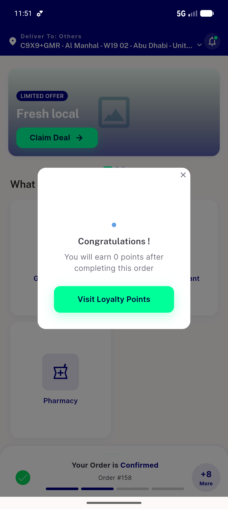
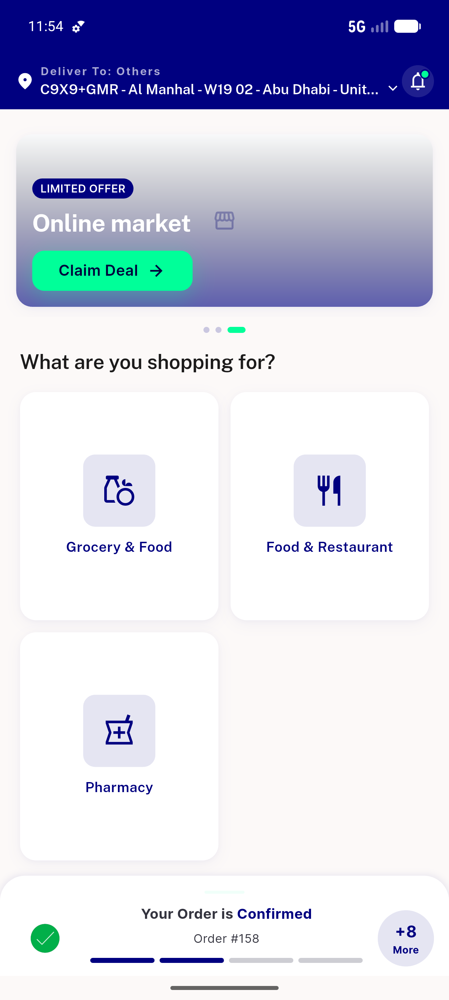
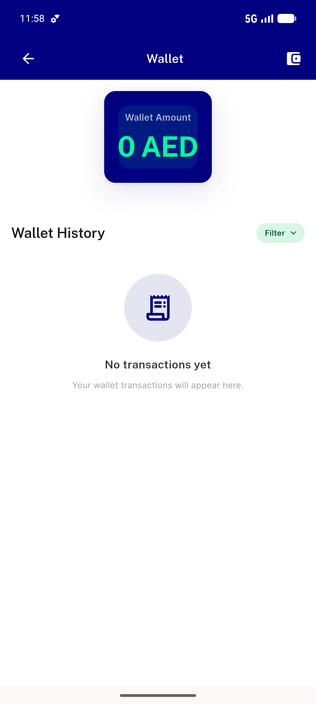
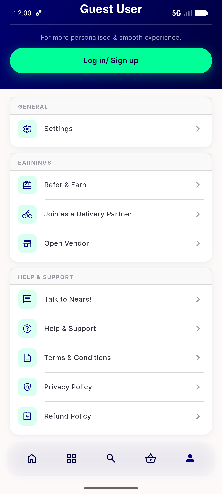

# QA Evidence — NEARS-758

**PASS — wallet callback nonce in secure storage (AC1 live+test), dedup preserved (AC2 test-substantiated, gateway absent), logout clears (AC3 live+test); emulator-5556**

**4 screenshot(s).** Click any thumbnail for full resolution.

<table>
<tr>
<td align="center" width="33%"> current</td>
<td align="center" width="33%"> home navprobe</td>
<td align="center" width="33%"> wallet screen</td>
</tr>
<tr>
<td align="center" width="33%"> post logout guest</td>
</tr>
</table>

### Other artifacts
- [`ac1-ac3-shared-prefs.log`](ac1-ac3-shared-prefs.log)

---
*From `nears/docs/qa-evidence/NEARS-758/` · public-repo scrub policy (no live secrets; verified clean).*
