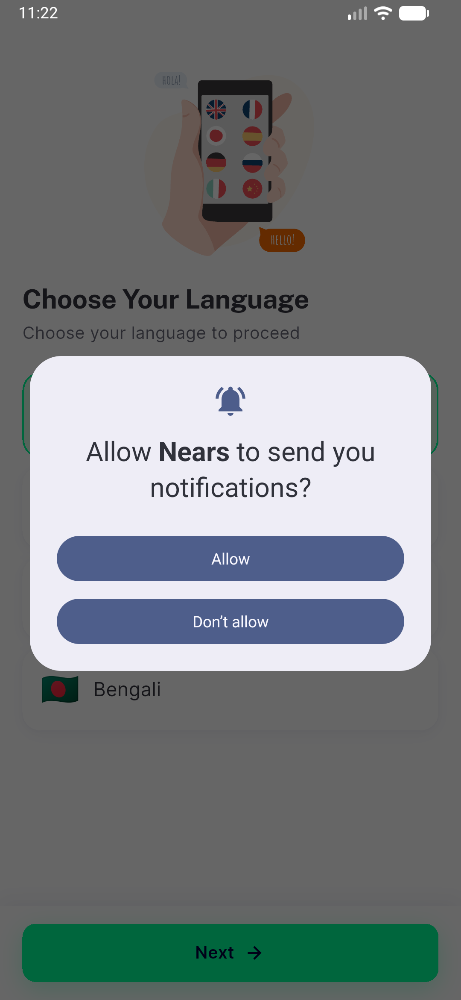
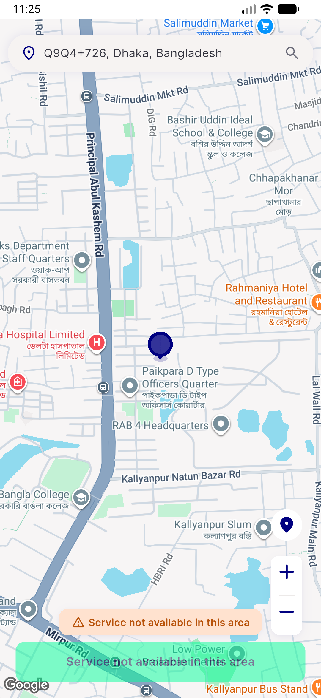
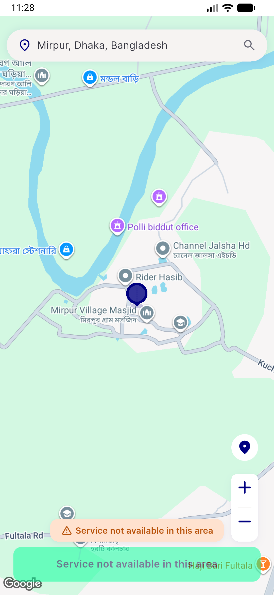
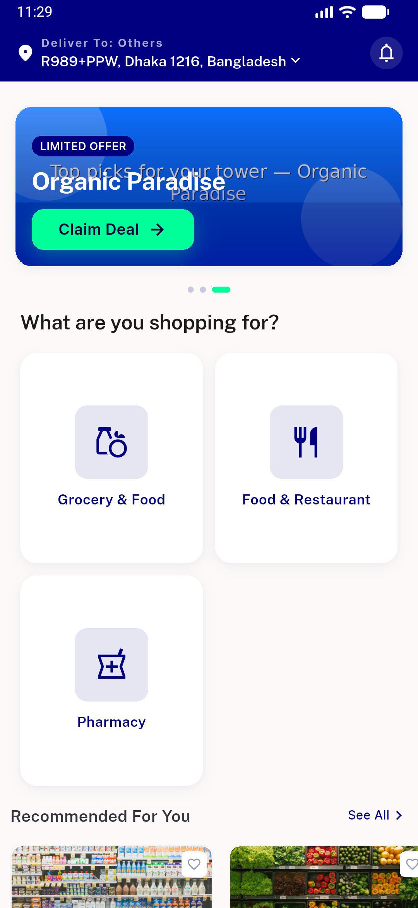
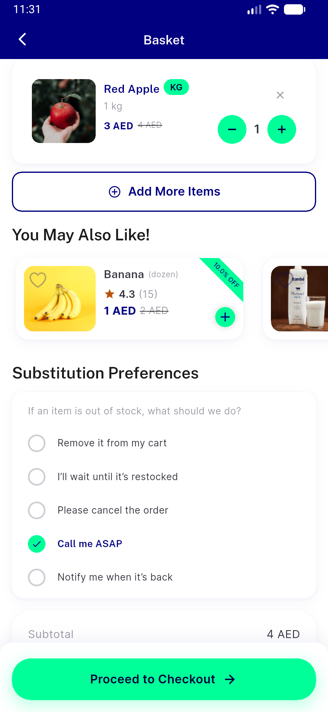
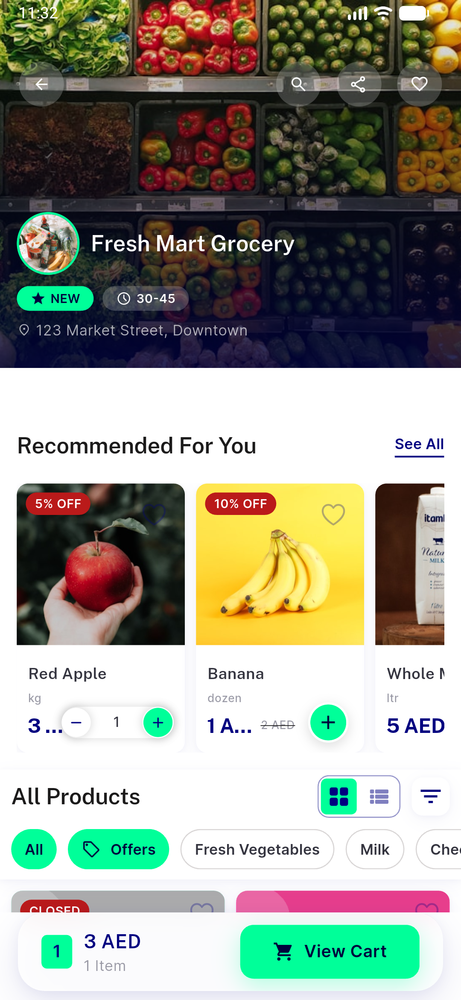

# QA Evidence — NEARS-759

**PASS — Add More Items opens store exactly once; view_store analytics fires once/tap; forcefullySetModule applies; Back returns to Cart (emulator-5560)**

**8 screenshot(s).** Click any thumbnail for full resolution.

<table>
<tr>
<td align="center" width="33%"> current</td>
<td align="center" width="33%"> location</td>
<td align="center" width="33%"> location full</td>
</tr>
<tr>
<td align="center" width="33%"> map fab</td>
<td align="center" width="33%"> home</td>
<td align="center" width="33%"> basket</td>
</tr>
<tr>
<td align="center" width="33%"> store after cta</td>
<td align="center" width="33%"> back to basket</td>
</tr>
</table>

### Other artifacts
- [`ac-proof-cta-single-nav.log`](ac-proof-cta-single-nav.log)
- [`bug-getzoneid-404.log`](bug-getzoneid-404.log)
- [`bug-signin-1px-overflow.log`](bug-signin-1px-overflow.log)

---
*From `nears/docs/qa-evidence/NEARS-759/` · public-repo scrub policy (no live secrets; verified clean).*
