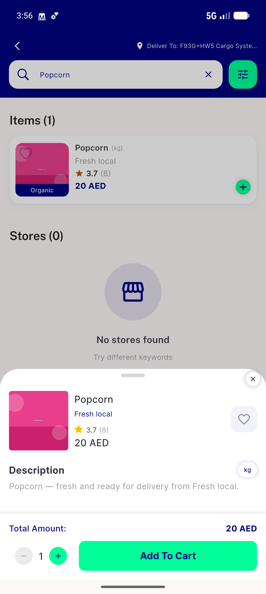

# QA Evidence — NEARS-761

**PASS — dead ItemDetailsScreen deletion: item flows intact (home/store/search->sheet), deep-link->sheet, nothing dead-links; AC2 endless-shimmer pre-existing (regression)**

**6 screenshot(s).** Click any thumbnail for full resolution.

<table>
<tr>
<td align="center" width="33%"> ac1a home rail item sheet</td>
<td align="center" width="33%"> ac1b store item sheet</td>
<td align="center" width="33%"> ac2 error retry settled</td>
</tr>
<tr>
<td align="center" width="33%"> ac2 error retry state</td>
<td align="center" width="33%"> ac3 deeplink item sheet</td>
<td align="center" width="33%"> ac4 search item sheet</td>
</tr>
</table>

### Other artifacts
- [`bug-item-sheet-endless-shimmer-on-failure.log`](bug-item-sheet-endless-shimmer-on-failure.log)
- [`progress.md`](progress.md)

---
*From `nears/docs/qa-evidence/NEARS-761/` · public-repo scrub policy (no live secrets; verified clean).*
