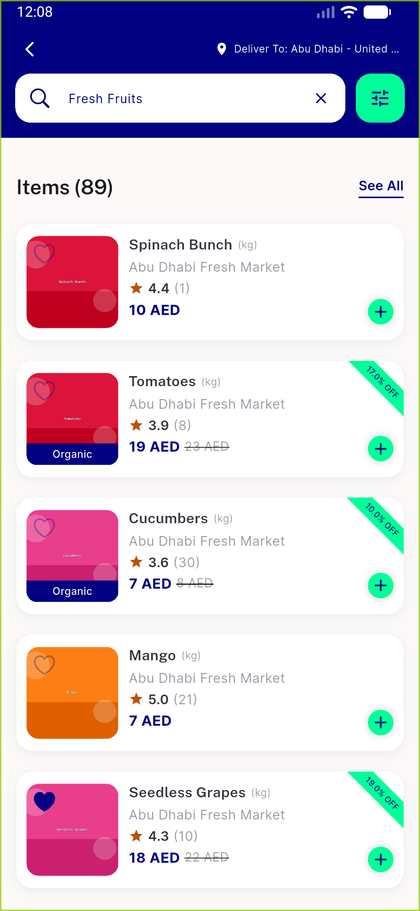

# QA Evidence — NEARS-770

**PASS — NEARS-770 deep-link/api-client PII: no raw URI/query/referral-code in any log or Crashlytics record (emulator-5560)**

**3 screenshot(s).** Click any thumbnail for full resolution.

<table>
<tr>
<td align="center" width="33%"> ac1 valid deeplink navigated</td>
<td align="center" width="33%"> ac2 app alive after malformed</td>
<td align="center" width="33%"> ac3 search unified path only</td>
</tr>
</table>

### Other artifacts
- [`ac1-deeplink-info.log`](ac1-deeplink-info.log)
- [`ac2-malformed-onError-fail.log`](ac2-malformed-onError-fail.log)
- [`ac3-net-path-only.log`](ac3-net-path-only.log)
- [`progress.md`](progress.md)

---
*From `nears/docs/qa-evidence/NEARS-770/` · public-repo scrub policy (no live secrets; verified clean).*
