# QA Evidence — NEARS-772

**PASS — i18n batch 772/773/777: bn+es backfill renders live, ar loads clean, 777 ar resolves**

**14 screenshot(s).** Click any thumbnail for full resolution.

<table>
<tr>
<td align="center" width="33%"><a href="ar-regression-onboarding.png">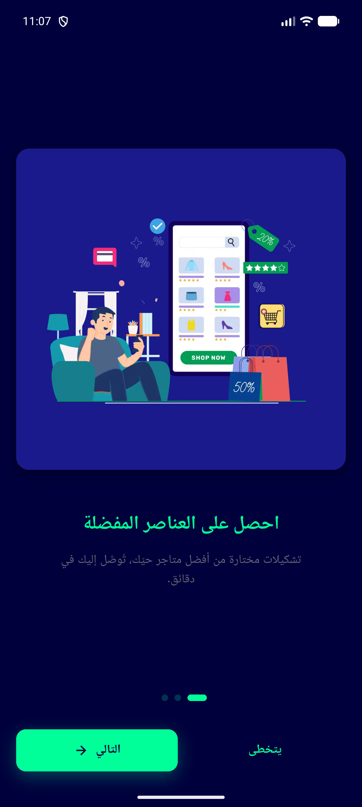</a> ar regression onboarding</td>
<td align="center" width="33%"><a href="bn-01-settings.png">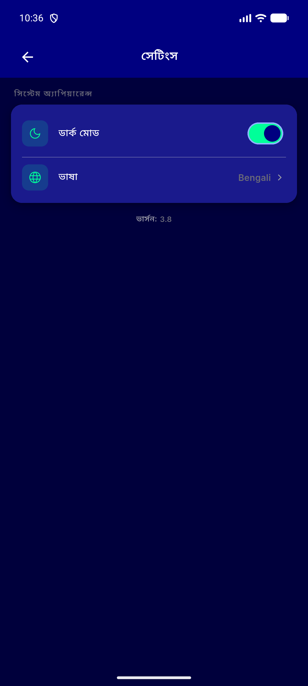</a> bn 01 settings</td>
<td align="center" width="33%"><a href="bn-02-login.png">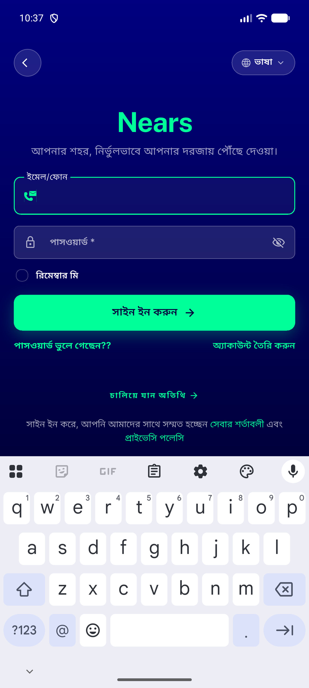</a> bn 02 login</td>
</tr>
<tr>
<td align="center" width="33%"><a href="bn-03-orders-ongoing-empty.png">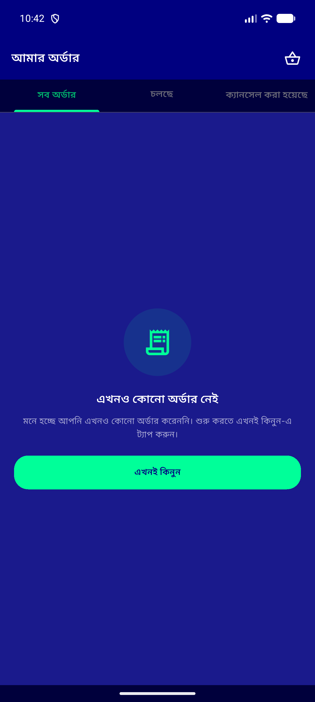</a> bn 03 orders ongoing empty</td>
<td align="center" width="33%"><a href="bn-04-orders-ongoing.png">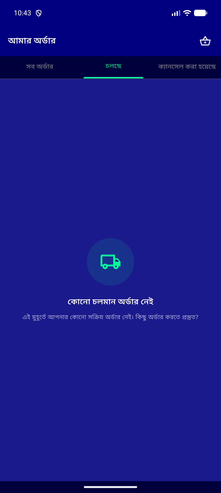</a> bn 04 orders ongoing</td>
<td align="center" width="33%"><a href="bn-05-orders-cancelled.png">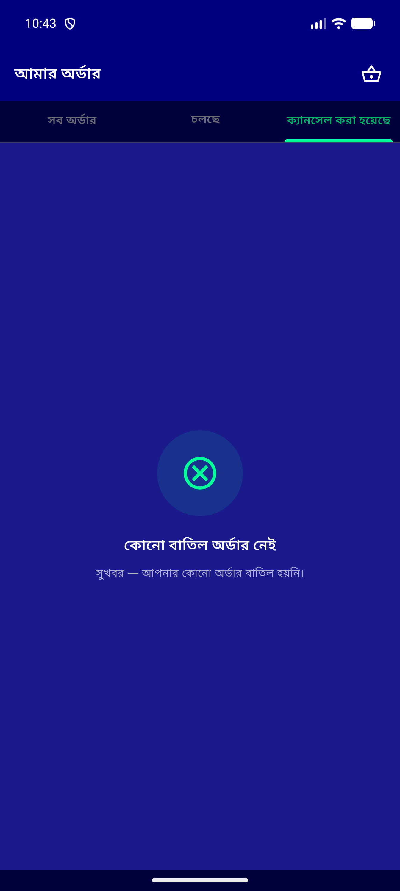</a> bn 05 orders cancelled</td>
</tr>
<tr>
<td align="center" width="33%"><a href="bn-06-store-closed-banner.png">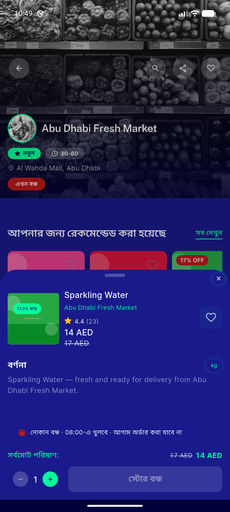</a> bn 06 store closed banner</td>
<td align="center" width="33%"><a href="es-01-settings.png">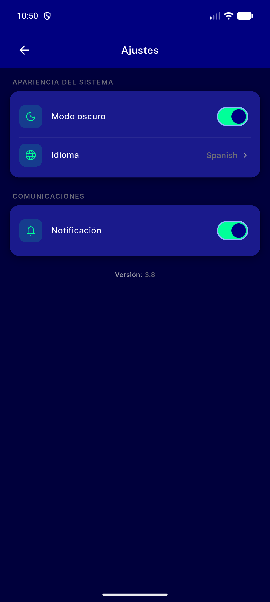</a> es 01 settings</td>
<td align="center" width="33%"> es 02 orders noorders</td>
</tr>
<tr>
<td align="center" width="33%"> es 03 orders ongoing</td>
<td align="center" width="33%"><a href="es-04-orders-cancelled.png">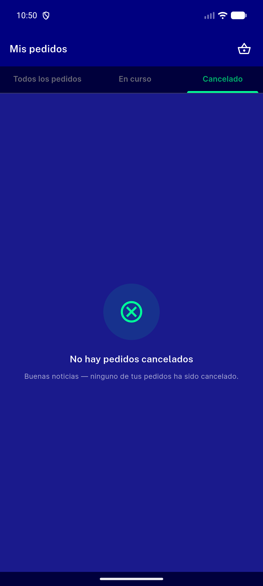</a> es 04 orders cancelled</td>
<td align="center" width="33%"><a href="es-05-store-closed-banner.png">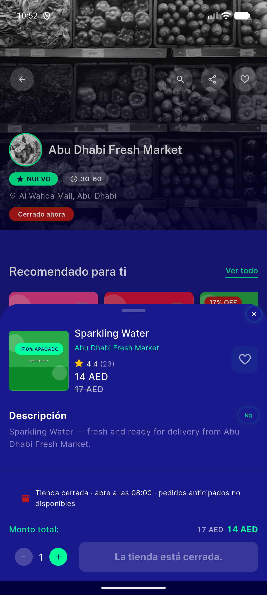</a> es 05 store closed banner</td>
</tr>
<tr>
<td align="center" width="33%"><a href="es-06-home.png">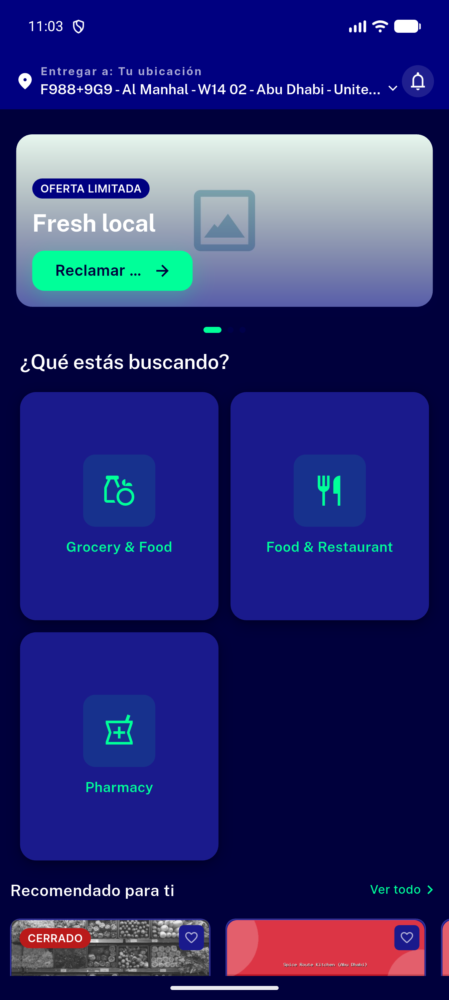</a> es 06 home</td>
<td align="center" width="33%"><a href="es-07-login.png">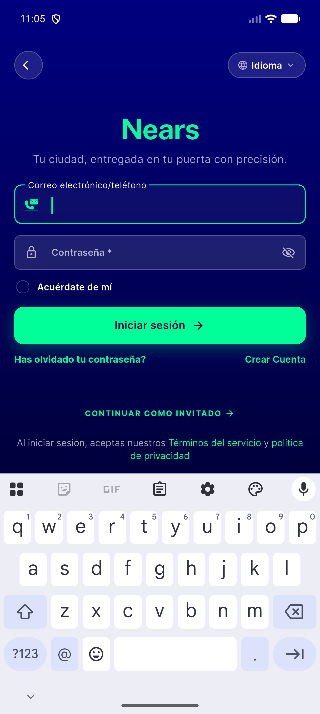</a> es 07 login</td>
</tr>
</table>

### Other artifacts
- [`777-ar-translator-verification.log`](777-ar-translator-verification.log)
- [`progress.md`](progress.md)

---
*From `nears/docs/qa-evidence/NEARS-772/` · public-repo scrub policy (no live secrets; verified clean).*
