# QA Evidence — NEARS-778

**PASS — orphan-widget sweep: all blast-radius screens render, twin + NearsBottomNav survive (emulator-5560)**

**13 screenshot(s).** Click any thumbnail for full resolution.

<table>
<tr>
<td align="center" width="33%"><a href="01-boot.png">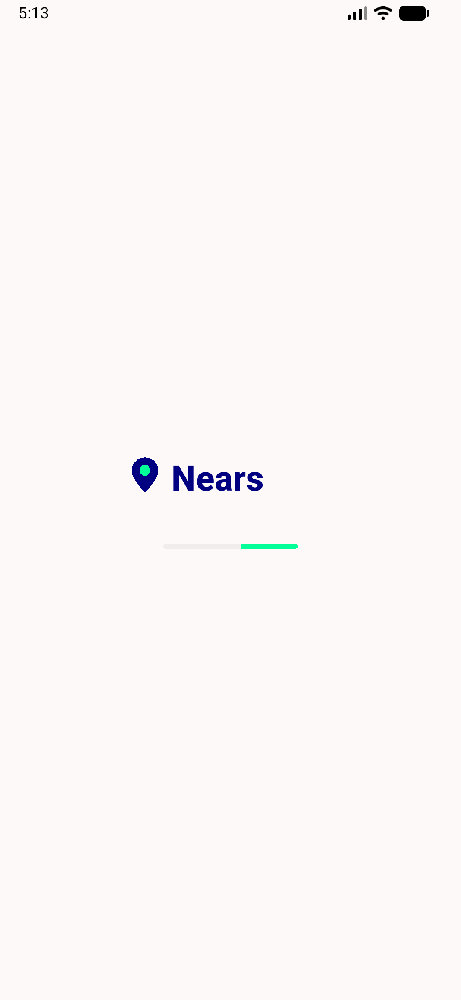</a> boot</td>
<td align="center" width="33%"><a href="02-sector-landing.png">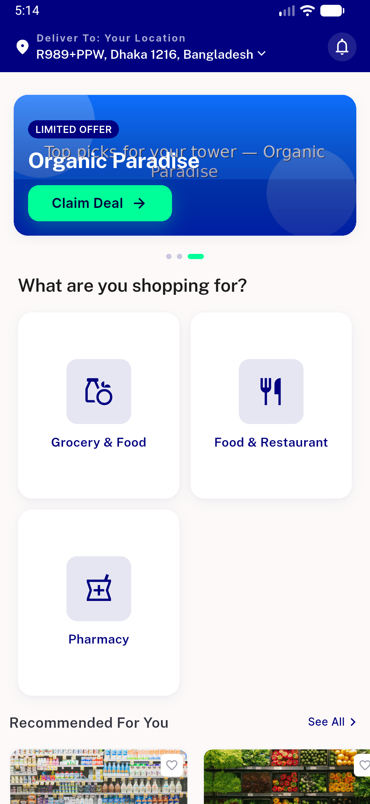</a> sector landing</td>
<td align="center" width="33%"><a href="03-pharmacy-home.png">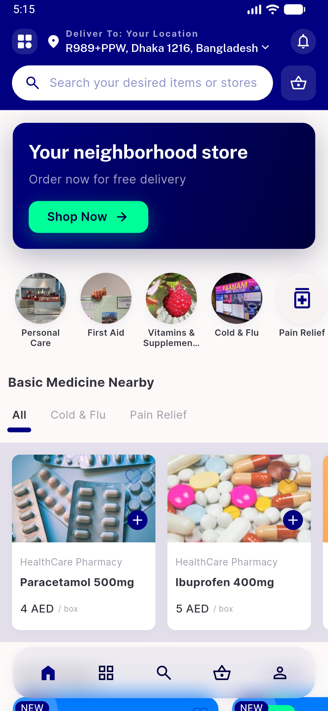</a> pharmacy home</td>
</tr>
<tr>
<td align="center" width="33%"><a href="04-pharmacy-painrelief-tab.png">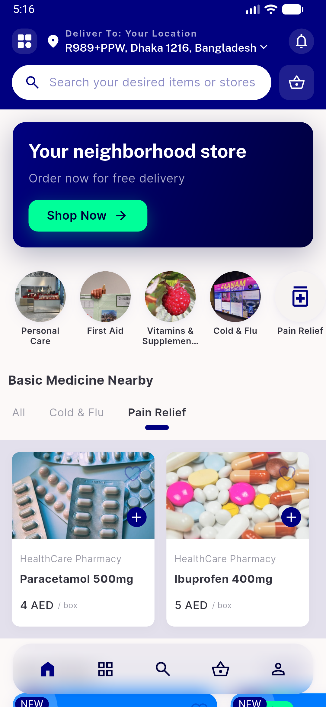</a> pharmacy painrelief tab</td>
<td align="center" width="33%"><a href="05-pharmacy-coldflu-tab.png">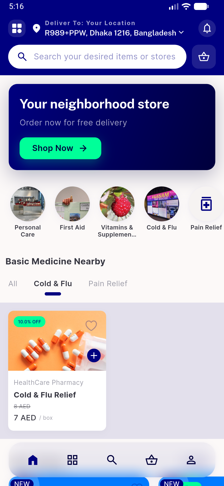</a> pharmacy coldflu tab</td>
<td align="center" width="33%"><a href="06-grocery-home.png">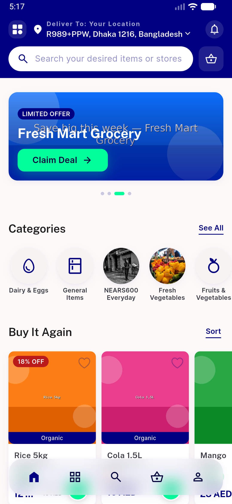</a> grocery home</td>
</tr>
<tr>
<td align="center" width="33%"><a href="07-food-home.png">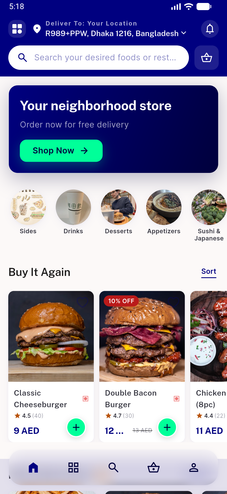</a> food home</td>
<td align="center" width="33%"><a href="08-cart-badge.png">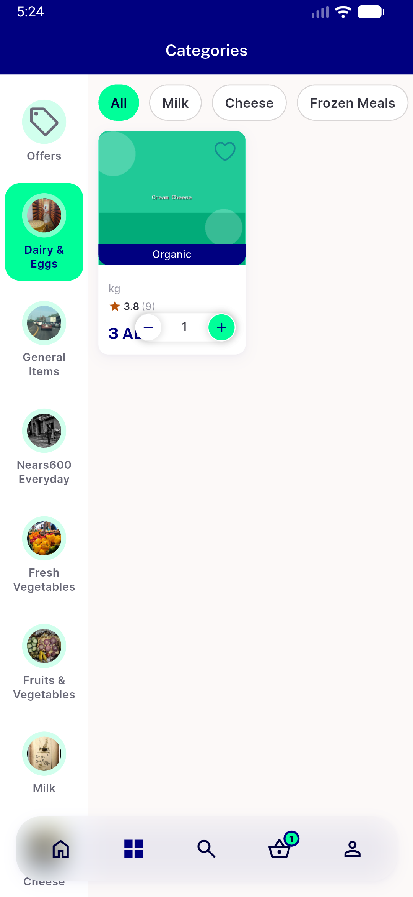</a> cart badge</td>
<td align="center" width="33%"><a href="09-login-state.png">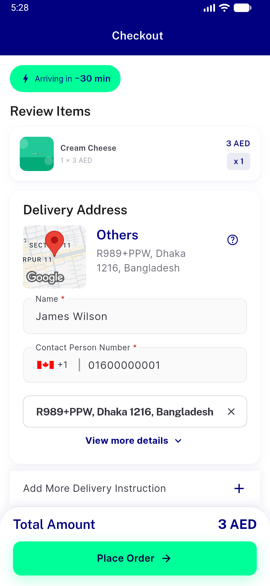</a> login state</td>
</tr>
<tr>
<td align="center" width="33%"><a href="10-order-detail-tracking.png">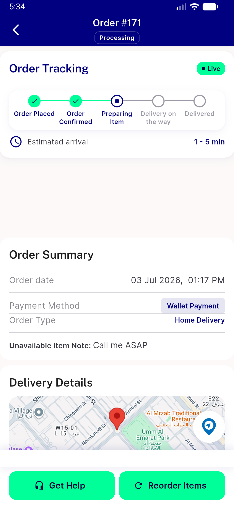</a> order detail tracking</td>
<td align="center" width="33%"><a href="11-store-profile.png">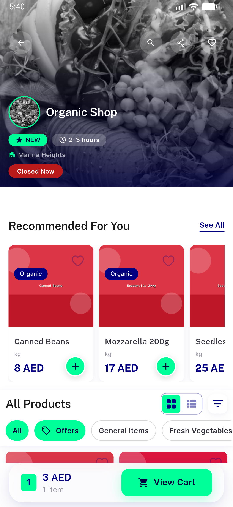</a> store profile</td>
<td align="center" width="33%"><a href="12-rtl-menu.png">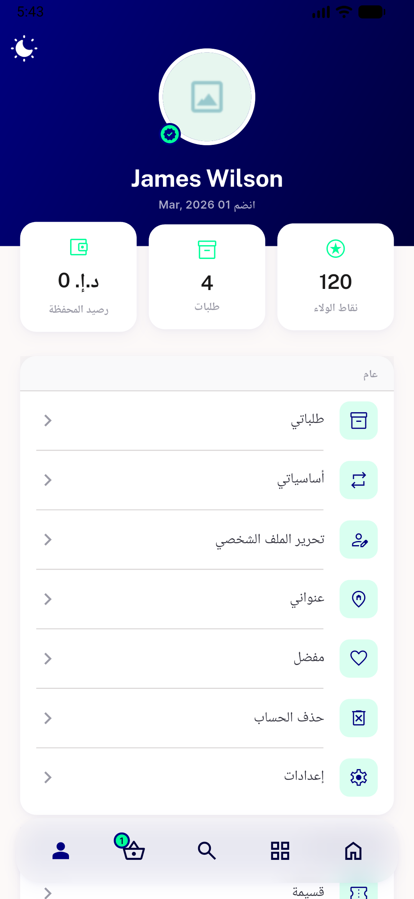</a> rtl menu</td>
</tr>
<tr>
<td align="center" width="33%"><a href="13-rtl-home.png">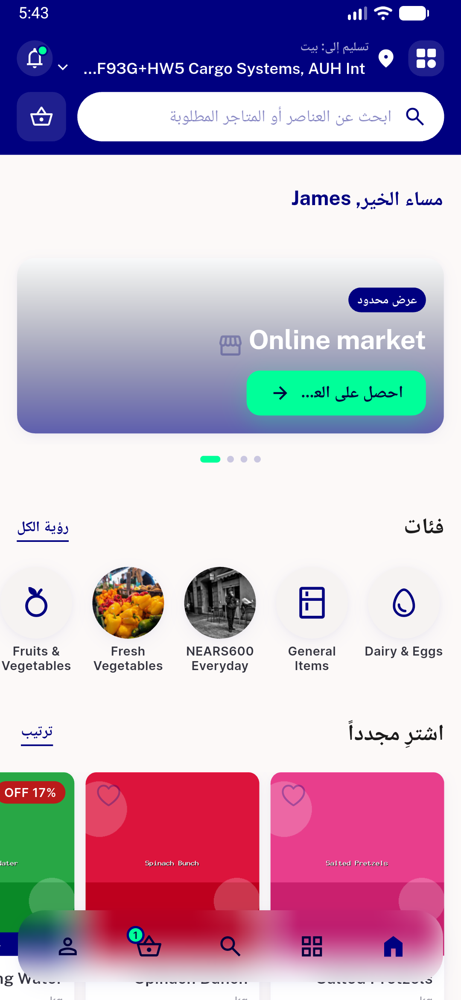</a> rtl home</td>
</tr>
</table>

### Other artifacts
- [`progress.md`](progress.md)

---
*From `nears/docs/qa-evidence/NEARS-778/` · public-repo scrub policy (no live secrets; verified clean).*
