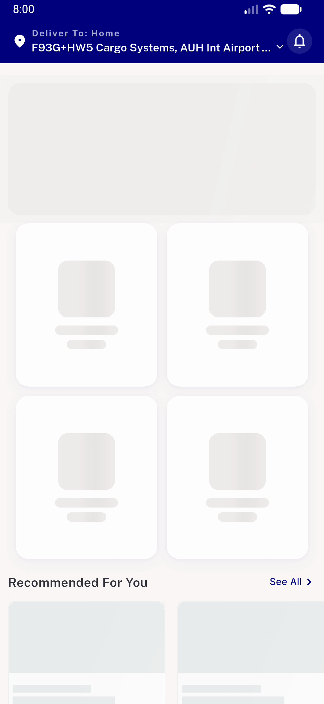
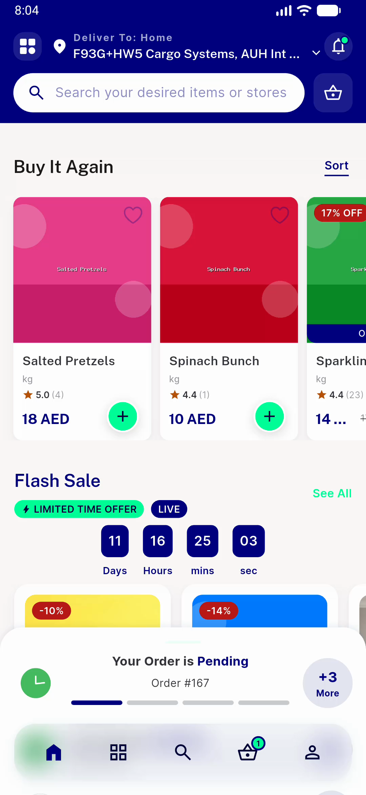
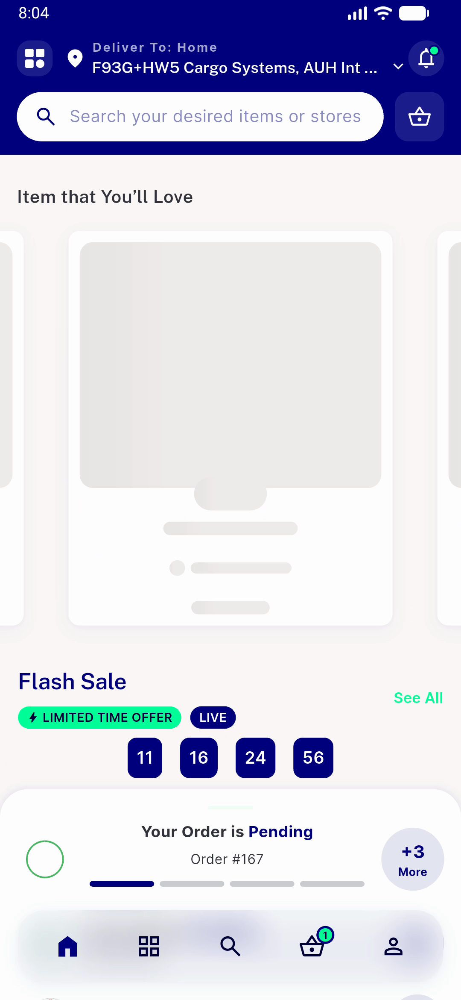
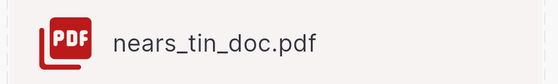

# QA Evidence — NEARS-779

**PASS — Batch B (781/786/779) token-hygiene + F1 coherent shimmer; light mode; emulator-5560**

**5 screenshot(s).** Click any thumbnail for full resolution.

<table>
<tr>
<td align="center" width="33%"> AC3 home skeleton live</td>
<td align="center" width="33%"> AC4 item love content</td>
<td align="center" width="33%"> AC4 item love shimmer coherent</td>
</tr>
<tr>
<td align="center" width="33%"> AC1 tin pdf icon brand red</td>
<td align="center" width="33%"> AC2 staples fab navy on mint</td>
</tr>
</table>

---
*From `nears/docs/qa-evidence/NEARS-779/` · public-repo scrub policy (no live secrets; verified clean).*
