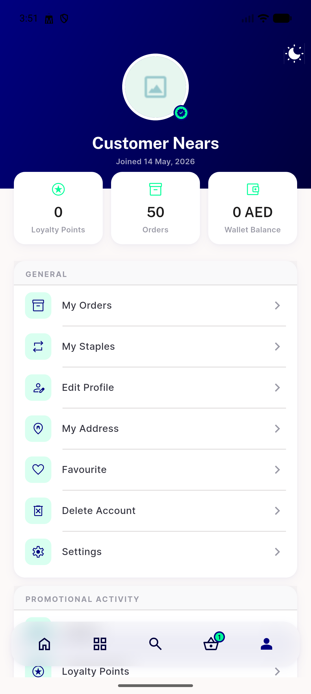
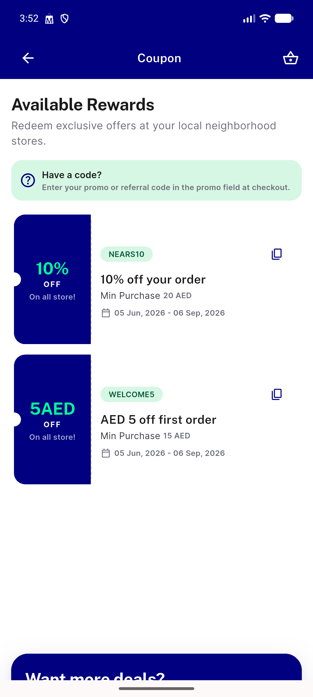
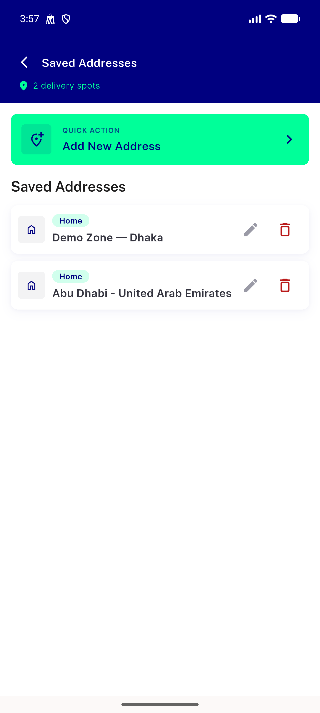
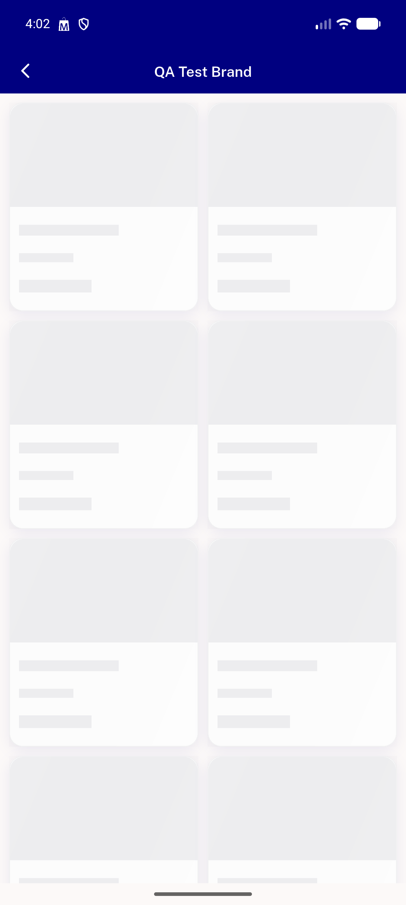
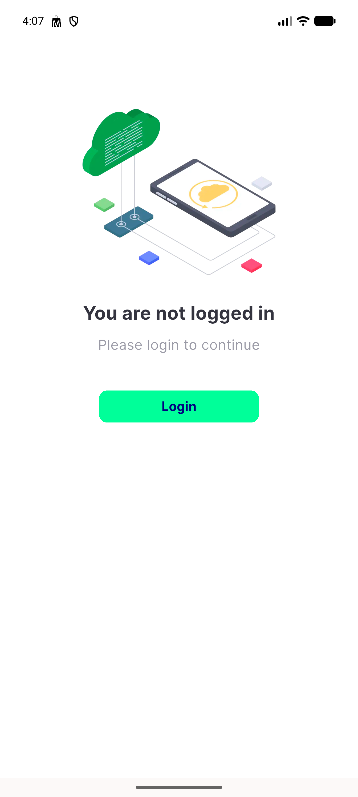
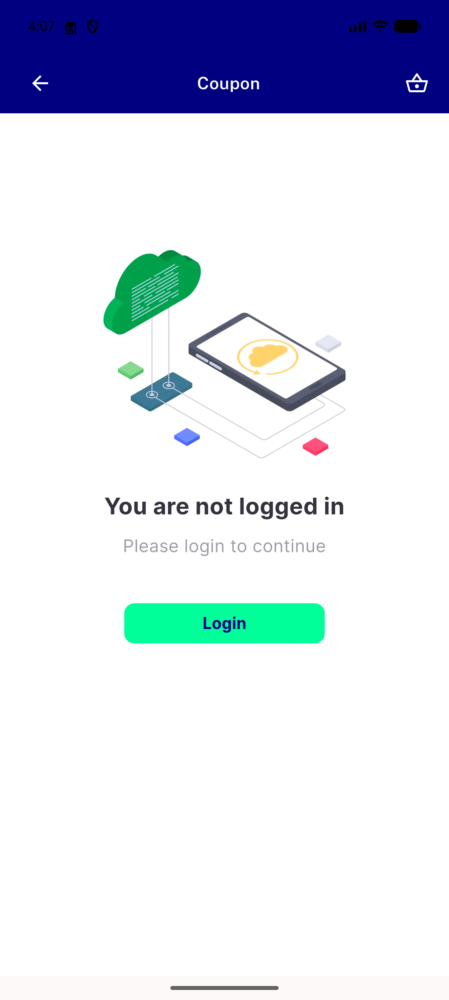
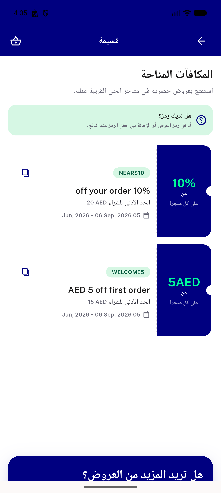

# QA Evidence — NEARS-780

**PASS — dispose ScrollController hygiene: coupon/address/brands survive repeated revisit, no dispose assertions, light mode, emulator-5558**

**7 screenshot(s).** Click any thumbnail for full resolution.

<table>
<tr>
<td align="center" width="33%"> profile loggedin</td>
<td align="center" width="33%"> ac1 coupon list</td>
<td align="center" width="33%"> ac2 address list</td>
</tr>
<tr>
<td align="center" width="33%"> ac3 brandsitem forced</td>
<td align="center" width="33%"> ac4 address loggedout</td>
<td align="center" width="33%"> ac4 coupon loggedout</td>
</tr>
<tr>
<td align="center" width="33%"> ac4 coupon rtl arabic</td>
</tr>
</table>

---
*From `nears/docs/qa-evidence/NEARS-780/` · public-repo scrub policy (no live secrets; verified clean).*
