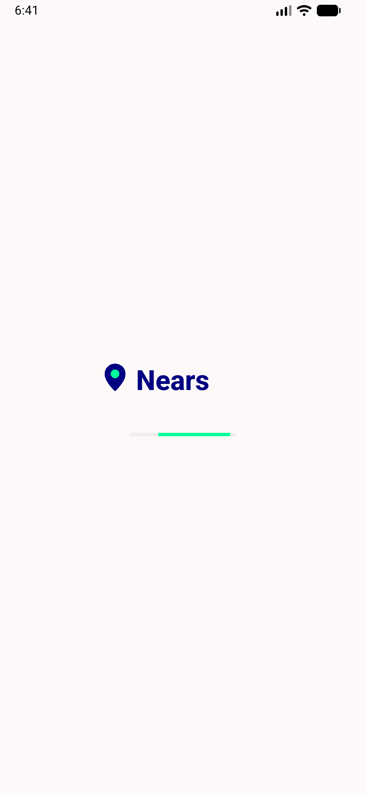
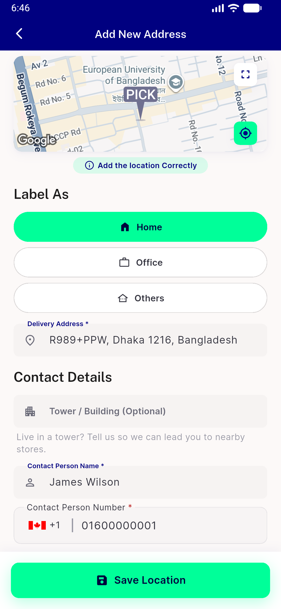
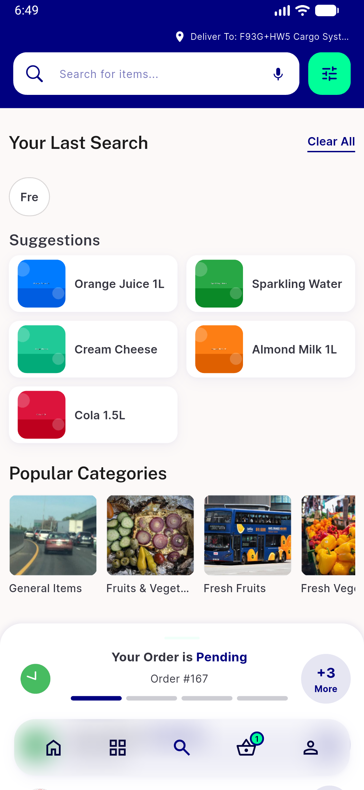

# QA Evidence — NEARS-782

**PASS — 782 elev1Up shadow + 783 whiteGlass fill render identical, no crash (emulator-5560)**

**4 screenshot(s).** Click any thumbnail for full resolution.

<table>
<tr>
<td align="center" width="33%"> launch</td>
<td align="center" width="33%"> add address sticky bar</td>
<td align="center" width="33%"> 783 search viewcart bar</td>
</tr>
<tr>
<td align="center" width="33%"> 783 store detail viewcart bar</td>
</tr>
</table>

### Other artifacts
- [`progress.md`](progress.md)

---
*From `nears/docs/qa-evidence/NEARS-782/` · public-repo scrub policy (no live secrets; verified clean).*
