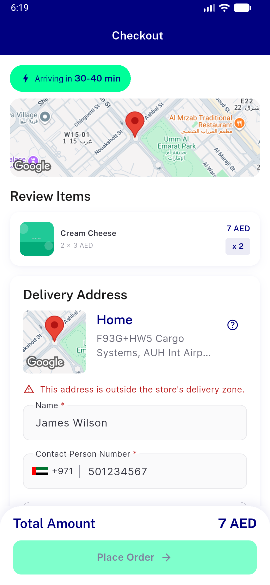
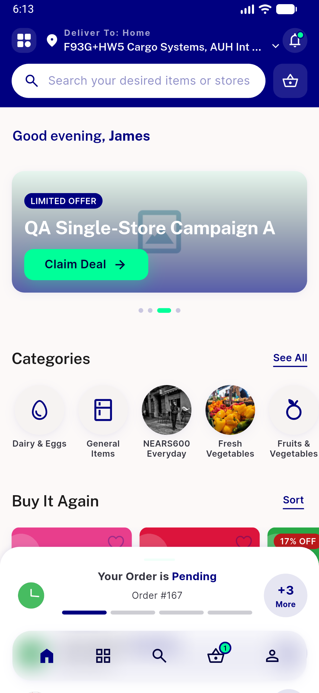
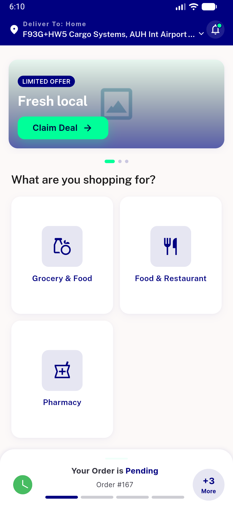
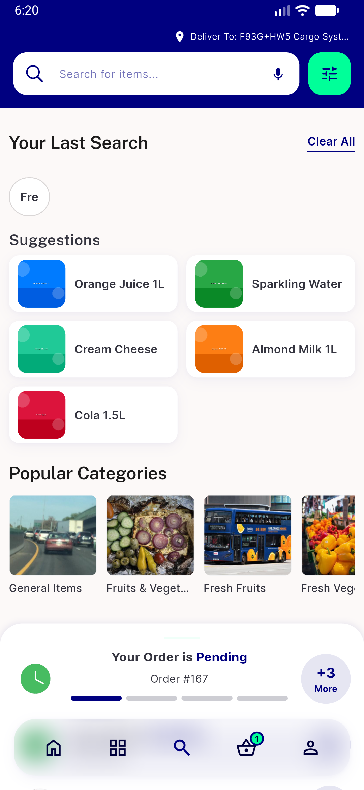
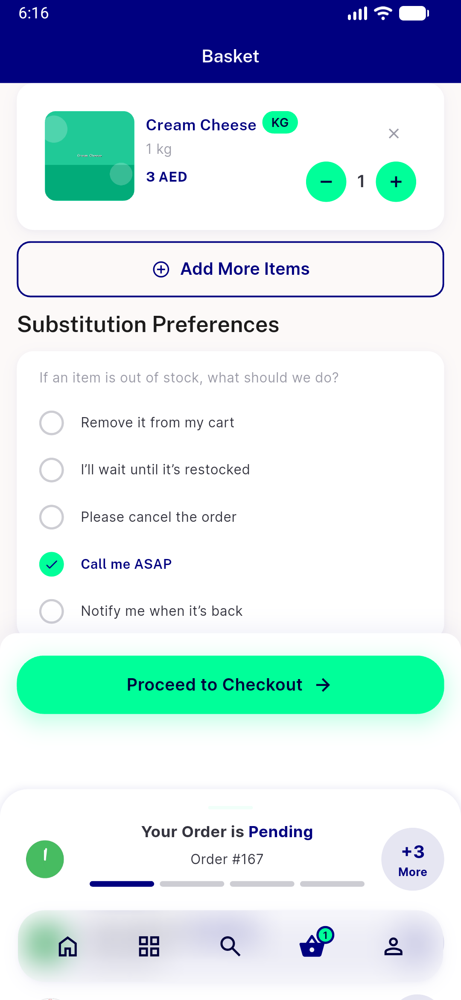
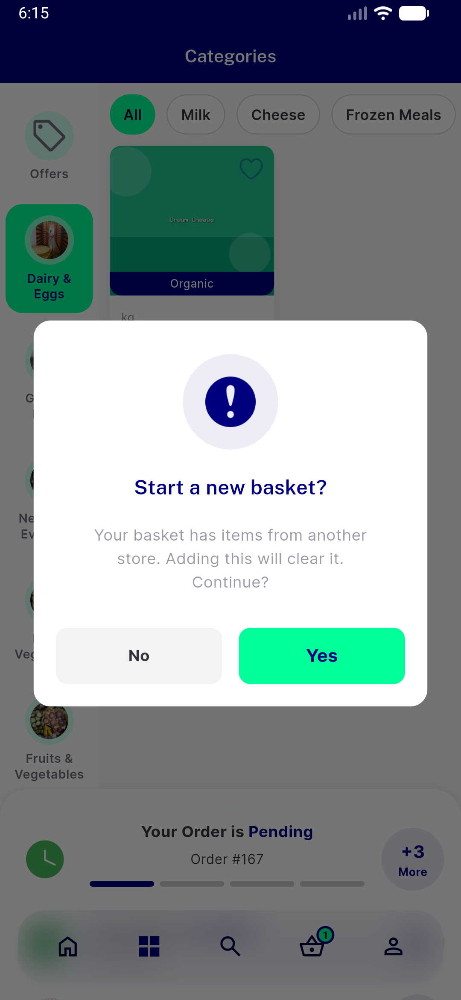
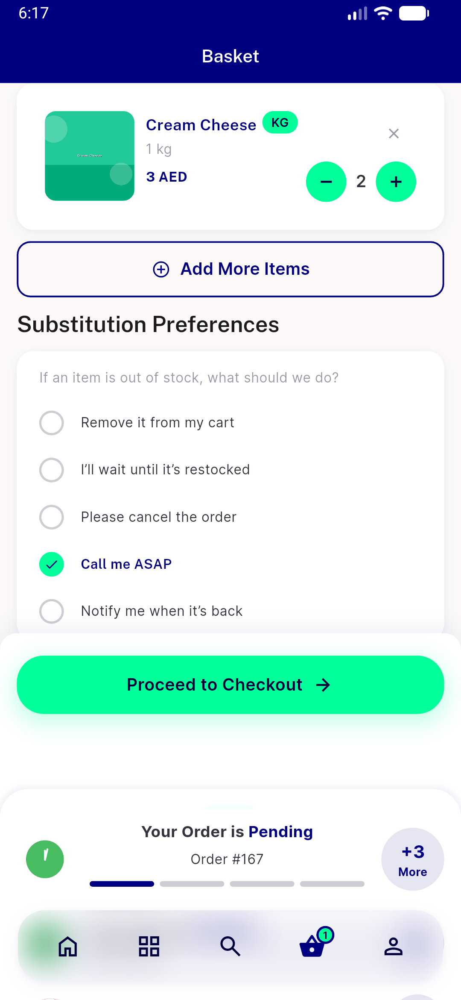
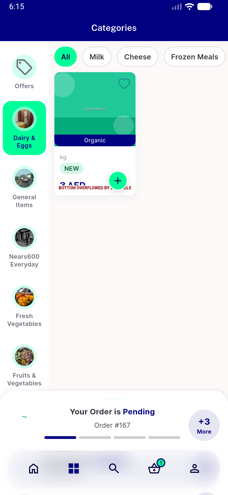

# QA Evidence — NEARS-784

**PASS — NEARS-784 color-source delegation: navy/mint/softGray render identically, no crash (emulator-5560, light)**

**8 screenshot(s).** Click any thumbnail for full resolution.

<table>
<tr>
<td align="center" width="33%"> ac1 checkout</td>
<td align="center" width="33%"> ac1 grocery module</td>
<td align="center" width="33%"> ac1 home</td>
</tr>
<tr>
<td align="center" width="33%"> ac1 search</td>
<td align="center" width="33%"> ac2 basket stepper</td>
<td align="center" width="33%"> ac2 multistore basket guard</td>
</tr>
<tr>
<td align="center" width="33%"> ac2 stepper incremented</td>
<td align="center" width="33%"> ac4 categories</td>
</tr>
</table>

---
*From `nears/docs/qa-evidence/NEARS-784/` · public-repo scrub policy (no live secrets; verified clean).*
