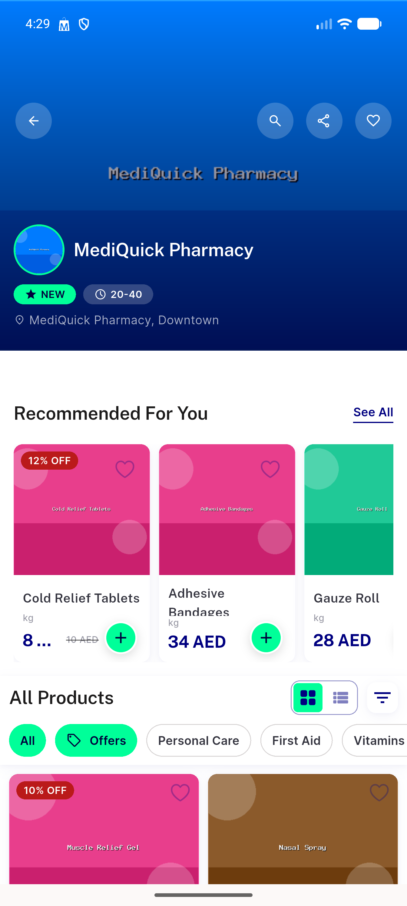
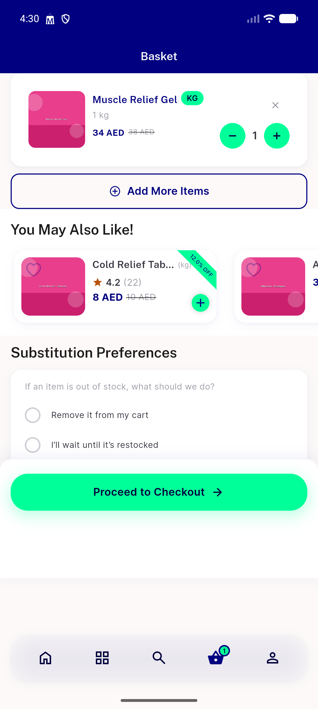
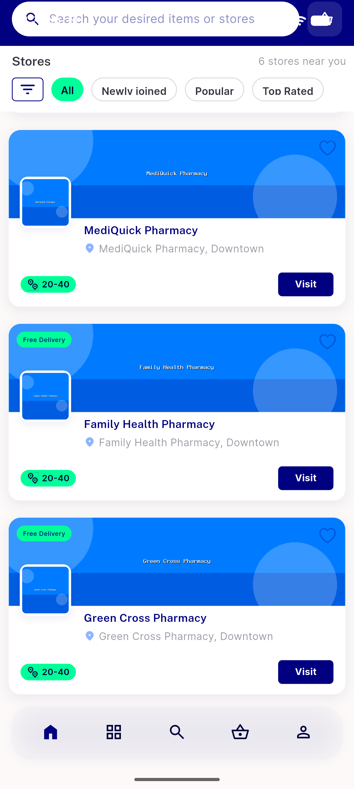
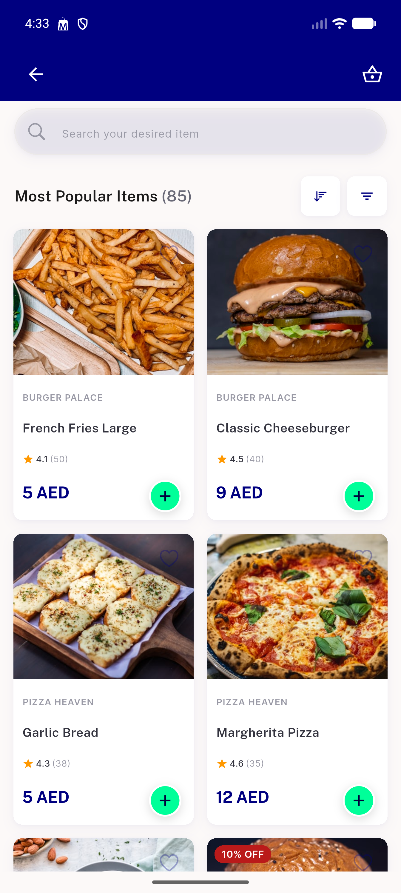
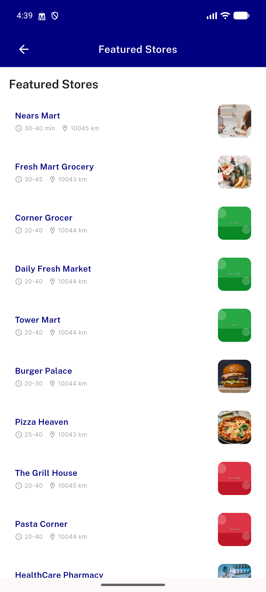

# QA Evidence — NEARS-785

**PASS — Wave 8 dead-route removal: nav intact, live common-conditions rail survives, no dead-links (emulator-5558)**

**9 screenshot(s).** Click any thumbnail for full resolution.

<table>
<tr>
<td align="center" width="33%"> ac1 01 sector landing</td>
<td align="center" width="33%"> ac1 02 store screen</td>
<td align="center" width="33%"> ac1 03 item sheet</td>
</tr>
<tr>
<td align="center" width="33%"> ac1 04 basket</td>
<td align="center" width="33%"> ac1 05 profile</td>
<td align="center" width="33%"> ac2 01 pharmacy home</td>
</tr>
<tr>
<td align="center" width="33%"> ac3 01 food home</td>
<td align="center" width="33%"> ac3 02 itemviewall popular</td>
<td align="center" width="33%"> ac3 03 storelist route</td>
</tr>
</table>

### Other artifacts
- [`ac2-common-condition-live.log`](ac2-common-condition-live.log)
- [`ac3-kept-routes.log`](ac3-kept-routes.log)
- [`progress.md`](progress.md)

---
*From `nears/docs/qa-evidence/NEARS-785/` · public-repo scrub policy (no live secrets; verified clean).*
