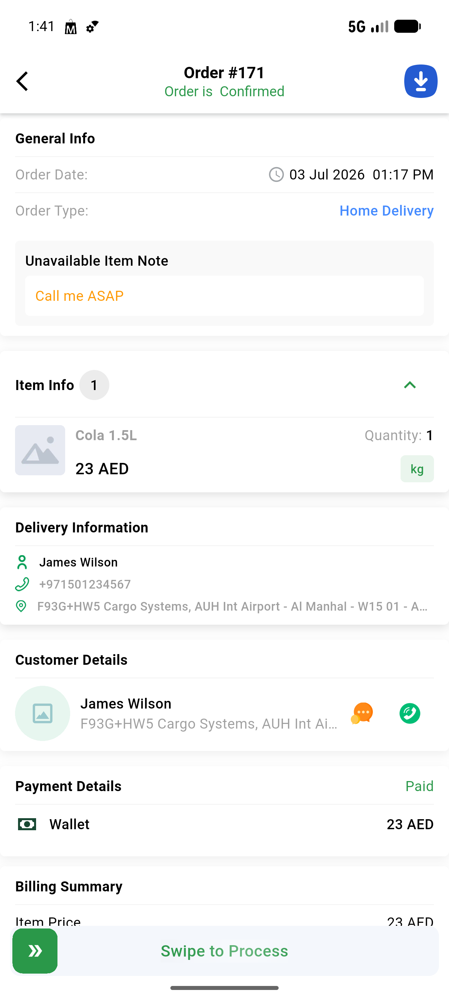
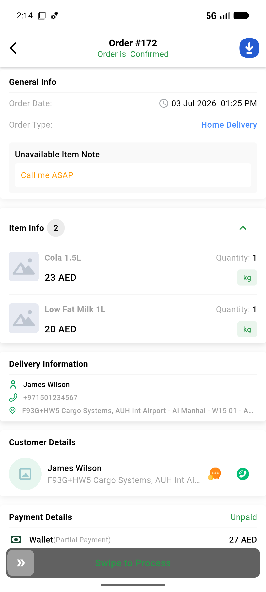
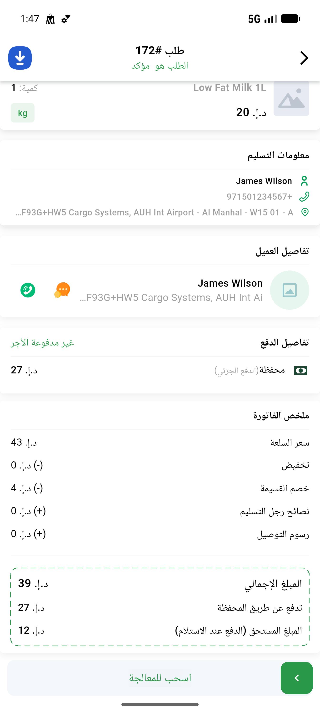
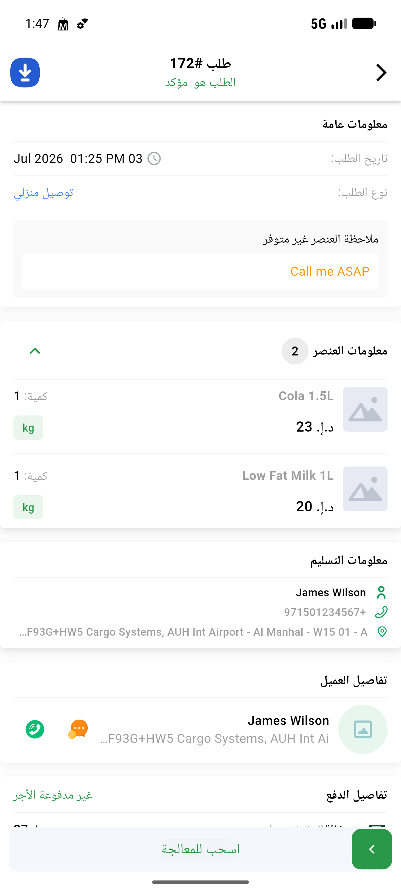
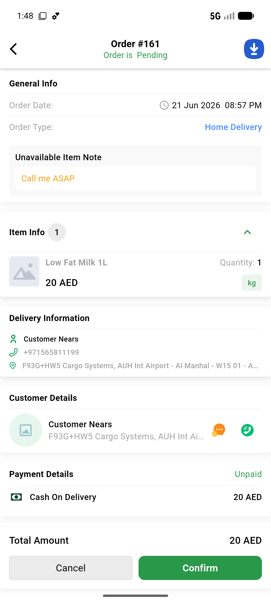
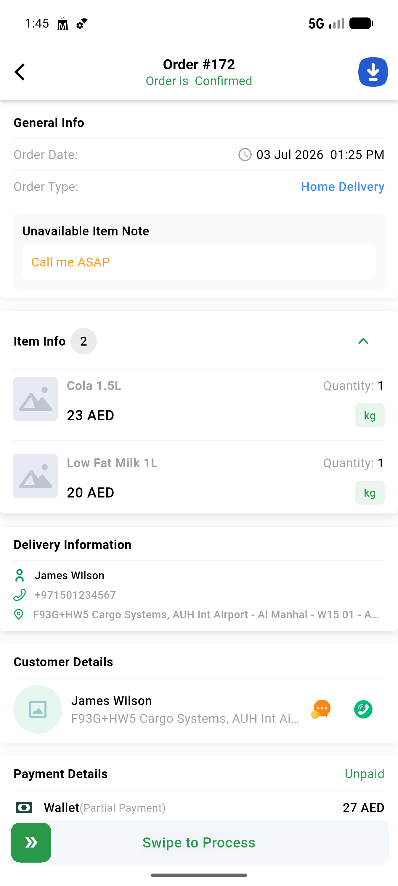
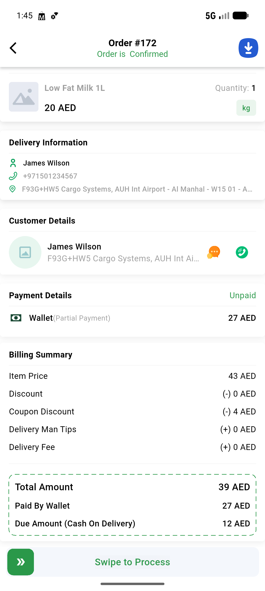
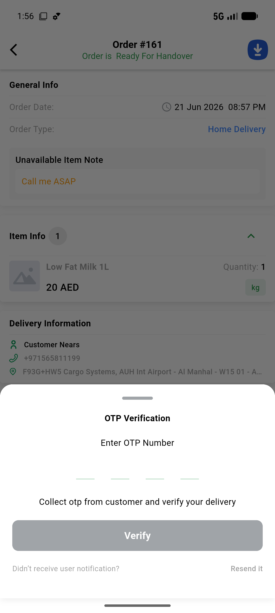
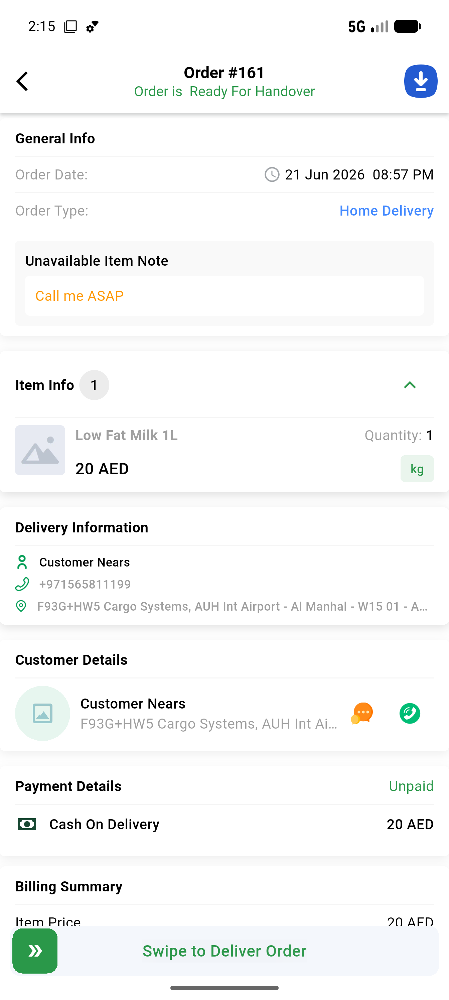
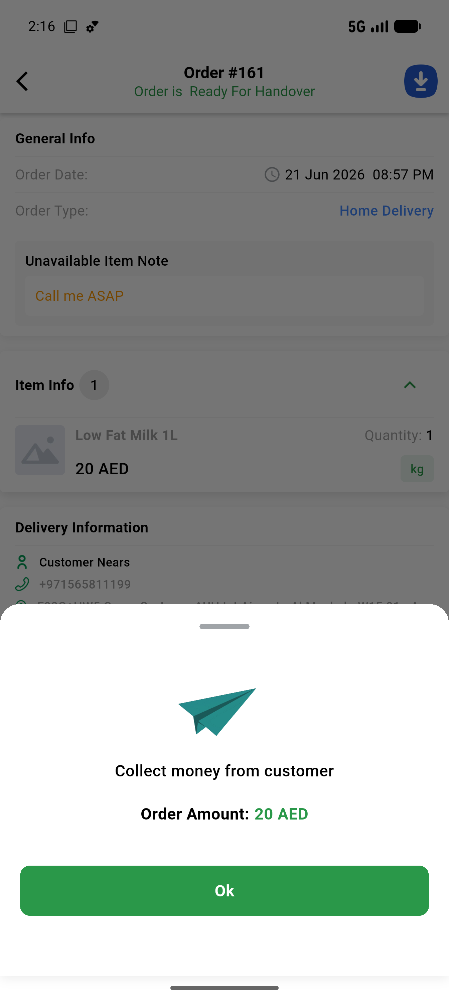

# QA Evidence — NEARS-789

**PASS — VendorApp order-details money path (7 tickets): payment card, PII scrub, partial breakdown, OTP chain, order_amount, poll efficiency, slider lockout, RTL**

**12 screenshot(s).** Click any thumbnail for full resolution.

<table>
<tr>
<td align="center" width="33%"> ac1 order171 wallet paid</td>
<td align="center" width="33%"> ac10 order171 external processing</td>
<td align="center" width="33%"> ac11 slider inflight</td>
</tr>
<tr>
<td align="center" width="33%"> ac12 rtl billing card</td>
<td align="center" width="33%"> ac12 rtl payment card</td>
<td align="center" width="33%"> ac2 order161 cod unpaid</td>
</tr>
<tr>
<td align="center" width="33%"> ac3 order172 partial sublabel</td>
<td align="center" width="33%"> ac5 order172 partial breakdown</td>
<td align="center" width="33%"> ac6 complete delivery otp sheet</td>
</tr>
<tr>
<td align="center" width="33%"> ac6 otp verify sheet open</td>
<td align="center" width="33%"> ac8 order161 total</td>
<td align="center" width="33%"> regression collect cash sheet</td>
</tr>
</table>

### Other artifacts
- [`ac11-single-transition.log`](ac11-single-transition.log)
- [`ac4-pii-window.log`](ac4-pii-window.log)
- [`ac6-ac7-widget-tests.log`](ac6-ac7-widget-tests.log)
- [`progress.md`](progress.md)

---
*From `nears/docs/qa-evidence/NEARS-789/` · public-repo scrub policy (no live secrets; verified clean).*
