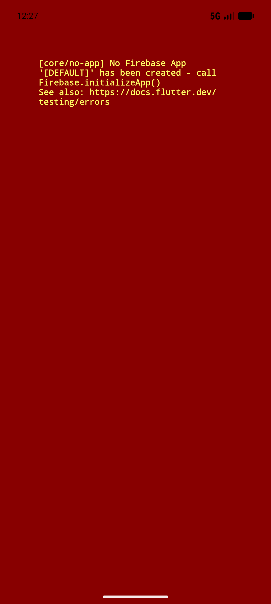
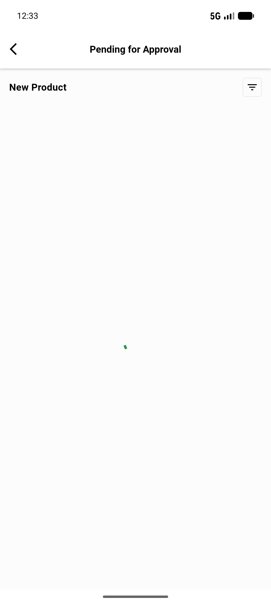
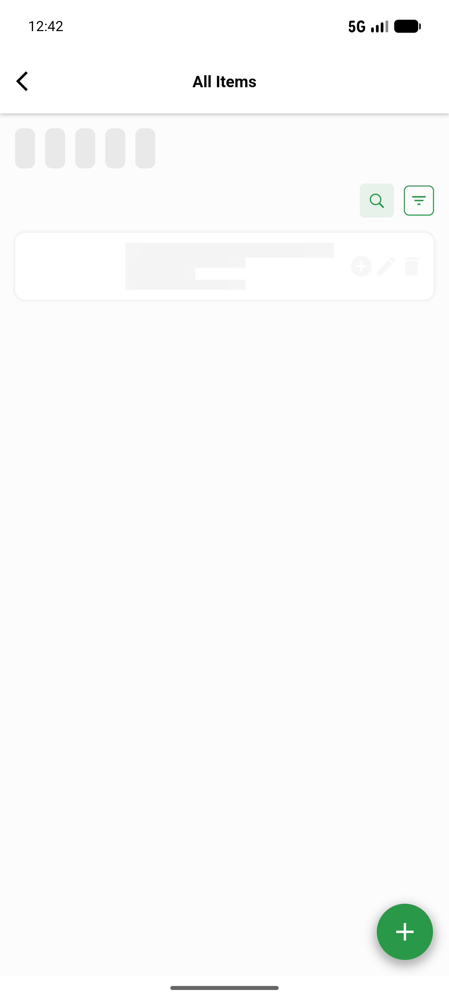

# QA Evidence — NEARS-790

**PASS (fix sound; killed-state FCM E2E partial-live; 1 pre-existing regression)**

**6 screenshot(s).** Click any thumbnail for full resolution.

<table>
<tr>
<td align="center" width="33%"> initial state</td>
<td align="center" width="33%"> cold start route</td>
<td align="center" width="33%"> pendingitem screen</td>
</tr>
<tr>
<td align="center" width="33%"> signin not logged in</td>
<td align="center" width="33%"> food vendor dashboard</td>
<td align="center" width="33%"> food allitems</td>
</tr>
</table>

### Other artifacts
- [`bug-offset-int-string-parse.log`](bug-offset-int-string-parse.log)
- [`progress.md`](progress.md)

---
*From `nears/docs/qa-evidence/NEARS-790/` · public-repo scrub policy (no live secrets; verified clean).*
