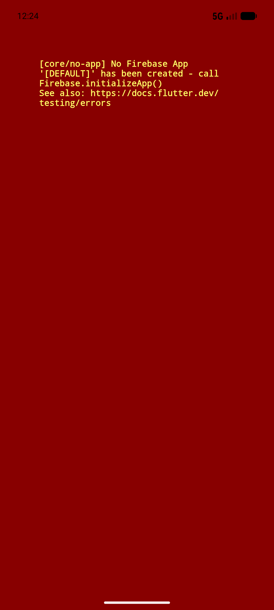

# QA Evidence — NEARS-791

**PASS — VendorApp FCM parse-guard: clean boot + notification init, orders surface regression-clean, AC3 unit pins 5/5, malformed-payload ACs rest on pins+review (live FCM injection infeasible)**

**1 screenshot(s).** Click any thumbnail for full resolution.

<table>
<tr>
<td align="center" width="33%"> ac6 dashboard clean boot</td>
</tr>
</table>

### Other artifacts
- [`ac3-unit-pins.log`](ac3-unit-pins.log)
- [`boot-notification-init-clean.log`](boot-notification-init-clean.log)

---
*From `nears/docs/qa-evidence/NEARS-791/` · public-repo scrub policy (no live secrets; verified clean).*
