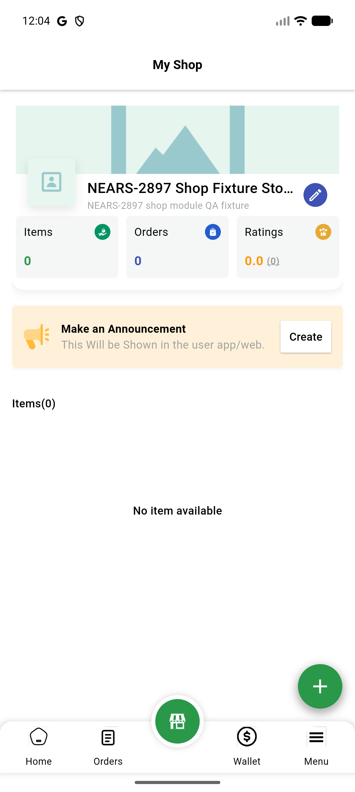

# QA Evidence — NEARS-794

**AC2b/AC3b re-verified PASS via VM-service route push (delta continuation, fix_cycle=0)**

**3 screenshot(s).** Click any thumbnail for full resolution.

<table>
<tr>
<td align="center" width="33%"> ac2a updatestore success</td>
<td align="center" width="33%"> ac2b ac3b post submit dashboard</td>
<td align="center" width="33%"> bug additem fab no a11y label</td>
</tr>
</table>

### Other artifacts
- [`ac2b-ac3b-logcat-excerpt.log`](ac2b-ac3b-logcat-excerpt.log)
- [`ac2b-ac3b-vmservice-decoded-excerpt.txt`](ac2b-ac3b-vmservice-decoded-excerpt.txt)
- [`ac2b-vmservice-positive-control.log`](ac2b-vmservice-positive-control.log)
- [`bug-additem-fab-no-a11y-label-dump.xml`](bug-additem-fab-no-a11y-label-dump.xml)

---
*From `nears/docs/qa-evidence/NEARS-794/` · public-repo scrub policy (no live secrets; verified clean).*
