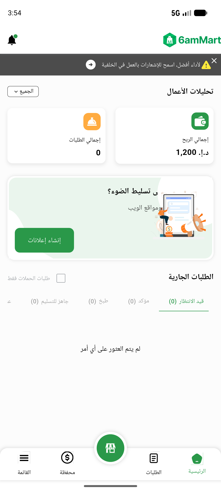
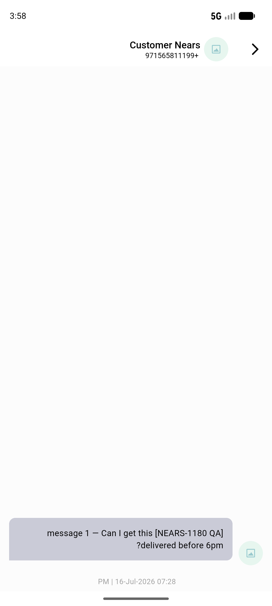
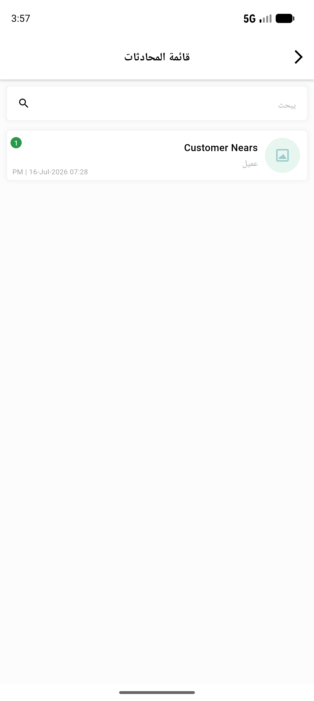
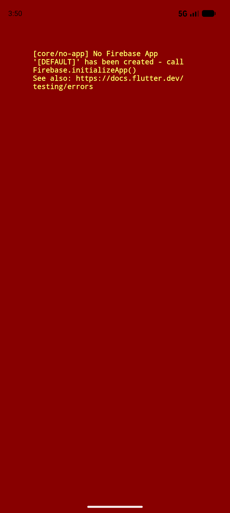

# QA Evidence — NEARS-802

**PASS — FCM chat null-guard: unit pin 6/6 + full suite 131/131, live chat happy-path 200 clean**

**4 screenshot(s).** Click any thumbnail for full resolution.

<table>
<tr>
<td align="center" width="33%"> vendorapp boot2</td>
<td align="center" width="33%"> vendorapp chatscreen</td>
<td align="center" width="33%"> vendorapp conversationlist</td>
</tr>
<tr>
<td align="center" width="33%"> vendorapp current</td>
</tr>
</table>

### Other artifacts
- [`progress.md`](progress.md)

---
*From `nears/docs/qa-evidence/NEARS-802/` · public-repo scrub policy (no live secrets; verified clean).*
