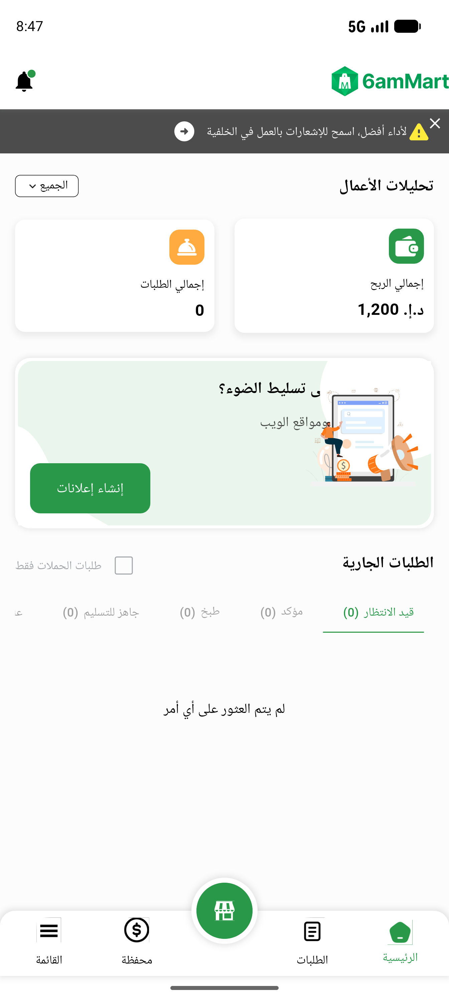
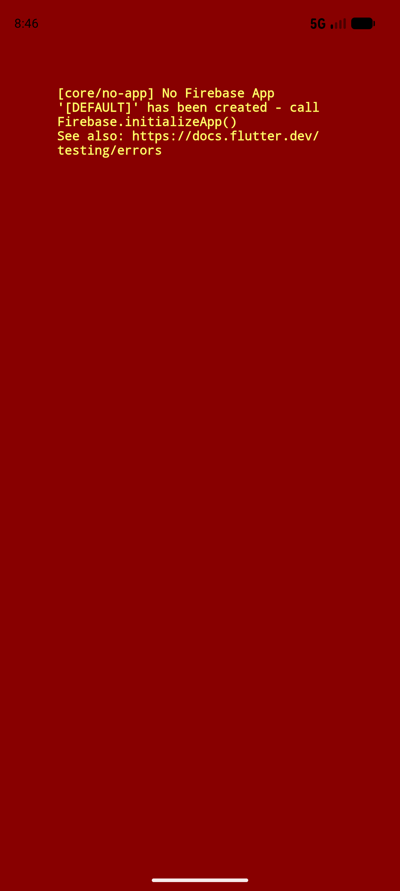

# QA Evidence — NEARS-811

**PASS — VendorApp FCM full-payload debugPrint removed; live push shows type-only log, no PII map**

**2 screenshot(s).** Click any thumbnail for full resolution.

<table>
<tr>
<td align="center" width="33%"> boot clean firebase</td>
<td align="center" width="33%"> boot state no gservices</td>
</tr>
</table>

### Other artifacts
- [`bug-none-onmessage-log-evidence.log`](bug-none-onmessage-log-evidence.log)
- [`progress.md`](progress.md)

---
*From `nears/docs/qa-evidence/NEARS-811/` · public-repo scrub policy (no live secrets; verified clean).*
