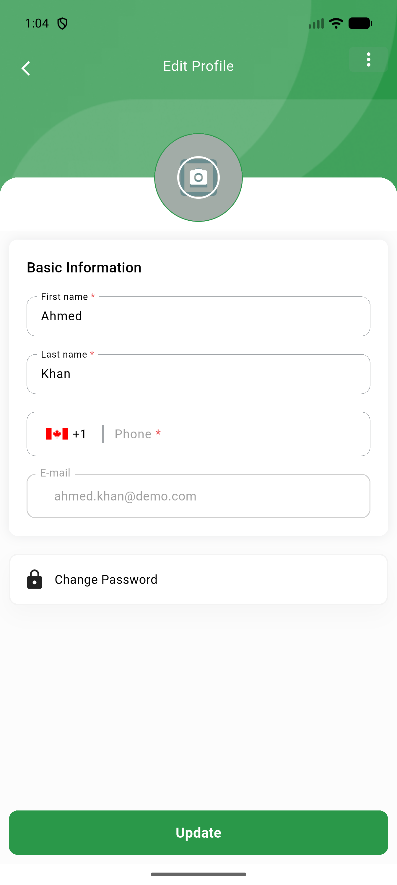
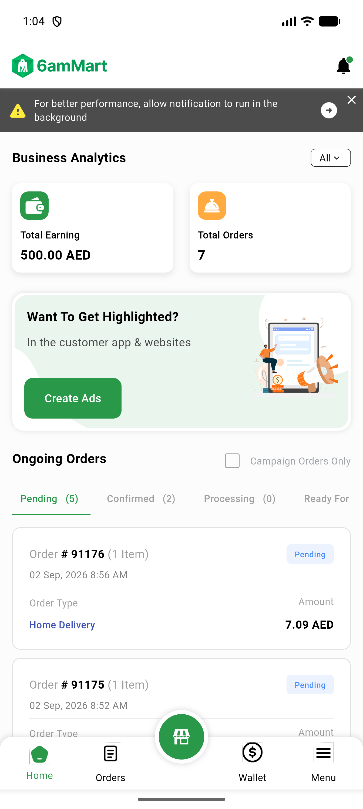

# QA Evidence — NEARS-813

**PASS - VendorApp SmartManagement.onlyBuilder verified live: AC1-AC5 PASS, logout/account-switch check PASS (no stale flash), flutter analyze 16 pre-existing/0 new, flutter test 357/357 pass**

**2 screenshot(s).** Click any thumbnail for full resolution.

<table>
<tr>
<td align="center" width="33%"> ac logout switch edit profile ahmed</td>
<td align="center" width="33%"> ac2 home after order details roundtrip</td>
</tr>
</table>

### Other artifacts
- [`progress.md`](progress.md)

---
*From `nears/docs/qa-evidence/NEARS-813/` · public-repo scrub policy (no live secrets; verified clean).*
