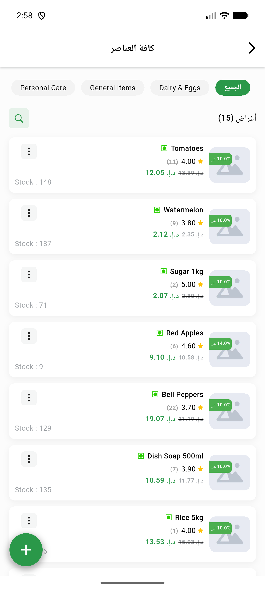
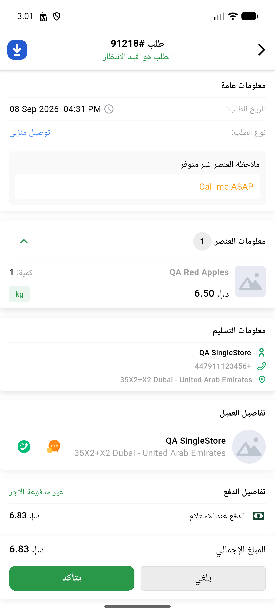
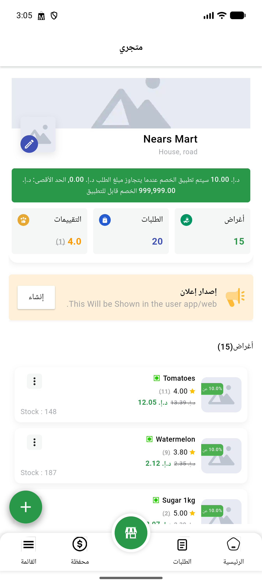
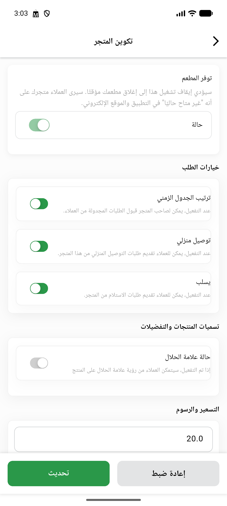
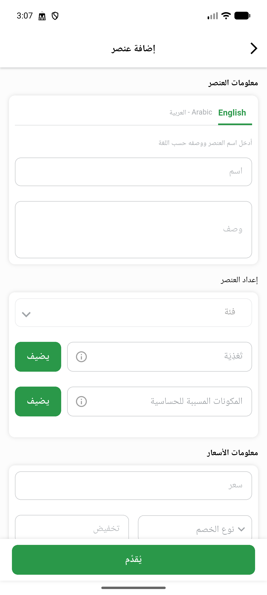
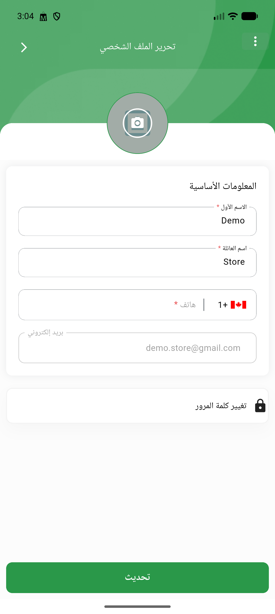
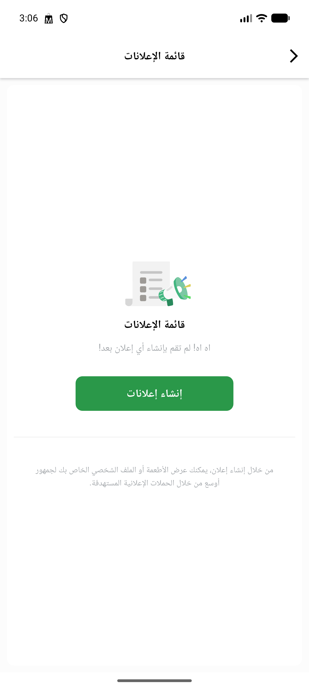
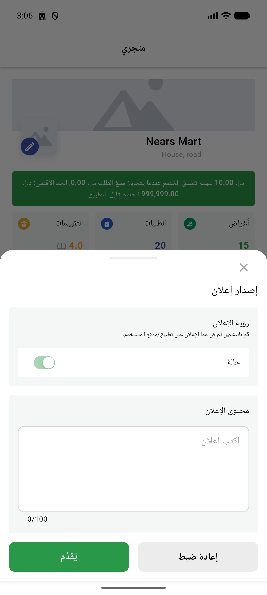
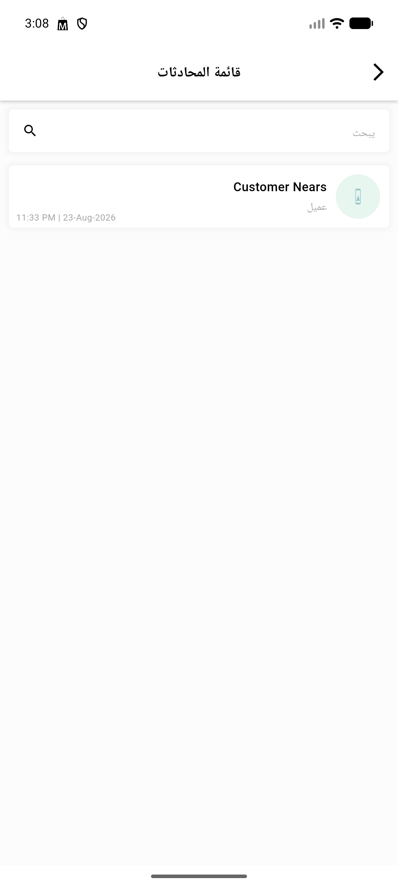

# QA Evidence — NEARS-817

**PASS - VendorApp memCache bounds fix verified live on emulator-5558, 4/4 unit tests + 350/350 full suite green, 0 analyze issues**

**9 screenshot(s).** Click any thumbnail for full resolution.

<table>
<tr>
<td align="center" width="33%"> ac1 item list</td>
<td align="center" width="33%"> ac2 order details</td>
<td align="center" width="33%"> ac3 ac4 store screen real</td>
</tr>
<tr>
<td align="center" width="33%"> ac3 ac4 store screen</td>
<td align="center" width="33%"> ac3 add item screen</td>
<td align="center" width="33%"> ac3 store edit screen</td>
</tr>
<tr>
<td align="center" width="33%"> ac4 advertisement list</td>
<td align="center" width="33%"> ac4 promo preview</td>
<td align="center" width="33%"> regression chat screen</td>
</tr>
</table>

---
*From `nears/docs/qa-evidence/NEARS-817/` · public-repo scrub policy (no live secrets; verified clean).*
