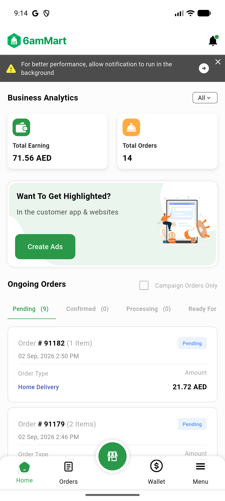
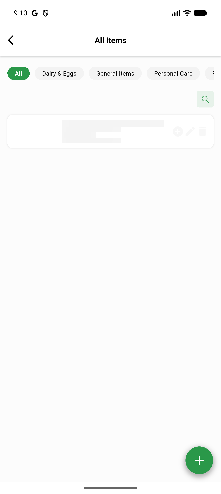
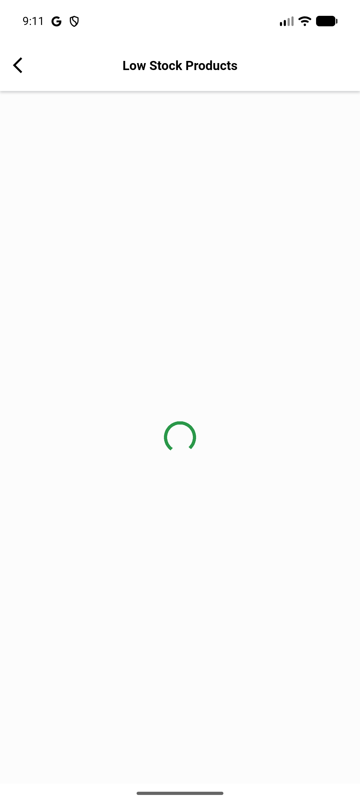

# QA Evidence — NEARS-829

**BLOCKED: AC1/AC3/AC4 PASS live+static; AC2 (discount-tag live render) blocked by pre-existing unrelated ItemModel/PendingItemModel offset int/String crash on every vendor item-list surface**

**3 screenshot(s).** Click any thumbnail for full resolution.

<table>
<tr>
<td align="center" width="33%"> ac1 dashboard boot</td>
<td align="center" width="33%"> bug itemmodel offset crash all items</td>
<td align="center" width="33%"> bug itemmodel offset crash low stock</td>
</tr>
</table>

### Other artifacts
- [`bug-itemmodel-offset-crash.log`](bug-itemmodel-offset-crash.log)

---
*From `nears/docs/qa-evidence/NEARS-829/` · public-repo scrub policy (no live secrets; verified clean).*
