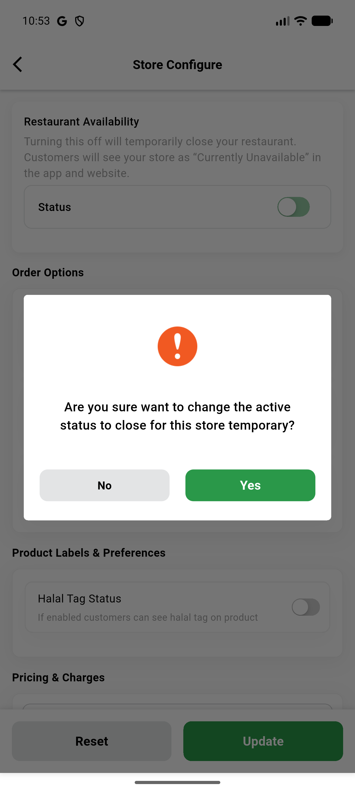
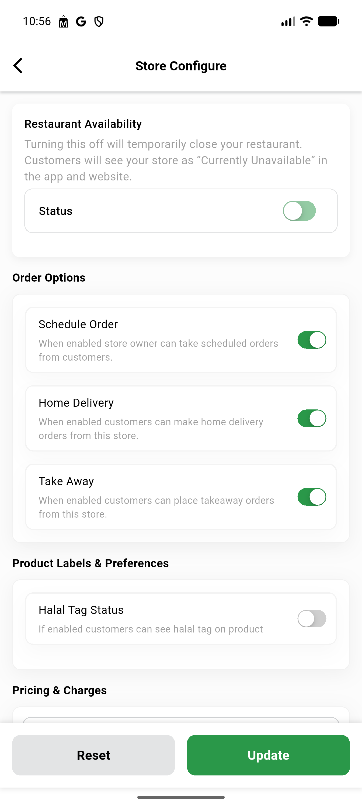
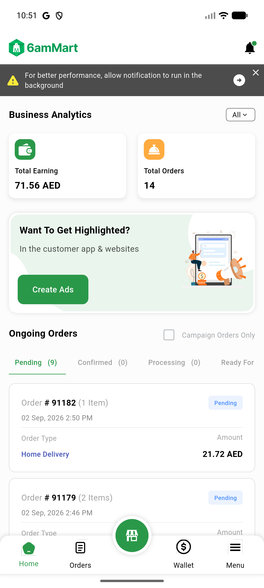
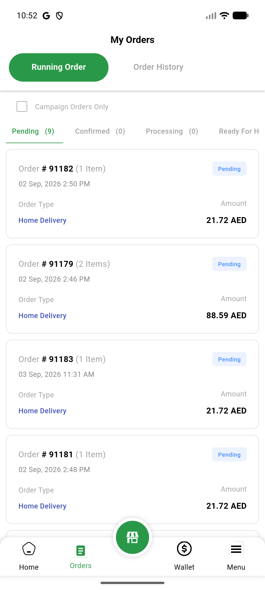
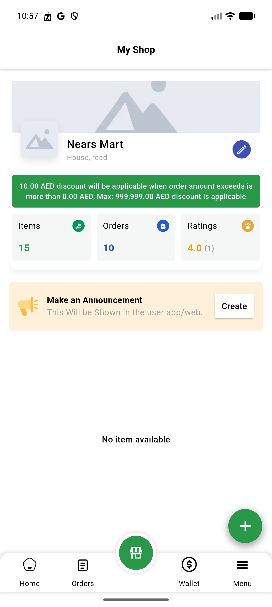
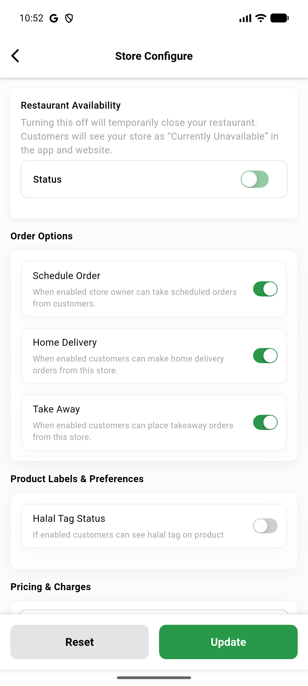
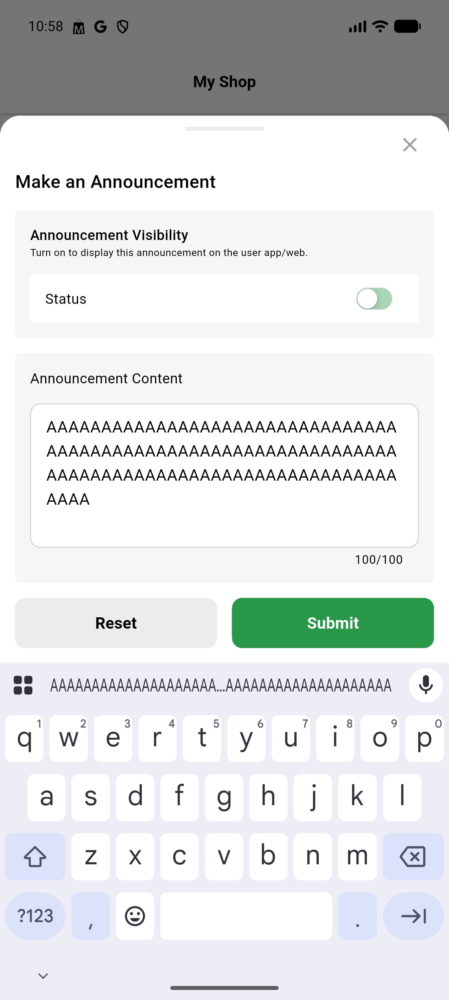

# QA Evidence — NEARS-840

**PASS - VendorApp analyzer hygiene NEARS-840: all 7 ACs demonstrated live on emulator-5554, 0 analyzer issues, 345/345 flutter tests pass**

**8 screenshot(s).** Click any thumbnail for full resolution.

<table>
<tr>
<td align="center" width="33%"> ac3 confirm dialog</td>
<td align="center" width="33%"> ac3 store config restored</td>
<td align="center" width="33%"> ac4 after back resetfilters</td>
</tr>
<tr>
<td align="center" width="33%"> ac5 home dashboard</td>
<td align="center" width="33%"> ac5 running orders</td>
<td align="center" width="33%"> ac6 my shop</td>
</tr>
<tr>
<td align="center" width="33%"> ac6 store config before</td>
<td align="center" width="33%"> ac7 maxlength enforced</td>
</tr>
</table>

### Other artifacts
- [`bug-vendor-itemlist-parse-preexisting.log`](bug-vendor-itemlist-parse-preexisting.log)

---
*From `nears/docs/qa-evidence/NEARS-840/` · public-repo scrub policy (no live secrets; verified clean).*
