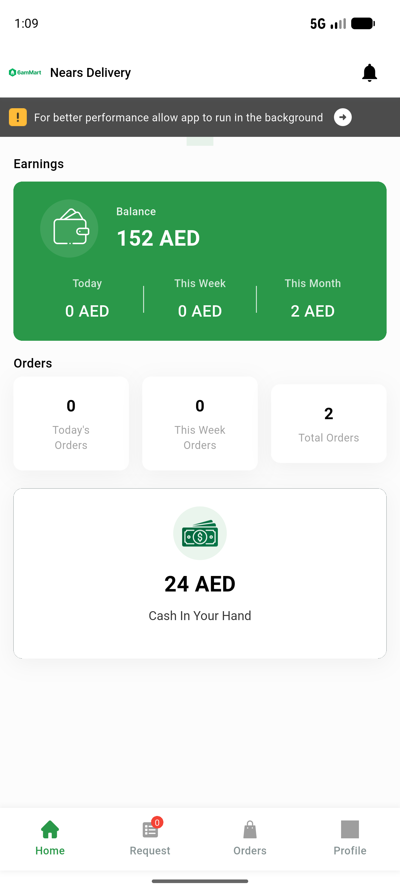
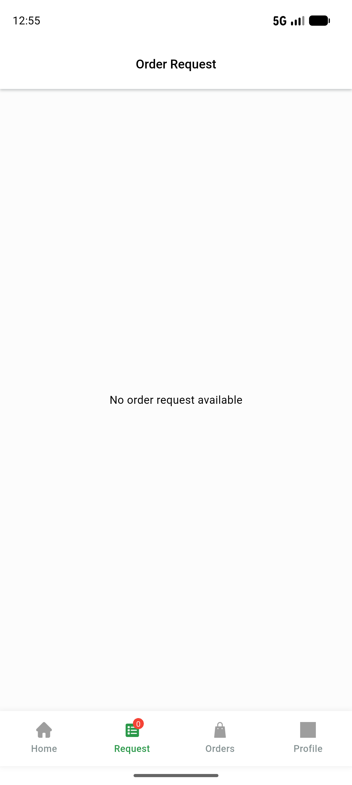
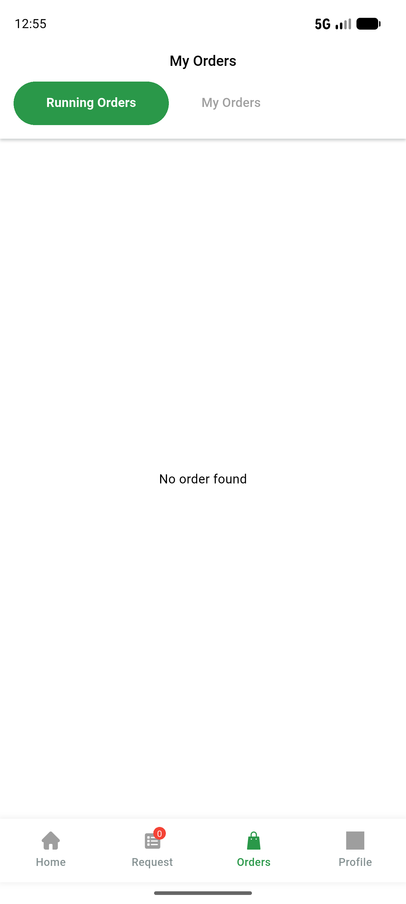

# QA Evidence — NEARS-860

**PASS — NEARS-860 defensive null-guards: 5 root-path guards verified (AC1 happy-path live + null static, AC2 live, AC3/AC4 empty-state live + null-edge static); 166 unit tests green; no crashes/errors**

**5 screenshot(s).** Click any thumbnail for full resolution.

<table>
<tr>
<td align="center" width="33%"> ac1 dashboard doubleback</td>
<td align="center" width="33%"> ac2 home cashcard</td>
<td align="center" width="33%"> ac3 request emptystate</td>
</tr>
<tr>
<td align="center" width="33%"> ac4 conversation emptystate</td>
<td align="center" width="33%"> reg orders tab</td>
</tr>
</table>

---
*From `nears/docs/qa-evidence/NEARS-860/` · public-repo scrub policy (no live secrets; verified clean).*
