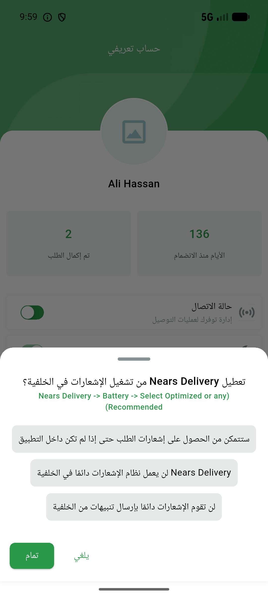

# QA Evidence — NEARS-861

**PASS — micro i18n ar-locale: AC1 background-notification sheet renders Arabic; AC2 key resolves (conversion not triggerable, 0 pts)**

**1 screenshot(s).** Click any thumbnail for full resolution.

<table>
<tr>
<td align="center" width="33%"> AC1 background notification ar</td>
</tr>
</table>

### Other artifacts
- [`AC2-key-resolution.log`](AC2-key-resolution.log)
- [`progress.md`](progress.md)

---
*From `nears/docs/qa-evidence/NEARS-861/` · public-repo scrub policy (no live secrets; verified clean).*
