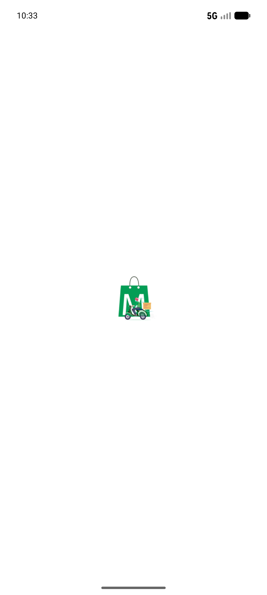
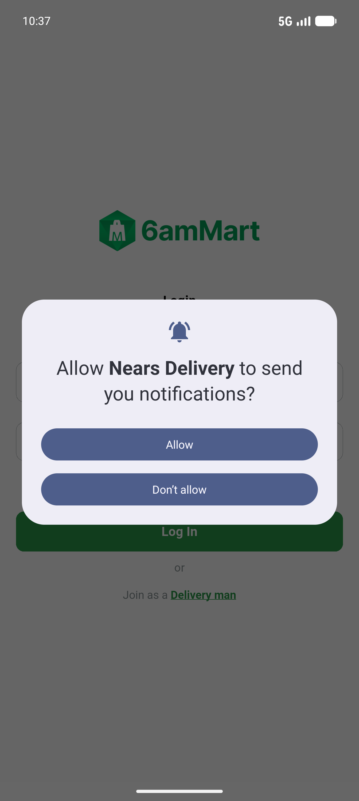
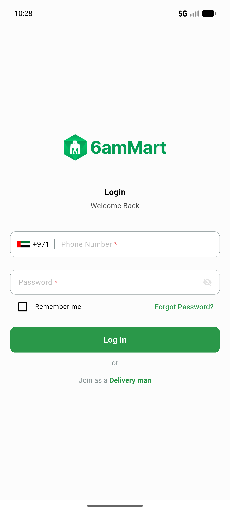

# QA Evidence — NEARS-862

**PASS — DeliveryApp release-mode https baseUrl guard (AC1-4)**

**3 screenshot(s).** Click any thumbnail for full resolution.

<table>
<tr>
<td align="center" width="33%"> ac1 release nodefine blank</td>
<td align="center" width="33%"> ac2 release https running</td>
<td align="center" width="33%"> ac4 debug login screen</td>
</tr>
</table>

### Other artifacts
- [`bug-signin-initstate-nullcheck.log`](bug-signin-initstate-nullcheck.log)

---
*From `nears/docs/qa-evidence/NEARS-862/` · public-repo scrub policy (no live secrets; verified clean).*
