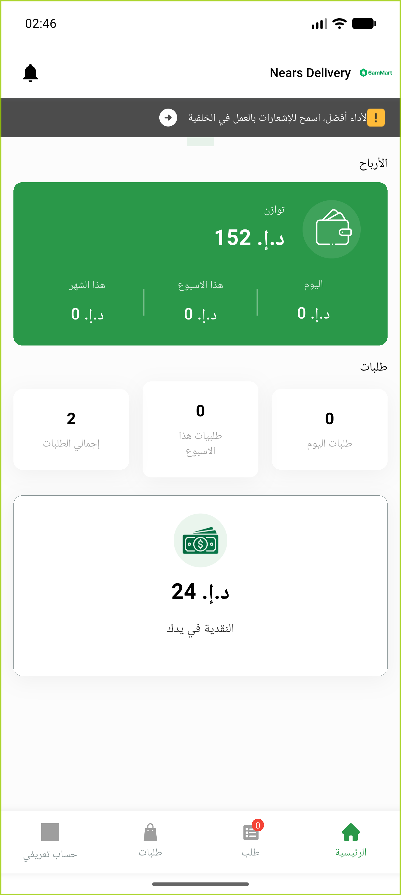
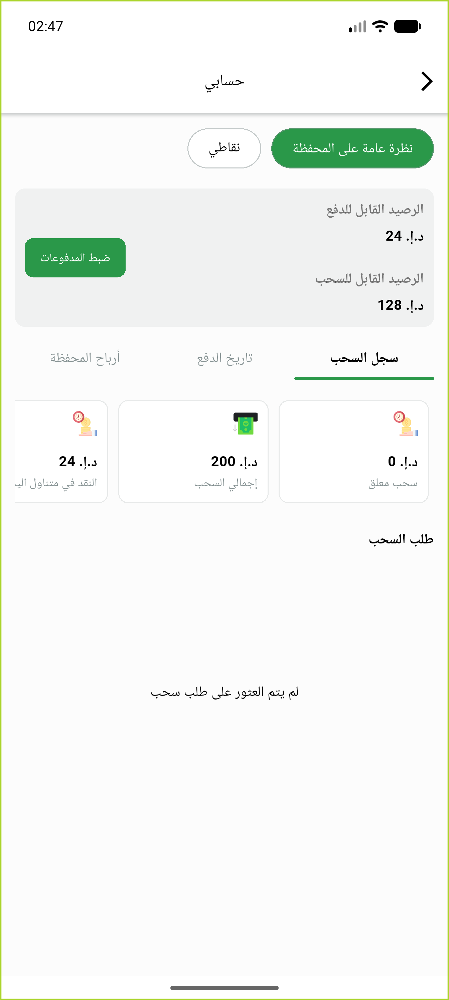
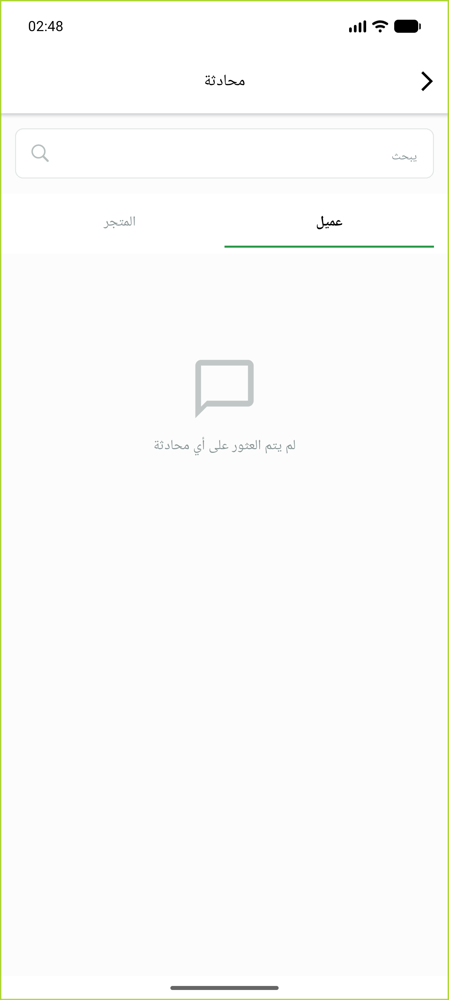
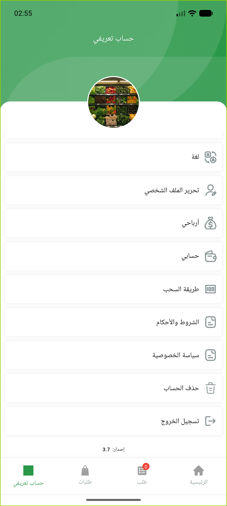
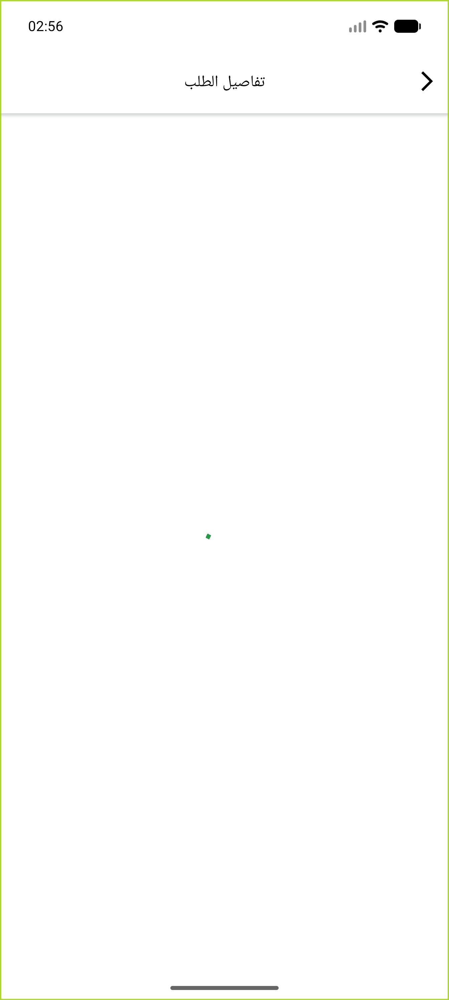

# QA Evidence — NEARS-863

**PASS — DM auth header-only, no token in URL (live + backend proof)**

**5 screenshot(s).** Click any thumbnail for full resolution.

<table>
<tr>
<td align="center" width="33%"> dashboard home</td>
<td align="center" width="33%"> my account wallet</td>
<td align="center" width="33%"> chat conversation list</td>
</tr>
<tr>
<td align="center" width="33%"> profile account menu</td>
<td align="center" width="33%"> order details</td>
</tr>
</table>

### Other artifacts
- [`network-capture-consolidated.txt`](network-capture-consolidated.txt)

---
*From `nears/docs/qa-evidence/NEARS-863/` · public-repo scrub policy (no live secrets; verified clean).*
