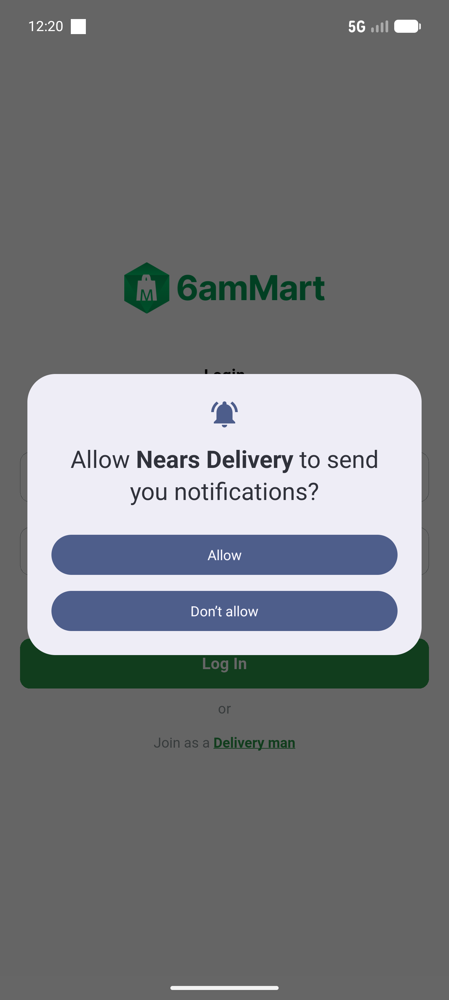

# QA Evidence — NEARS-864

**PASS cycle-1 — DeliveryApp launches, cleartext GET /api/v1/config -> 200 to 10.0.2.2, no NSC crash, no dart:io block**

**3 screenshot(s).** Click any thumbnail for full resolution.

<table>
<tr>
<td align="center" width="33%"> ac1 crash state</td>
<td align="center" width="33%"> cycle1 app screen</td>
<td align="center" width="33%"> cycle1b app screen</td>
</tr>
</table>

### Other artifacts
- [`bug-nsc-nested-domain-config-crash.log`](bug-nsc-nested-domain-config-crash.log)
- [`cycle1-ac1-cleartext-200-proof.log`](cycle1-ac1-cleartext-200-proof.log)
- [`cycle1-launch-logcat.raw`](cycle1-launch-logcat.raw)
- [`cycle1b-launch-logcat.raw`](cycle1b-launch-logcat.raw)
- [`launch-logcat.raw`](launch-logcat.raw)
- [`progress.md`](progress.md)

---
*From `nears/docs/qa-evidence/NEARS-864/` · public-repo scrub policy (no live secrets; verified clean).*
