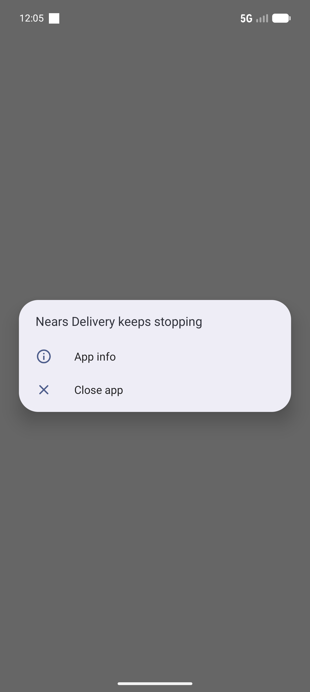

# QA Evidence — NEARS-864

**FAIL — DeliveryApp Android crashes at launch: network_security_config.xml nested domain-config in debug-overrides rejected by platform parser**

**1 screenshot(s).** Click any thumbnail for full resolution.

<table>
<tr>
<td align="center" width="33%"> ac1 crash state</td>
</tr>
</table>

### Other artifacts
- [`bug-nsc-nested-domain-config-crash.log`](bug-nsc-nested-domain-config-crash.log)
- [`launch-logcat.raw`](launch-logcat.raw)

---
*From `nears/docs/qa-evidence/NEARS-864/` · public-repo scrub policy (no live secrets; verified clean).*
