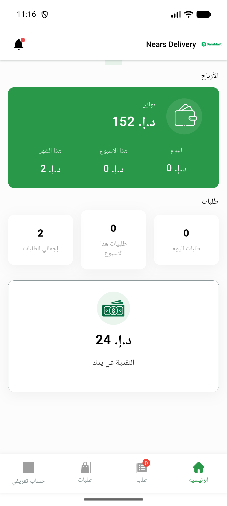

# QA Evidence — NEARS-865

**PASS — NEARS-865 WebView debug guard: change compiles+runs clean; wallet/My Account area navigable no regression; PaymentScreen unreachable (pre-existing env: digital_payment off + no gateway)**

**1 screenshot(s).** Click any thumbnail for full resolution.

<table>
<tr>
<td align="center" width="33%"> home wallet cashinhand</td>
</tr>
</table>

### Other artifacts
- [`bug-dm-background-401.log`](bug-dm-background-401.log)

---
*From `nears/docs/qa-evidence/NEARS-865/` · public-repo scrub policy (no live secrets; verified clean).*
