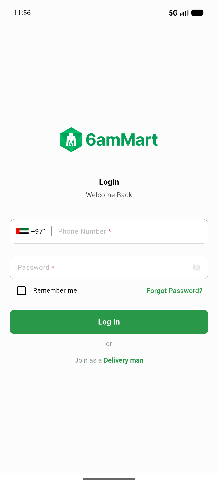

# QA Evidence — NEARS-866

**PASS — DeliveryApp payment log hygiene: static repro-gone + analyze clean + boot-smoke (gateway redirect not verifiable locally, module absent)**

**1 screenshot(s).** Click any thumbnail for full resolution.

<table>
<tr>
<td align="center" width="33%"> boot smoke</td>
</tr>
</table>

### Other artifacts
- [`progress.md`](progress.md)

---
*From `nears/docs/qa-evidence/NEARS-866/` · public-repo scrub policy (no live secrets; verified clean).*
