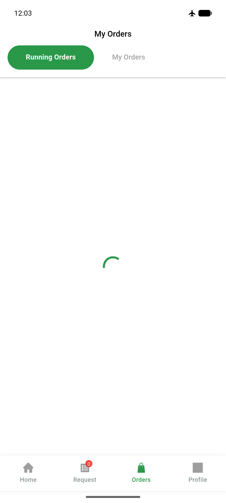

# QA Evidence — NEARS-869

**PASS — DeliveryApp perf-metric finally leak fix: throw-path graceful, 5/5 verbs, no regression**

**3 screenshot(s).** Click any thumbnail for full resolution.

<table>
<tr>
<td align="center" width="33%"> ac1 offline graceful</td>
<td align="center" width="33%"> ac3 home loaded</td>
<td align="center" width="33%"> ac3 recovery home</td>
</tr>
</table>

---
*From `nears/docs/qa-evidence/NEARS-869/` · public-repo scrub policy (no live secrets; verified clean).*
