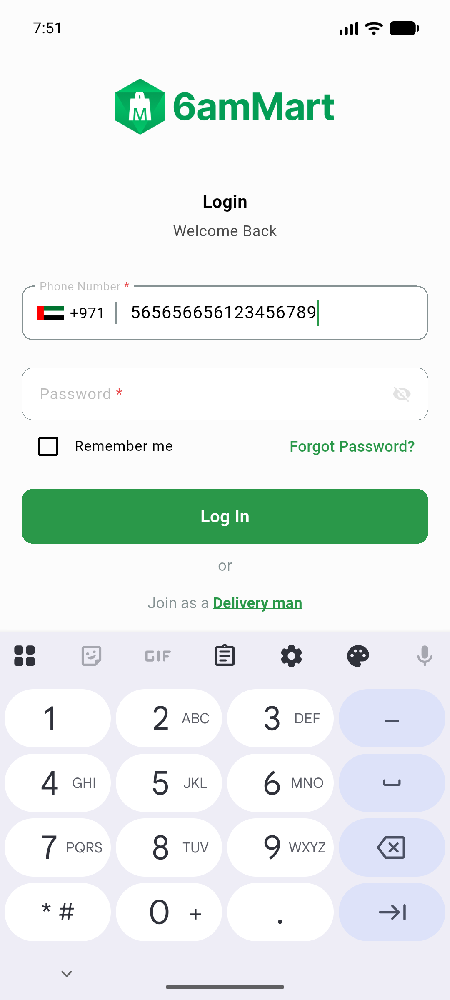
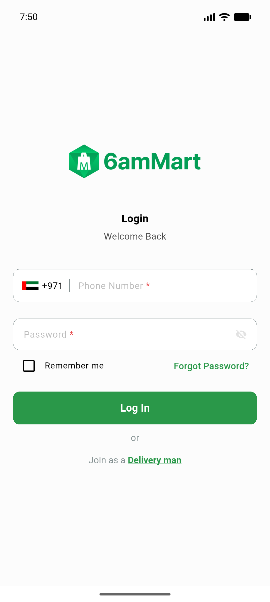
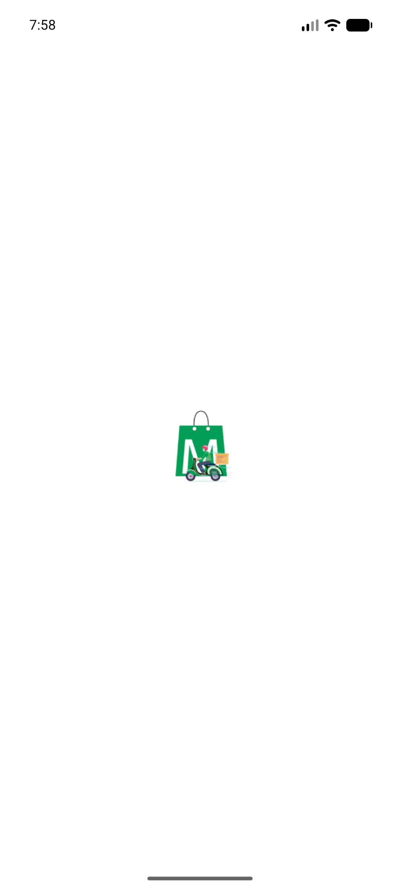
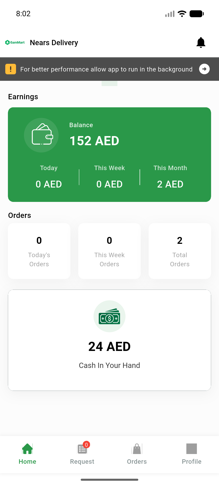
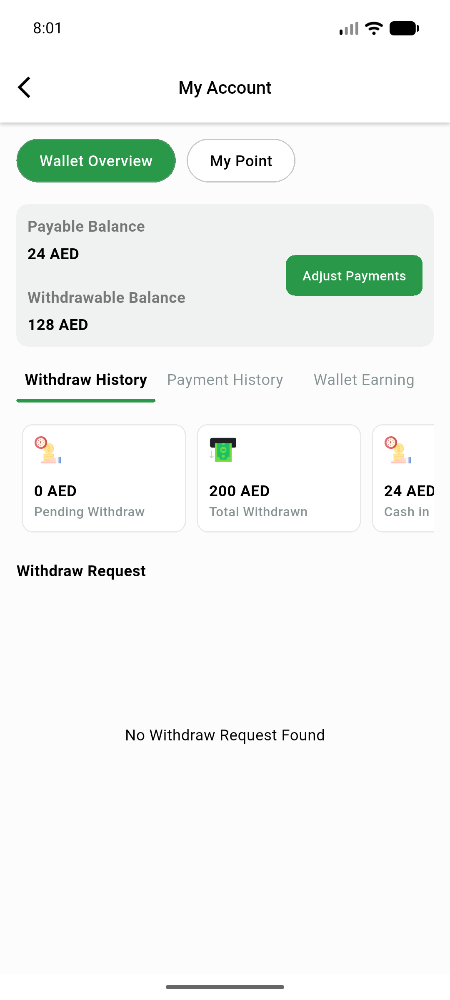
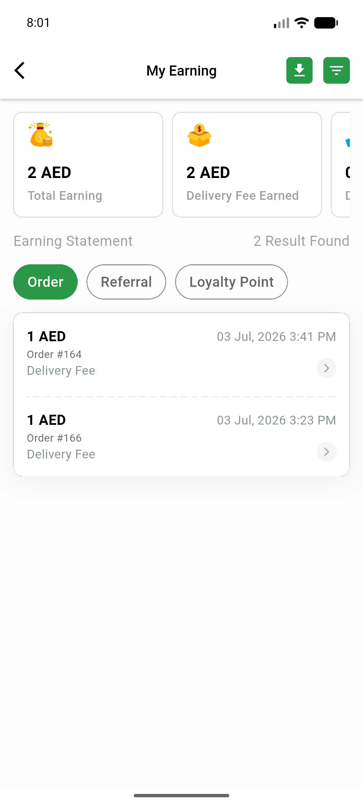
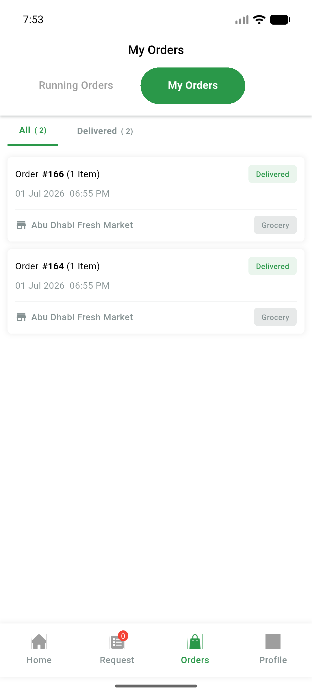
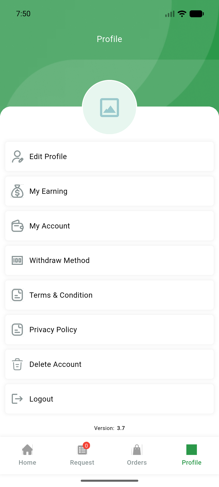
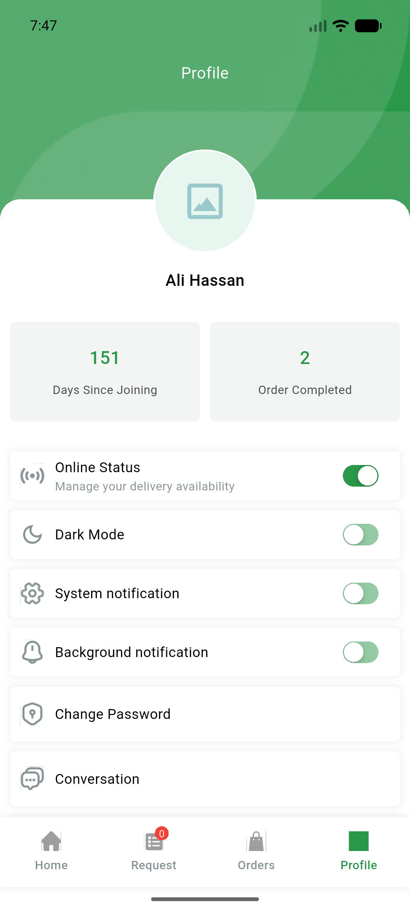

# QA Evidence — NEARS-870

**PASS — DeliveryApp SmartManagement.onlyBuilder: teardown flows + core-screen sweep clean, 202 tests pass**

**11 screenshot(s).** Click any thumbnail for full resolution.

<table>
<tr>
<td align="center" width="33%"> ac4 home dashboard</td>
<td align="center" width="33%"> ac4 login filled</td>
<td align="center" width="33%"> ac5 home after relogin</td>
</tr>
<tr>
<td align="center" width="33%"> ac5 signin after logout</td>
<td align="center" width="33%"> ac6 after corrupt token</td>
<td align="center" width="33%"> ac7 home final</td>
</tr>
<tr>
<td align="center" width="33%"> ac7 my account</td>
<td align="center" width="33%"> ac7 my earning</td>
<td align="center" width="33%"> ac7 order list</td>
</tr>
<tr>
<td align="center" width="33%"> ac7 profile menu</td>
<td align="center" width="33%"> ac7 profile</td>
</tr>
</table>

### Other artifacts
- [`progress.md`](progress.md)

---
*From `nears/docs/qa-evidence/NEARS-870/` · public-repo scrub policy (no live secrets; verified clean).*
