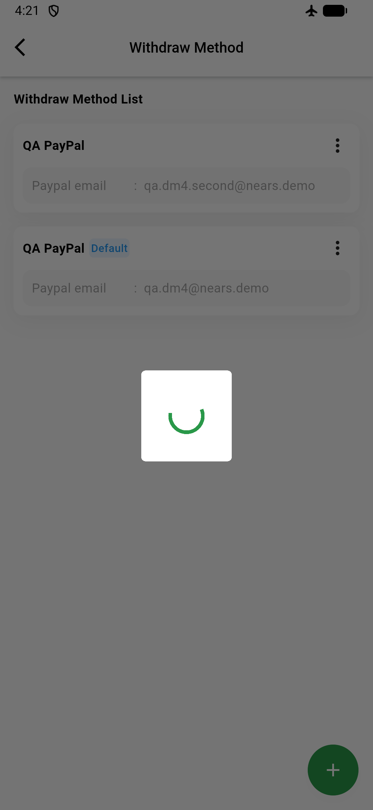
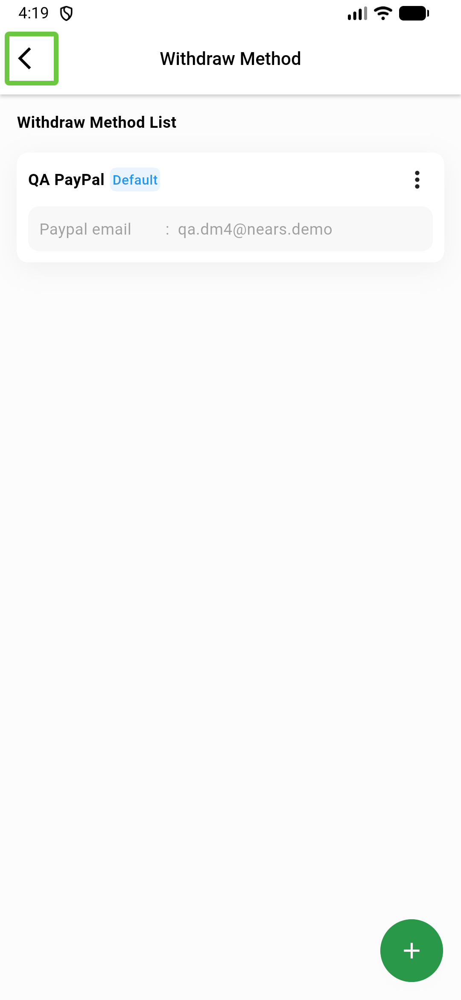

# QA Evidence — NEARS-871

**FAIL — AC1 failure-path toast/log unreachable; AC1 success + AC2/AC3 logic verified**

**3 screenshot(s).** Click any thumbnail for full resolution.

<table>
<tr>
<td align="center" width="33%"> ac1 fail no toast state</td>
<td align="center" width="33%"> ac1 success default set</td>
<td align="center" width="33%"> ac1 withdraw list</td>
</tr>
</table>

### Other artifacts
- [`bug-ac1-setdefault-failure-no-toast.log`](bug-ac1-setdefault-failure-no-toast.log)

---
*From `nears/docs/qa-evidence/NEARS-871/` · public-repo scrub policy (no live secrets; verified clean).*
