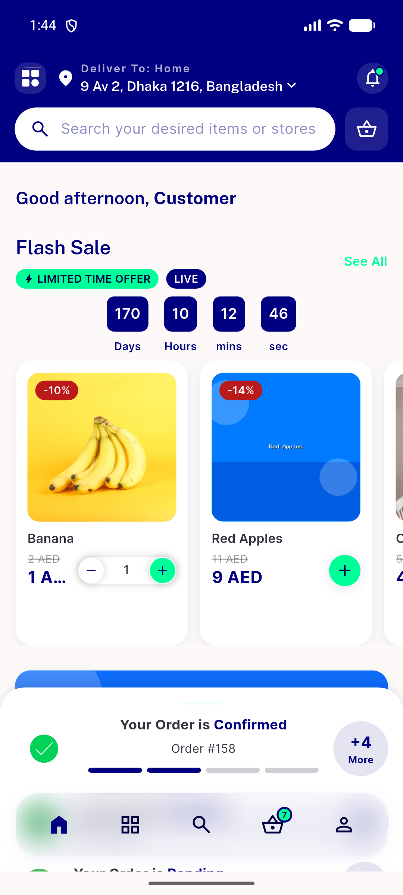
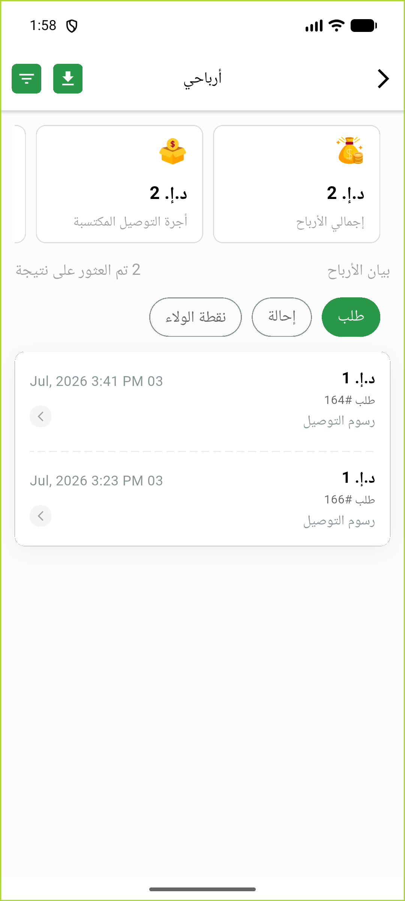

# QA Evidence — NEARS-874

**PASS — DeliveryApp mounted-guards: AC2/AC3 demonstrated live (AC3 dispose-race forced 4x, overlay clears, zero setState-after-dispose); AC1 guard-in-place + happy path (onPaginate 2nd-page fetch unforceable, seed data <11 items)**

**3 screenshot(s).** Click any thumbnail for full resolution.

<table>
<tr>
<td align="center" width="33%"> home loaded</td>
<td align="center" width="33%"> dropdown open</td>
<td align="center" width="33%"> paginated earning list</td>
</tr>
</table>

### Other artifacts
- [`console-log-check.log`](console-log-check.log)
- [`progress.md`](progress.md)

---
*From `nears/docs/qa-evidence/NEARS-874/` · public-repo scrub policy (no live secrets; verified clean).*
