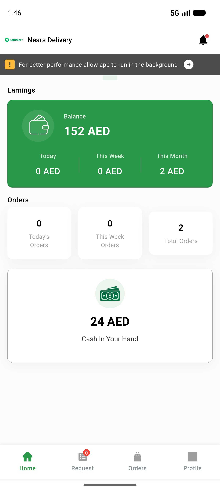

# QA Evidence — NEARS-876

**PASS — null-guard + alarm-player lifecycle verified (live boot + falsifiable widget-test seam), 170/170 backstop**

**1 screenshot(s).** Click any thumbnail for full resolution.

<table>
<tr>
<td align="center" width="33%"> live dashboard usable</td>
</tr>
</table>

### Other artifacts
- [`seam-test-source.dart.txt`](seam-test-source.dart.txt)
- [`seam-widget-test.log`](seam-widget-test.log)

---
*From `nears/docs/qa-evidence/NEARS-876/` · public-repo scrub policy (no live secrets; verified clean).*
