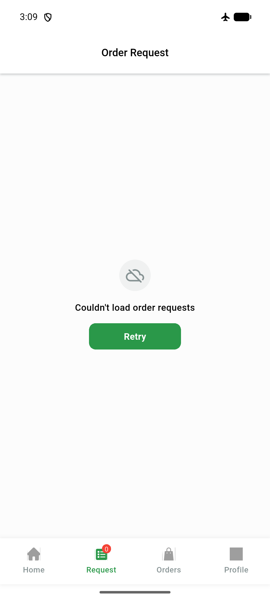
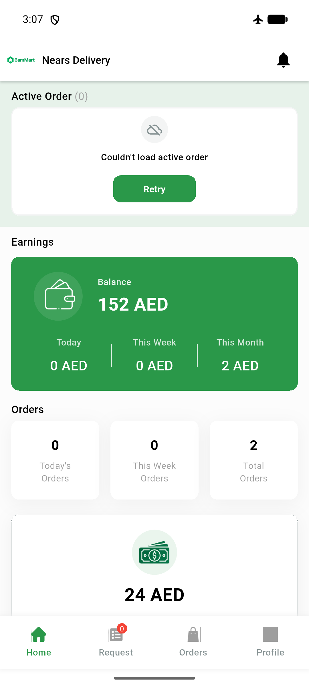
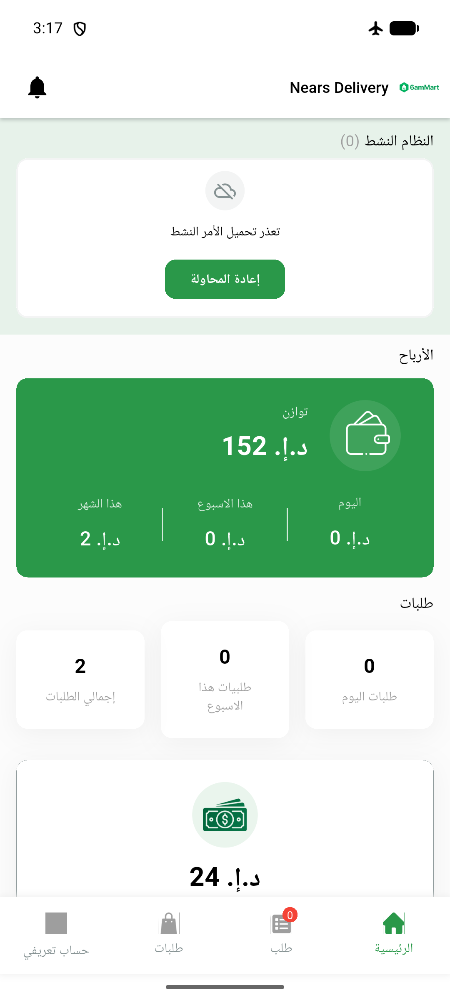
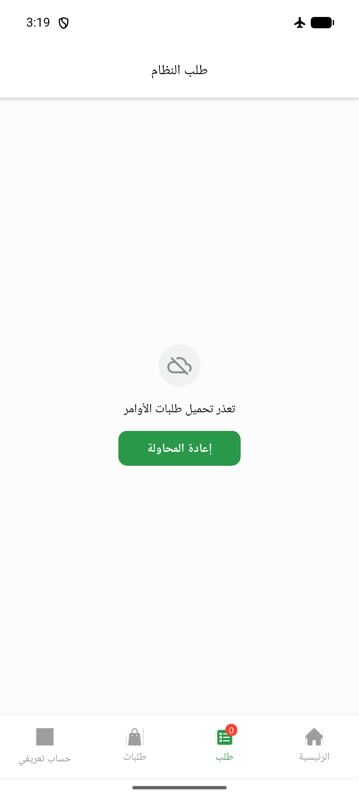

# QA Evidence — NEARS-877

**PASS — DeliveryApp order error+retry (6 ACs live, unit 12/12) on emulator-5556**

**4 screenshot(s).** Click any thumbnail for full resolution.

<table>
<tr>
<td align="center" width="33%"> ac1 request error retry</td>
<td align="center" width="33%"> ac4 home error retry</td>
<td align="center" width="33%"> rtl home error arabic</td>
</tr>
<tr>
<td align="center" width="33%"> rtl request error arabic</td>
</tr>
</table>

### Other artifacts
- [`ac6-fail-log-excerpt.log`](ac6-fail-log-excerpt.log)

---
*From `nears/docs/qa-evidence/NEARS-877/` · public-repo scrub policy (no live secrets; verified clean).*
