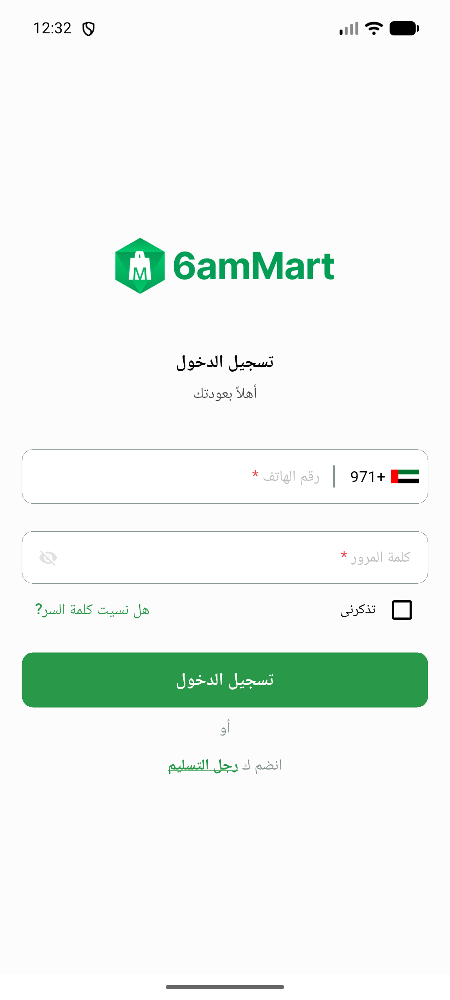
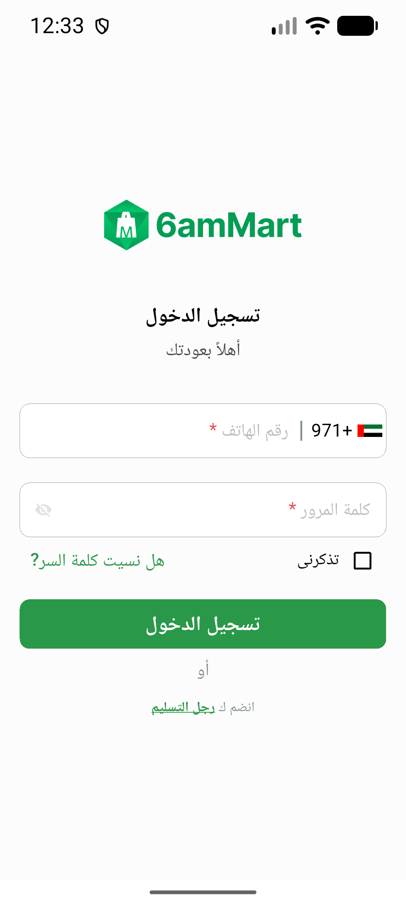
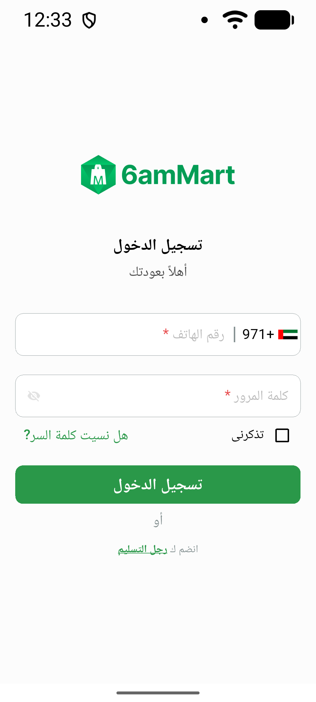
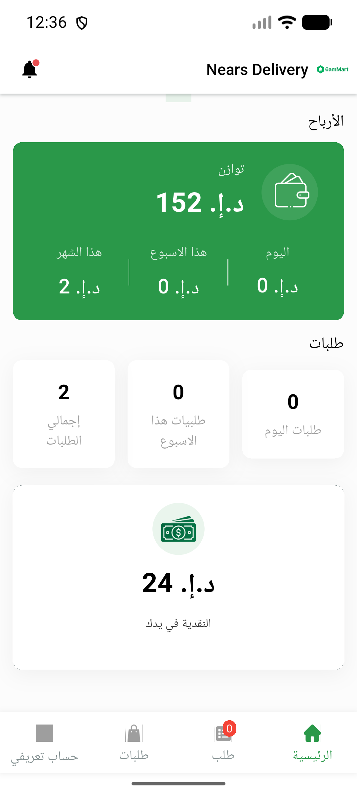
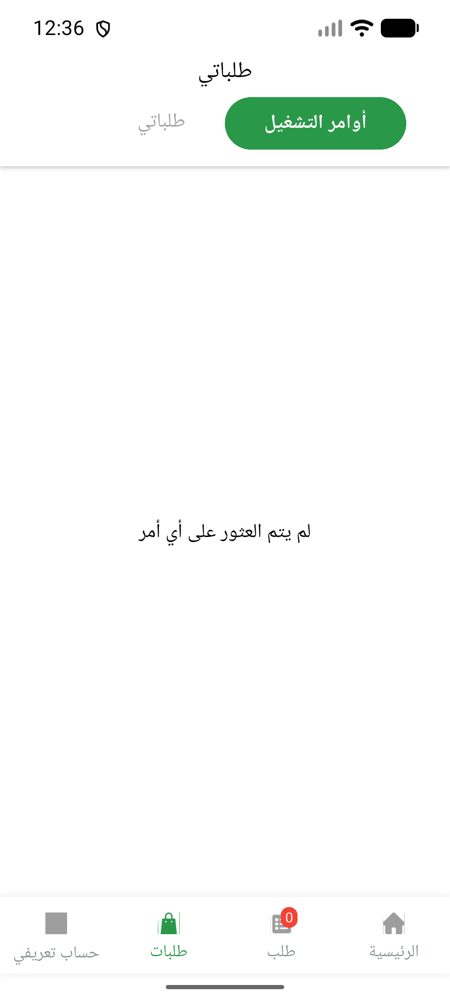
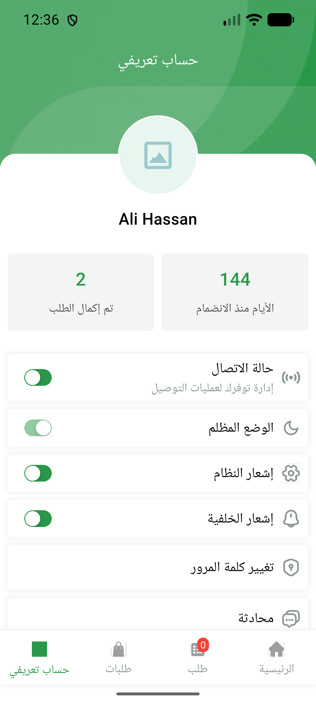
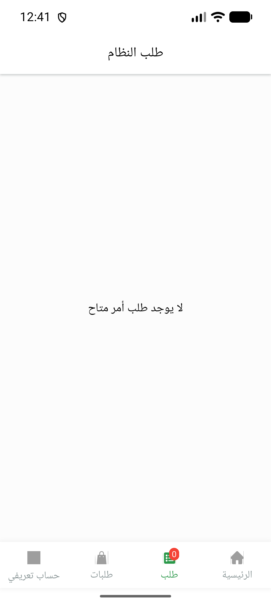

# QA Evidence — NEARS-879

**AC1-4 PASS — OS font-scale honored + clamped [1.0,1.3]; no overflow at 1.3x**

**8 screenshot(s).** Click any thumbnail for full resolution.

<table>
<tr>
<td align="center" width="33%"> ac2 login scale 1.0</td>
<td align="center" width="33%"> ac2 login scale 1.3</td>
<td align="center" width="33%"> ac2 login scale 1.5</td>
</tr>
<tr>
<td align="center" width="33%"> ac2 login scale 2.0</td>
<td align="center" width="33%"> ac3 dashboard 1.3</td>
<td align="center" width="33%"> ac3 orders 1.3</td>
</tr>
<tr>
<td align="center" width="33%"> ac3 profile 1.3</td>
<td align="center" width="33%"> ac4 order request 1.3 rtl</td>
</tr>
</table>

### Other artifacts
- [`bug-location-record-fail.log`](bug-location-record-fail.log)

---
*From `nears/docs/qa-evidence/NEARS-879/` · public-repo scrub policy (no live secrets; verified clean).*
