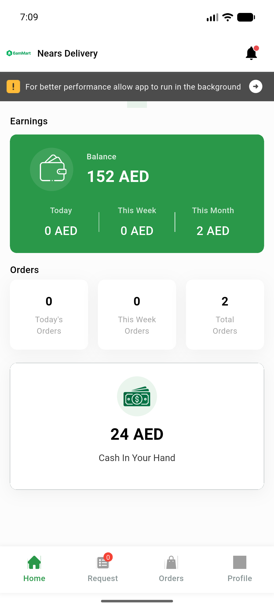
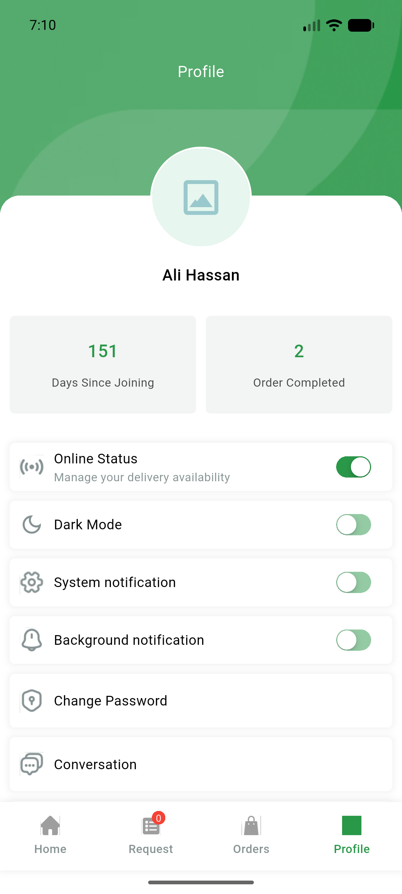

# QA Evidence — NEARS-880

**PASS — raw-print→AppLogger sweep: static ACs green, boot smoke clean**

**2 screenshot(s).** Click any thumbnail for full resolution.

<table>
<tr>
<td align="center" width="33%"> home earnings</td>
<td align="center" width="33%"> profile</td>
</tr>
</table>

---
*From `nears/docs/qa-evidence/NEARS-880/` · public-repo scrub policy (no live secrets; verified clean).*
