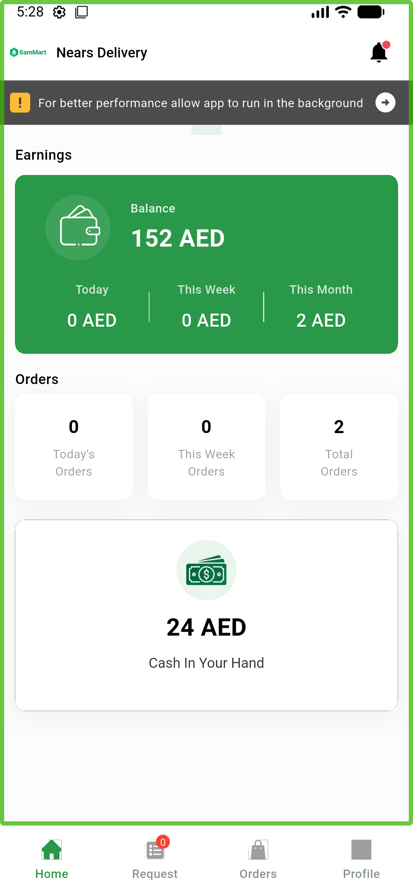

# QA Evidence — NEARS-881

**PASS — Bearer-null header fix verified live on the wire (AC1 logged-out absent, AC2 logged-in present)**

**1 screenshot(s).** Click any thumbnail for full resolution.

<table>
<tr>
<td align="center" width="33%"> dashboard logged in</td>
</tr>
</table>

### Other artifacts
- [`wire-header-capture.log`](wire-header-capture.log)

---
*From `nears/docs/qa-evidence/NEARS-881/` · public-repo scrub policy (no live secrets; verified clean).*
