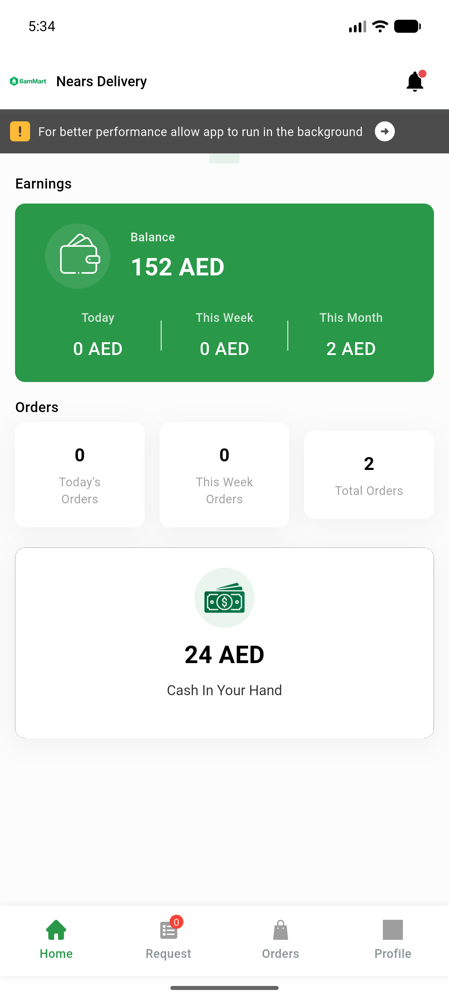
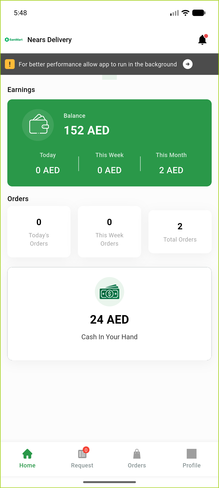
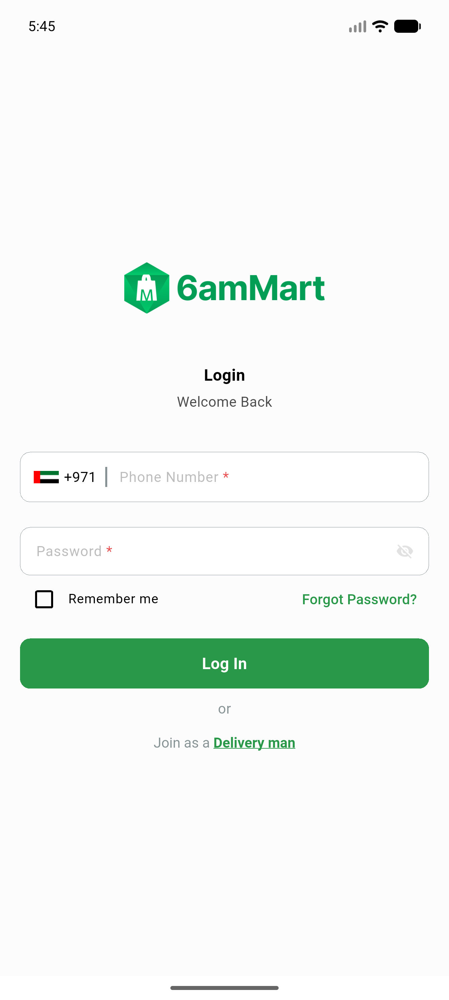

# QA Evidence — NEARS-882

**PASS (cycle 1) — AC1 fixed via tryFromCountryCode; null+ZZ both survive; happy-path login 200**

**4 screenshot(s).** Click any thumbnail for full resolution.

<table>
<tr>
<td align="center" width="33%"> ac3 home after login</td>
<td align="center" width="33%"> ac3 signin rendered</td>
<td align="center" width="33%"> cycle1 home after login</td>
</tr>
<tr>
<td align="center" width="33%"> cycle1 signin dialcode seeded</td>
</tr>
</table>

### Other artifacts
- [`bug-unrecognized-country-still-crashes.log`](bug-unrecognized-country-still-crashes.log)
- [`cycle1-ac1-tryFromCountryCode-pass.log`](cycle1-ac1-tryFromCountryCode-pass.log)

---
*From `nears/docs/qa-evidence/NEARS-882/` · public-repo scrub policy (no live secrets; verified clean).*
