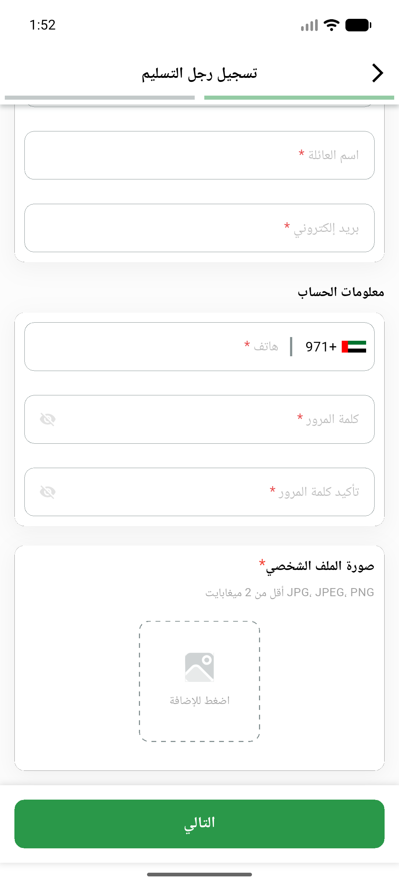

# QA Evidence — NEARS-885

**PASS — dead-code getZone removal: analyze clean, build+launch OK, zone/list 200 live**

**1 screenshot(s).** Click any thumbnail for full resolution.

<table>
<tr>
<td align="center" width="33%"> ac4 registration step1</td>
</tr>
</table>

### Other artifacts
- [`ac4-zone-list-200.log`](ac4-zone-list-200.log)
- [`bug-preexisting-dm-endpoints.log`](bug-preexisting-dm-endpoints.log)
- [`progress.md`](progress.md)

---
*From `nears/docs/qa-evidence/NEARS-885/` · public-repo scrub policy (no live secrets; verified clean).*
