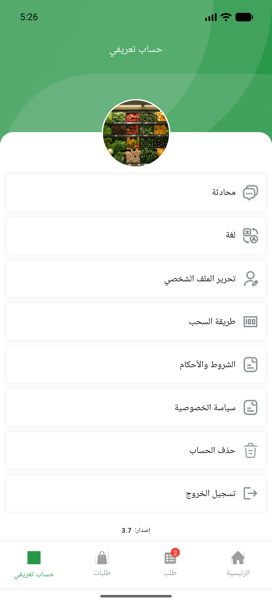
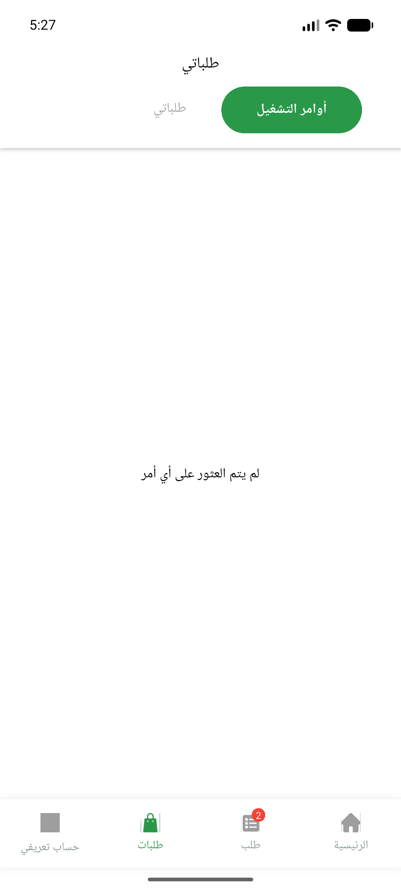
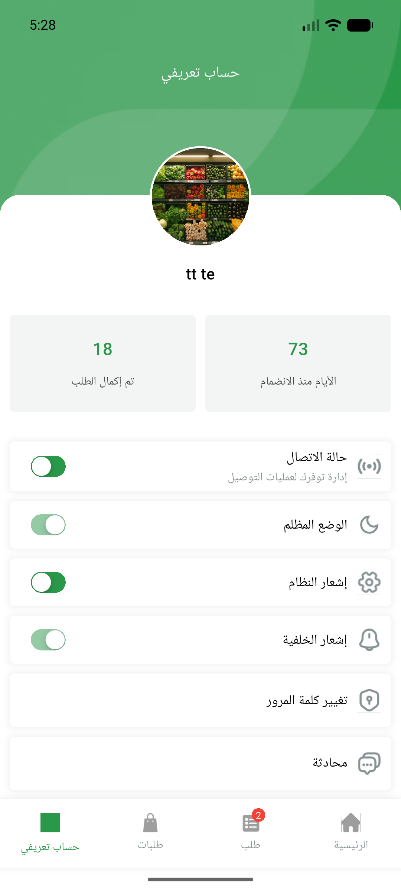
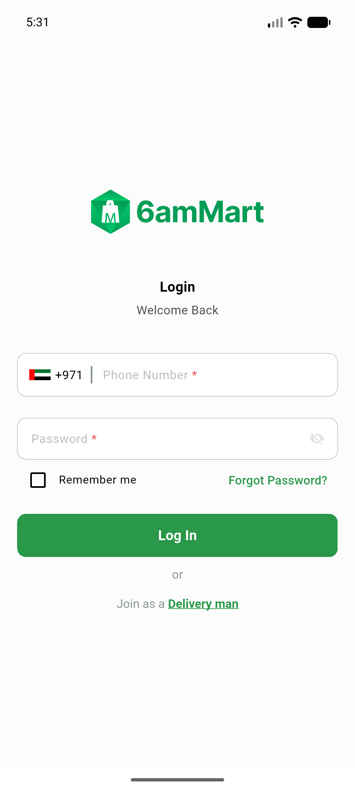

# QA Evidence — NEARS-886

**PASS — DeliveryApp dashboard housekeeping (dispose leak fix + widget rename): clean teardown, no PageController disposed exception, order request renders**

**5 screenshot(s).** Click any thumbnail for full resolution.

<table>
<tr>
<td align="center" width="33%"> dashboard home baseline</td>
<td align="center" width="33%"> dashboard home</td>
<td align="center" width="33%"> order request screen</td>
</tr>
<tr>
<td align="center" width="33%"> profile screen</td>
<td align="center" width="33%"> after logout signin</td>
</tr>
</table>

### Other artifacts
- [`bug-fcm-token-403-logout.log`](bug-fcm-token-403-logout.log)
- [`teardown-clean.log`](teardown-clean.log)

---
*From `nears/docs/qa-evidence/NEARS-886/` · public-repo scrub policy (no live secrets; verified clean).*
